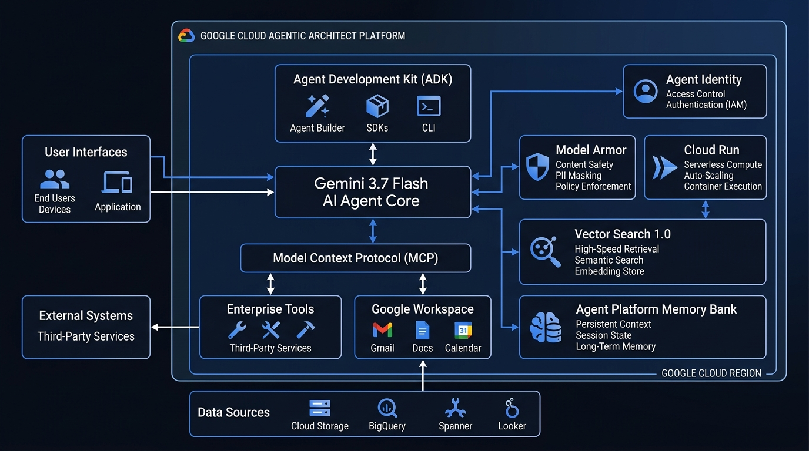

# Google Cloud Certified Professional Agentic Architect — Study & Hands-On Lab Repository 🚀

> [!IMPORTANT]
> **Unofficial Certification Guide & Training Disclaimer**:
> This repository is an **independent, unofficial** study and hands-on preparation guide developed for technical practitioners preparing for the *Google Cloud Certified Professional Agentic Architect (Beta)* exam. It is **not** officially endorsed, sponsored, or affiliated with Google Cloud.
> 
> - For official certification details, requirements, and authoritative exam guide objectives, please refer to the official [Google Cloud Certification Portal](https://cloud.google.com/certification).
> - For official on-demand training courses, interactive labs, and skill badges, please visit [Google Cloud Skills Boost](https://www.cloudskillsboost.google/) (and the official `skills.google` learning paths).

Welcome to the definitive, hands-on preparation repository for the **Google Cloud Certified Professional Agentic Architect** certification (Beta).

This repository is designed for developers, architects, and AI engineers who want to achieve deep mastery of autonomous agents, multi-agent orchestration, enterprise tool integration, security guardrails, and production deployment on Google Cloud.

Every module in this repository is **100% independently runnable**, thoroughly tested, grounded in real-world enterprise architectures, and pre-configured for the latest **Gemini 3.7 Flash** model.

---

## 🏛️ Platform Architecture Overview



---

## 📚 Repository Structure & Learning Path

```
gcp-certification-professional-agentic-architect/
├── README.md                                 # Master overview, quickstart & curriculum
├── STUDY_GUIDE.md                            # Comprehensive exam guide, concepts & cheatsheets
├── EXAM_BLUEPRINT.md                         # Detailed domain weightings, objectives & tool map
├── PRACTICE_EXAM.md                          # High-yield scenario-based exam questions & rationales
├── requirements.txt                          # Python dependencies
├── .env.example                              # Environment configuration template
├── cli.py                                    # Interactive CLI tool (Labs, Tests, Exam Simulator)
│
├── modules/                                  # 13 Standalone Hands-On Modules
│   ├── 01_understand_agents_and_architecture/ # Low-Code vs Code, Agent vs Workflow
│   ├── 02_antigravity_and_coding_agents/     # Antigravity SDK, Coding Agents & Sandboxing
│   ├── 03_agentic_strategy_and_prototyping/  # Model Selection, Gemini 3.7 Flash Thinking Budgets
│   ├── 04_optimizing_agent_behavior/         # Prompt Templates, Few-Shot, CoT & Loop Prevention
│   ├── 05_agent_development_kit_adk/        # Agent Development Kit (ADK) & Structured Outputs
│   ├── 06_agent_memory_and_state/            # Memory Bank, Managed Sessions & Redis Caching
│   ├── 07_agent_tools_and_capabilities/      # Dynamic Tool Calling, OpenAPI & Fallbacks
│   ├── 08_custom_skills_plugins_and_hooks/   # Antigravity Skills, Plugins, Hooks & Rules
│   ├── 09_enterprise_rag_and_vector_search/  # Vector Search 1.0, Agent Retrieval & RAG Engine
│   ├── 10_enterprise_databases_and_mcp/      # Model Context Protocol (MCP) & MCP Toolbox
│   ├── 11_multi_agent_orchestration_a2a/     # Agent2Agent (A2A), Hierarchical & Graph Workflows
│   ├── 12_agentops_evaluation_and_monitoring/# ADK evalset, Golden Datasets, Autoraters & Tracing
│   └── 13_production_deployment_and_security/# Agent Runtime, Cloud Run, Model Armor, PAB & HITL
│
├── scripts/                                  # Automation & Setup Utilities
│   ├── setup_environment.sh                  # Bootstrap virtualenv and dependencies
│   ├── test_all_modules.sh                   # Run full test suite across all 13 modules
│   └── deploy_to_gcp.sh                      # Cloud deployment helper
│
└── .github/
    └── workflows/
        └── ci.yml                            # Automated CI test workflow
```

---

## 🎯 Exam Domain Mapping

| Exam Domain | Weight | Covered Modules |
| :--- | :---: | :--- |
| **Domain 1: Building agents using low-code tools** | **13%** | [Module 01](modules/01_understand_agents_and_architecture), [Module 04](modules/04_optimizing_agent_behavior) |
| **Domain 2: Using coding agents for application development** | **17%** | [Module 02](modules/02_antigravity_and_coding_agents), [Module 08](modules/08_custom_skills_plugins_and_hooks) |
| **Domain 3: Developing custom agents** | **33%** | [Module 03](modules/03_agentic_strategy_and_prototyping), [Module 05](modules/05_agent_development_kit_adk), [Module 06](modules/06_agent_memory_and_state), [Module 07](modules/07_agent_tools_and_capabilities), [Module 09](modules/09_enterprise_rag_and_vector_search), [Module 10](modules/10_enterprise_databases_and_mcp), [Module 11](modules/11_multi_agent_orchestration_a2a) |
| **Domain 4: Evaluating and deploying agentic workflows** | **22%** | [Module 12](modules/12_agentops_evaluation_and_monitoring), [Module 13](modules/13_production_deployment_and_security) |
| **Domain 5: Securing and governing agentic workflows** | **15%** | [Module 13](modules/13_production_deployment_and_security) |

---

## ⚡ Quickstart Guide

### 1. Prerequisites
- **Python 3.10+** (Tested on Python 3.10, 3.11, 3.12, 3.14)
- **Google Cloud SDK (`gcloud`)** (Optional for local testing; required for cloud deployment)
- **Gemini API Key** from [Google AI Studio](https://aistudio.google.com/app/api-keys) OR authenticated Google Cloud project credentials.

### 2. Installation
```bash
# Clone or navigate to the repository
cd gcp-certification-professional-agentic-architect

# Create and activate virtual environment
python3 -m venv .venv
source .venv/bin/activate

# Install all dependencies
pip install -r requirements.txt
```

### 3. Environment Configuration
Copy the `.env.example` file to `.env`:
```bash
cp .env.example .env
```
Edit `.env` and set your credentials:
```ini
GCP_PROJECT_ID=your-gcp-project-id
GEMINI_API_KEY=your-gemini-api-key-here
GEMINI_MODEL=gemini-3.7-flash
```

> **Note**: All labs feature an **automatic mock fallback**. You can run and test all 13 modules immediately even if you don't have a live GCP project or API key configured!

---

## 🛠️ Running the Interactive CLI Runner

Launch the master interactive terminal suite:
```bash
python3 cli.py
```

The CLI provides an interactive terminal menu to:
1. 🚀 **Run Any Hands-On Module**: Step through concepts, code demos, and outputs.
2. 🧪 **Run All Automated Tests**: Execute the full pytest test suite across all 13 modules.
3. 📋 **Take the Practice Exam**: Interactive quiz simulator with real-time scoring and full rationales.
4. 🔍 **Verify Cloud Setup**: Validate your GCP project ID, Gemini API keys, and SDK installations.

---

## 🧪 Running Automated Tests

You can run the entire test suite via `pytest`:
```bash
pytest modules/ -v
```
Or run a specific module's test suite:
```bash
pytest modules/05_agent_development_kit_adk/ -v
```

---

## 📖 Module-by-Module Breakdown

1. **[Module 01: Understand Google Cloud Agents & Architecture](modules/01_understand_agents_and_architecture)**
   - Deterministic workflows vs Autonomous Agents.
   - Gemini Enterprise Agent Designer vs CX Agent Studio vs Custom Code.
2. **[Module 02: Antigravity SDK & Coding Agents](modules/02_antigravity_and_coding_agents)**
   - Autonomous coding agents, Antigravity SDK, Claude Code on GCP.
   - Sandboxing with GKE (gVisor) and Cloud Workstations.
3. **[Module 03: Agentic Strategy & Model Selection](modules/03_agentic_strategy_and_prototyping)**
   - Model selection matrix: Gemini 3.7 Flash vs 2.5 Pro vs Flash-Lite vs Gemma 2.
   - Dynamic thinking budget optimization and latency-cost profiling.
4. **[Module 04: Optimizing Agent Behavior](modules/04_optimizing_agent_behavior)**
   - In-console prompt templates, system instructions, Few-Shot, and Chain-of-Thought.
   - Loop detection and hallucination mitigations.
5. **[Module 05: Agent Development Kit (ADK) & GenAI SDK](modules/05_agent_development_kit_adk)**
   - Building custom agents with Gemini 3.7 Flash and the Google GenAI SDK.
   - Type-safe structured output schemas (`response_schema`).
6. **[Module 06: Agent Memory, State & Sessions](modules/06_agent_memory_and_state)**
   - Agent Platform Memory Bank, Managed Sessions, context window sliding-window pruning.
   - Redis / Firestore state store integration.
7. **[Module 07: Agent Capabilities & Tool Function Calling](modules/07_agent_tools_and_capabilities)**
   - Dynamic function calling, OpenAPI tool schemas, parameter validation, and retry handlers.
8. **[Module 08: Custom Skills, Plugins & Lifecycle Hooks](modules/08_custom_skills_plugins_and_hooks)**
   - Antigravity skills (`SKILL.md`), progressive disclosure, lifecycle hooks, and rules.
9. **[Module 09: Enterprise RAG & Vector Search 1.0](modules/09_enterprise_rag_and_vector_search)**
   - Vector Search 1.0, Agent Retrieval, `text-embedding-005`, similarity metrics & reranking.
10. **[Module 10: Enterprise Databases & Model Context Protocol (MCP)](modules/10_enterprise_databases_and_mcp)**
    - Model Context Protocol (MCP) servers and clients over Stdio and SSE.
    - Google Cloud MCP Toolbox for BigQuery and Cloud SQL.
11. **[Module 11: Multi-Agent Systems & Agent2Agent (A2A)](modules/11_multi_agent_orchestration_a2a)**
    - Multi-agent topologies: Sequential pipelines, Parallel analyzers, Hierarchical Supervisors.
    - Agent2Agent (A2A) handoff protocol.
12. **[Module 12: AgentOps, Evaluation & Observability](modules/12_agentops_evaluation_and_monitoring)**
    - Continuous evaluation with ADK `evalset` and Gemini 3.7 Flash autoraters.
    - Cloud Logging, Cloud Trace, latency profiling, and metric scorecards.
13. **[Module 13: Production Deployment, Security & Governance](modules/13_production_deployment_and_security)**
    - Runtime selection (Agent Runtime, Cloud Run, GKE).
    - Model Armor, Agent Identity PAB, Agent Gateway, and Human-in-the-Loop (HITL).

---

## 📜 Study Tips for Passing the Beta Exam
1. **Understand Architectural Trade-Offs**: The exam heavily tests when to use low-code vs custom code, when to use Gemini 3.7 Flash vs Pro vs Gemma 2, and when to use Agent Runtime vs Cloud Run vs GKE.
2. **Master Agent Security**: Understand Principal Access Boundaries (PAB), Model Armor filters, and OAuth 2.0 Auth Manager.
3. **Know MCP & A2A**: Be ready for questions on the Model Context Protocol (MCP) for tool integration and Agent2Agent (A2A) for multi-agent delegation.
4. **Practice with Real Code**: Run every lab in this repository to build muscle memory for prompt design, tool declarations, and evaluation pipelines.
