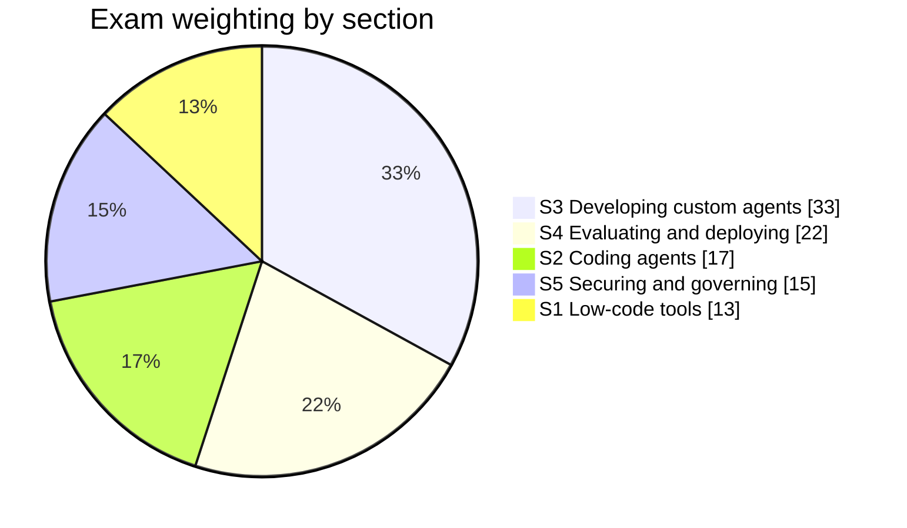
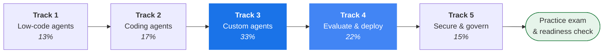

# Google Cloud Professional Agentic Architect — Beta Exam Prep

> [!IMPORTANT]
> **Personal, unofficial repository.** This is a personal study project. It is **not
> affiliated with, endorsed by, or maintained by Google or Google Cloud**. For official
> guidance — exam objectives, registration, policies, and the current exam guide — refer to
> **[cloud.google.com/learn/certification/agentic-architect](https://cloud.google.com/learn/certification/agentic-architect)**.
> Where anything here disagrees with the official source, **the official source is correct**.
> See [`DISCLAIMER.md`](DISCLAIMER.md) for the full disclaimer.

A hands-on study repository for the **Google Cloud Certified — Professional Agentic Architect** beta
exam. Twenty independent labs, structured to mirror the five scored sections of the
[official exam guide](https://services.google.com/fh/files/misc/professional_agentic_architect_exam_guide_english.pdf)
exactly.

Every lab runs **offline and free by default**. Every lab has an **opt-in live path** that touches
real Google Cloud. Every technical claim in this repo was verified against the live Gemini API and
against an actual installation of the Agent Development Kit — see [`docs/VERIFIED_FACTS.md`](docs/VERIFIED_FACTS.md).

---

## What this exam actually tests

The exam is not a recall test. It is a **judgement** test: given a scenario, pick the right
abstraction, the right runtime, the right guardrail. The labs are built around that, so each one
ends with a "the decision that matters" table rather than a glossary.



> [!IMPORTANT]
> Section 3 is **33% of the exam** — more than double any other single section except deployment.
> Track 3 has six labs for that reason. If your time is short, do Track 3 and Track 4 first;
> together they are **55%** of the paper.

### Naming changes you must know

The exam guide uses newer product names than most public documentation. Answer with the exam's
vocabulary.

| Exam guide name | What public docs or scenarios mean by it |
| :--- | :--- |
| **Gemini Enterprise** (umbrella) vs. **Gemini Enterprise App (`GEApp`)** | **Gemini Enterprise** is now the umbrella brand for the entire enterprise agentic stack; **Gemini Enterprise App (`GEApp`)** is the turn-key employee search & assistant web app (formerly Google Agentspace), distinct from **Agent Platform (`GEAP`)** for custom code-first agents |
| **Agent Runtime** | Vertex AI Agent Engine (`adk deploy agent_engine`) |
| **Agent Search** | Vertex AI Search (`VertexAiSearchTool`) |
| **Agent Registry** | Central discovery & governance service for A2A Agent Cards and MCP servers |
| **Agent Gateway** | Policy-enforcing ingress/egress proxy for agentic A2A & MCP traffic |
| **GKE Inference Gateway** | Kubernetes Gateway API extension (`InferencePool`, `InferenceModel`) for KV-cache & LoRA aware GPU routing |
| **Code Mender** | Autonomous AI vulnerability-patching & root-cause repair agent (Objective 2.1) |

---

## The learning path



The arrows are a *suggested* order, not a dependency chain. **Every lab is self-contained** — it
restates the concepts it needs and never says "as you saw in the previous lab". Jump straight to
whichever section you are weakest in.

---

## All twenty labs

### Track 1 — Building agents using low-code tools · 13%
[`tracks/01_low_code_agents/`](tracks/01_low_code_agents/)

| Lab | Topic | Objectives |
| :--- | :--- | :--- |
| [01](tracks/01_low_code_agents/lab_01_agent_designer_workflows/) | Agent Designer workflows — prompt patterns, zero/few-shot, chain-of-thought | 1.1 |
| [02](tracks/01_low_code_agents/lab_02_cx_agent_studio_state/) | CX Agent Studio — pages, intents, transition routes, event handlers | 1.1 |
| [03](tracks/01_low_code_agents/lab_03_enterprise_data_and_multimodal/) | Connecting enterprise data to Gemini Enterprise App (`GEApp`); multimodal input | 1.2 |

### Track 2 — Using coding agents for application development · 17%
[`tracks/02_coding_agents/`](tracks/02_coding_agents/)

| Lab | Topic | Objectives |
| :--- | :--- | :--- |
| [04](tracks/02_coding_agents/lab_04_mcp_and_tooling/) | MCP servers and toolsets — extending a coding agent's reach | 2.1 |
| [05](tracks/02_coding_agents/lab_05_secure_sandboxes/) | Secure code execution — GKE Agent Sandbox (gVisor) vs Job vs Cloud Run, Code Mender | 2.1, 2.2 |
| [06](tracks/02_coding_agents/lab_06_antigravity_customization/) | Customising and governing coding agents — rules, skills, allowlists, Code Mender | 2.1, 2.2 |

### Track 3 — Developing custom agents · 33% ⭐
[`tracks/03_custom_agents/`](tracks/03_custom_agents/)

| Lab | Topic | Objectives |
| :--- | :--- | :--- |
| [07](tracks/03_custom_agents/lab_07_model_selection/) | Choosing a model — Pro vs Flash vs Lite, open-weights on GKE GPUs, cost shape | 3.1 |
| [08](tracks/03_custom_agents/lab_08_adk_fundamentals/) | ADK fundamentals — `LlmAgent`, workflow agents, the graph `Workflow` | 3.1, 3.3 |
| [09](tracks/03_custom_agents/lab_09_sessions_and_memory/) | Session state vs memory; Memory Bank vs RAG memory | 3.1, 3.2 |
| [10](tracks/03_custom_agents/lab_10_tools_and_skills/) | Tools, long-running tools, human-in-the-loop, and the Skill Registry | 3.1, 3.2 |
| [11](tracks/03_custom_agents/lab_11_rag_and_retrieval/) | Grounding — Agent Search, RAG Engine, vector stores, citations | 3.2 |
| [12](tracks/03_custom_agents/lab_12_multi_agent_and_a2a/) | Multi-agent architecture patterns, MCP + A2A orchestration, Agent Registry | 3.2, 3.3 |

### Track 4 — Evaluating and deploying agentic workflows · 22%
[`tracks/04_evaluate_and_deploy/`](tracks/04_evaluate_and_deploy/)

| Lab | Topic | Objectives |
| :--- | :--- | :--- |
| [13](tracks/04_evaluate_and_deploy/lab_13_agent_evaluation/) | Evaluation — eval sets, trajectory vs response scoring, rubric & hallucination metrics | 4.1 |
| [14](tracks/04_evaluate_and_deploy/lab_14_deployment_runtimes/) | Agent Runtime limitations vs Cloud Run vs GKE vs GCE; `adk deploy` | 4.2 |
| [15](tracks/04_evaluate_and_deploy/lab_15_observability_and_troubleshooting/) | Cloud Logging, Cloud Trace, OpenTelemetry spans, token accounting, conformance replay | 4.1, 4.2 |
| [19](tracks/04_evaluate_and_deploy/lab_19_gke_inference_gateway_and_gpus/) | GKE Inference Gateway (`InferencePool`), open-weight GPU serving (`vLLM`), GKE Agent Sandbox | 3.1, 4.2 |

### Track 5 — Securing and governing agentic workflows · 15%
[`tracks/05_secure_and_govern/`](tracks/05_secure_and_govern/)

| Lab | Topic | Objectives |
| :--- | :--- | :--- |
| [16](tracks/05_secure_and_govern/lab_16_agent_identity_and_auth/) | Agent Identity, Principal Access Boundary (PAB), OAuth 2.0, identity propagation | 5.1 |
| [17](tracks/05_secure_and_govern/lab_17_model_armor_and_hitl/) | Model Armor, prompt-injection defence, fail-closed vs fail-open, HITL | 5.2 |
| [18](tracks/05_secure_and_govern/lab_18_governance_gateway_registry/) | Agent Gateway, Agent Registry, audit and lifecycle governance | 5.1, 5.2 |
| [20](tracks/05_secure_and_govern/lab_20_e2e_ai_threat_defense/) | End-to-End AI Threat Defense — Agent Gateway, Agent Registry, Model Armor & PAB | 5.1, 5.2 |

---

## Quickstart

### 1. Install

```bash
git clone https://github.com/cmanikandan/gcp-certification-professional-agentic-architect.git
cd gcp-certification-professional-agentic-architect

python3 -m venv .venv
source .venv/bin/activate
pip install -r requirements.txt
```

> [!NOTE]
> `requirements.txt` pulls `google-adk[agent-identity,gcp,a2a,extensions]`. Those extras matter:
> without them you get precise `ImportError`s on the identity, Model Armor, A2A and GKE-executor
> labs. See [`docs/VERIFIED_FACTS.md`](docs/VERIFIED_FACTS.md) for the extras-to-module mapping.

### 2. Run any lab, offline and free

```bash
./tracks/03_custom_agents/lab_08_adk_fundamentals/run_lab.sh
```

No credentials. No network. No cost. The offline path still builds **real ADK objects** and asserts
on the **real API surface** — only the model call itself is stubbed.

### 3. Optionally run it live on Google Cloud

```bash
cp .env.example .env     # fill in GOOGLE_CLOUD_PROJECT etc.
./tracks/03_custom_agents/lab_08_adk_fundamentals/run_lab.sh --live
```

Each lab states its own cost estimate before it charges you anything. If `--live` is passed but the
configuration is incomplete, the lab tells you exactly what is missing and **falls back to offline
rather than crashing**.

### 4. Tear down

```bash
./tracks/03_custom_agents/lab_08_adk_fundamentals/cleanup.sh
```

Idempotent. Safe to run twice. Offline labs provision nothing, so cleanup is a no-op for them.

---

## Repository layout

```
.
├── tracks/                  # the 18 labs, grouped into the 5 exam sections
│   └── NN_track_name/
│       └── lab_NN_topic/
│           ├── README.md        # the teaching material (11 fixed sections)
│           ├── lab.py           # runnable demo, offline by default
│           ├── run_lab.sh       # demo + tests
│           ├── cleanup.sh       # idempotent teardown
│           └── tests/           # pytest assertions
├── common/                  # shared foundation used by every lab
│   ├── models.py                # verified model catalog + selection helper
│   ├── config.py                # the offline/live gate
│   └── labkit.py                # dependency-free console output helpers
├── docs/
│   ├── VERIFIED_FACTS.md        # ← the authority. Nothing may contradict this.
│   ├── EXAM_GUIDE.md            # verbatim objectives, weights, lab cross-reference
│   └── LAB_AUTHORING_CONTRACT.md
├── STUDY_GUIDE.md           # concepts, condensed
├── PRACTICE_EXAM.md         # weighted practice questions, every option explained
├── EXAM_READINESS.md        # self-assessment checklist
└── cli.py                   # interactive runner
```

---

## Every lab has the same eleven sections

This is deliberate. It means you always know where to look, and it means a lab can be read cold.

1. **Exam objectives covered** — quoted verbatim from the official guide
2. **Explain it simply** — plain English, analogy first, no jargon until the idea has landed
3. **How it works** — a mermaid diagram, then the mechanics
4. **The decision that matters** — the trade-off table; the highest-value section for the exam
5. **Hands-on A — offline** (free)
6. **Hands-on B — live on Google Cloud** (opt-in, costed)
7. **Verify it worked**
8. **Troubleshooting** — real failure modes only
9. **Clean up**
10. **Exam traps** — the specific distinctions that get tested
11. **Check yourself** — recall questions with collapsible answers

---

## How the facts in this repo were verified

Certification material goes stale fast, and an out-of-date model name is worse than no model name.
So nothing here is quoted from memory:

| Claim type | How it was verified |
| :--- | :--- |
| Gemini model IDs, context windows | Live `ListModels` call against the Gemini API |
| Package versions | PyPI JSON API |
| ADK classes, methods, keyword arguments | `inspect.signature` against an actual ADK install |
| `adk` CLI commands and flags | `--help` on the installed binary |
| Exam objectives and weights | Text extracted directly from the official exam-guide PDF |

Anything that could **not** be verified against a public source is explicitly flagged in-line as
**Pre-GA / unverified**, alongside the closest verified equivalent. There is also a guard test that
fails the build if a retired model ID such as `text-embedding-005` ever reappears.

> [!WARNING]
> This is a **beta** exam. The product surface is moving. Re-read `docs/VERIFIED_FACTS.md` and
> re-check the official guide close to your exam date.

---

## Suggested study plan

| Week | Focus | Deliverable |
| :--- | :--- | :--- |
| 1 | Track 3 labs 07–10 | Can build an ADK agent with tools, state and memory from a blank file |
| 2 | Track 3 labs 11–12, Track 4 | Can ground an agent, orchestrate several, evaluate and deploy them |
| 3 | Track 5, then Tracks 1–2 | Can secure an agent and place it correctly on the low-code ↔ custom-code spectrum |
| 4 | `PRACTICE_EXAM.md`, then re-run weak labs live | ≥80% on the practice exam, `EXAM_READINESS.md` fully ticked |

---

## Contributing back to your own fork

The rules that keep this repo coherent are in
[`docs/LAB_AUTHORING_CONTRACT.md`](docs/LAB_AUTHORING_CONTRACT.md). The short version: offline by
default, never invent an API, never hard-code a model ID, always include a diagram.
