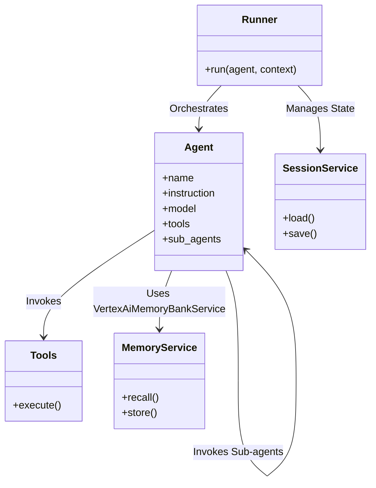
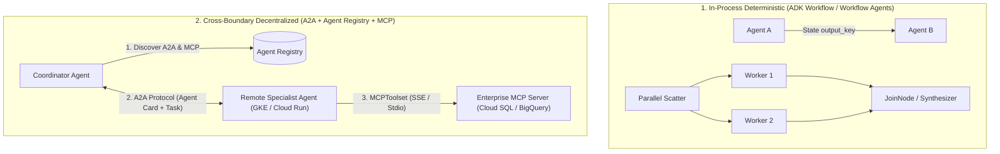
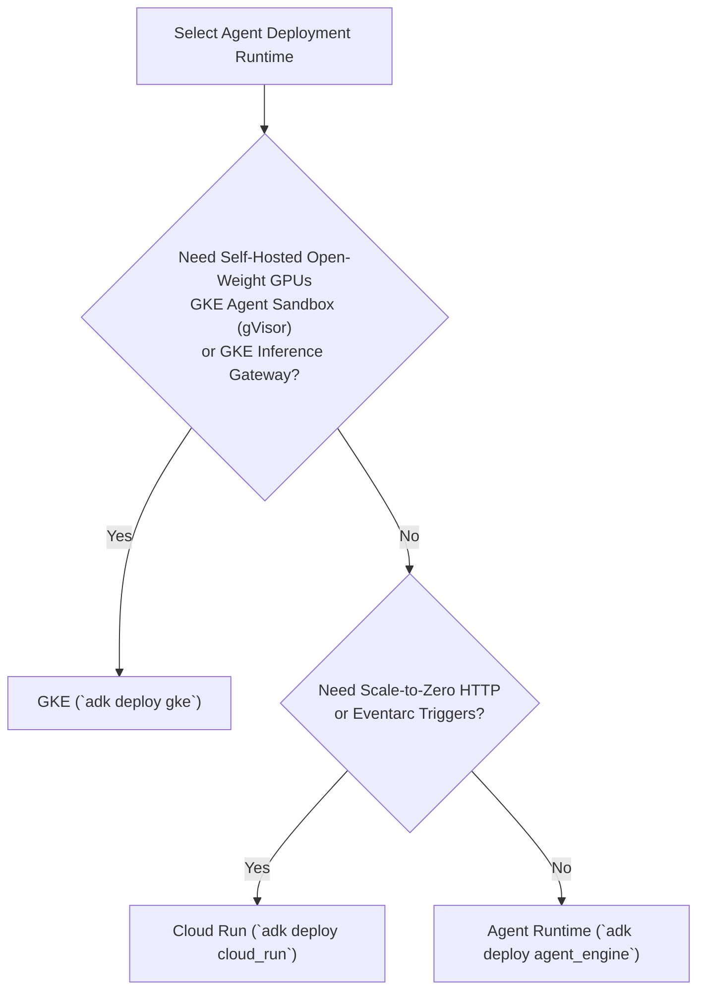
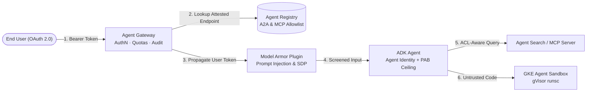

# Google Cloud Certified Professional Agentic Architect — Study Guide

> [!IMPORTANT]
> **Personal, unofficial repository.** This is a personal study project. It is **not
> affiliated with, endorsed by, or maintained by Google or Google Cloud**. For official
> guidance — exam objectives, registration, policies, and the current exam guide — refer to
> **[cloud.google.com/learn/certification/agentic-architect](https://cloud.google.com/learn/certification/agentic-architect)**.
> Where anything here disagrees with the official source, **the official source is correct**.
> See [`DISCLAIMER.md`](DISCLAIMER.md) for the full disclaimer.

This guide provides an in-depth architectural breakdown for the exam (75 questions, 3 hours). It is ordered by the weight of each domain on the exam. Use it for final review before taking the exam.

## Glossary of Renamed Products & Naming Hierarchy

- **Gemini Enterprise (Umbrella) vs. Gemini Enterprise App (`GEApp`) vs. Agent Platform (`GEAP`)**:
  - **Gemini Enterprise**: Now the overarching **umbrella brand** for Google Cloud's entire enterprise agentic ecosystem.
  - **Gemini Enterprise App (`GEApp`)**: Formerly *Google Agentspace* / Enterprise Search web app. The turn-key, out-of-the-box web experience for employees to search connected enterprise data sources and invoke low-code/custom agents. *(Note: Many scenario prompts refer generically to "Gemini Enterprise" when specifically describing the **Gemini Enterprise App (`GEApp`)** UI/connector experience.)*
  - **Agent Platform (`GEAP` / Vertex AI Agent Platform)**: The developer-facing platform (`adk`, Agent Runtime, Agent Registry, Memory Bank, Gen AI Evaluation Service) for building, orchestrating, and governing custom code-first agents across Google Cloud runtimes (Agent Runtime, GKE, Cloud Run).
- **Agent Runtime**: Formerly *Vertex AI Agent Engine* (and *Reasoning Engine*). Managed serverless runtime for deploying ADK agents (`adk deploy agent_engine`).
- **Agent Search**: Formerly *Vertex AI Search*. Managed enterprise RAG engine with native Document-Level Access Control Lists (ACLs).
- **Agent Registry**: Central metadata, discovery, and governance catalog (`google.adk.integrations.agent_registry.AgentRegistry`) for discovering A2A Agent Cards (`get_remote_a2a_agent`) and approved MCP servers (`get_mcp_toolset`).
- **Agent Gateway**: Reverse proxy and policy enforcement point (PEP) for observing, rate-limiting, authenticating, and propagating user identity across agentic (A2A/MCP) traffic.
- **GKE Inference Gateway**: Kubernetes Gateway API extension (`InferencePool` / `InferenceModel`) that performs KV-cache aware routing, prefix-cache affinity, LoRA adapter multiplexing, and priority-based load shedding for self-hosted LLMs/SLMs on GKE GPU pools.
- **Code Mender**: Autonomous AI security and vulnerability-patching coding agent that detects application-layer vulnerabilities/CVEs, performs root-cause analysis, synthesizes patches, and verifies fixes inside isolated sandboxes (Objective 2.1).

---

## 1. Domain 3: Developing Custom Agents (~33%)

This is the largest and most critical domain. Although the official exam guide mentions the word "multiagent" only once, **multi-agent architecture patterns with MCP and A2A** dominate real scenario questions across Domain 3, Domain 4, and Domain 5.

### The ADK Object Model
To build agents in code, you must understand the ADK 2.9.0 architecture:

### Model Selection Matrix & Self-Hosted GKE GPUs
Selecting the right model is a core exam skill. Do not rely on floating aliases (like `gemini-flash-latest`); memorize the pinned models and when to self-host open-weight models on GKE with GPUs:

| Model ID | Primary Best Use Case | Capabilities & Limits |
| :--- | :--- | :--- |
| `gemini-3.7-flash` / `gemini-3.8-flash` | **Default Enterprise Agent Workhorse**: Complex reasoning, coding, tool orchestration, multi-step planning | 1M in / 65K out |
| `gemini-2.5-pro` | Deep analytical synthesis, complex multi-document auditing, LLM-as-a-Judge autorating | 1M in / 65K out |
| `gemini-3.5-flash-lite` | High-throughput classification, intent routing, basic sentiment extraction | 1M in / 65K out |
| `gemma-4-26b-a4b-it` / `gemma-4-31b-it` | **Self-hosted Open-Weight / SLM on GKE GPUs**: Strict data residency, air-gapped VPCs, custom LoRA fine-tuning, predictable flat GPU capacity cost at high utilization | 262K in / 32K out |
| `gemini-embedding-2` | **RAG / Vector Search**: Converting text to semantic embeddings | 8,192 input tokens limit |
| `gemini-3.5-live-translate-preview` | **Live API**: Real-time bidirectional audio/video WebSocket streaming | Native audio |

### Deep Dive: Multi-Agent Architecture Patterns (MCP + A2A)
Multi-agent architecture scenarios require choosing the right coordination pattern based on **determinism**, **process/network boundaries**, and **tool vs. agent semantics**:

1. **Deterministic Graph Orchestration (`google.adk.workflow.Workflow`)**:
   - Uses explicit `Node`, `FunctionNode`, `JoinNode`, and `Edge` definitions.
   - Best when execution order must be strictly guaranteed (compliance pipelines, financial settlement steps).
   - **Critical ADK 2.9.0 Nuance**: `SequentialAgent`, `ParallelAgent`, and `LoopAgent` emit a `DeprecationWarning` in favor of `Workflow`, **however** `Workflow` *cannot yet be nested as a `sub_agent` inside an `LlmAgent`*. Therefore, hierarchical trees where an `LlmAgent` delegates to a deterministic sub-pipeline still require `SequentialAgent` / `ParallelAgent` / `LoopAgent` (terminated via `exit_loop`).
2. **Dynamic LLM-Driven Delegation (`sub_agents` + `transfer_to_agent`)**:
   - A parent `LlmAgent` inspects child agent `name` and `description` fields and dynamically transfers control within the same process/session (`disallow_transfer_to_parent`, `disallow_transfer_to_peers`).
3. **Cross-Boundary Agent2Agent (`A2A` Protocol)**:
   - Triggered when agents cross **process, runtime, team, VPC, or organizational boundaries** (e.g., an orchestrator on Agent Runtime calling a GPU-backed specialist on GKE and a serverless specialist on Cloud Run).
   - **Agent Card** (`/.well-known/agent.json`): Advertises the remote agent's capabilities, skills, input/output MIME types, and authentication schemes (`OAuth2`, `OIDC`).
   - **A2A Task Lifecycle**: Stateful task creation, streaming status updates (`a2a_status_update_converter`), and multi-part artifact exchange (`a2a_artifact_update_converter`).
4. **Model Context Protocol (`MCP`) + `AgentRegistry` Synergy**:
   - **MCP (`MCPToolset` / `RemoteMcpServer`)** connects an agent to **tools, databases, and resources** (never to another reasoning agent).
   - **`AgentRegistry`** bridges governance and discovery: an agent calls `registry.get_remote_a2a_agent()` to resolve an attested peer agent and `registry.get_mcp_toolset()` to dynamically bind an approved enterprise MCP server without hardcoding URLs.

*Covered in: [Track 3 / Labs 07–12](tracks/03_custom_agents)*

---

## 2. Domain 4: Evaluating and Deploying Agentic Workflows (~22%)

### Deployment Runtimes: Limitations of Agent Runtime vs. When to Choose GKE
Real-world Agentic AI architectures on Google Cloud span **Agent Runtime**, **GKE**, **Cloud Run**, **VPC Service Controls**, and **Cloud Storage** — not just low-code console apps. A major exam focus is knowing the **architectural limitations of Agent Runtime** and when you **must** choose **GKE** instead.

| Architectural Dimension | Agent Runtime (`adk deploy agent_engine`) | Cloud Run (`adk deploy cloud_run`) | GKE (`adk deploy gke`) |
| :--- | :--- | :--- | :--- |
| **Primary Sweet Spot** | Zero-ops managed Python ADK agents with native `VertexAiSessionService` & `VertexAiMemoryBankService` | Stateless/serverless event-driven HTTP/gRPC agents, scale-to-zero cost optimization | Multi-agent clusters, self-hosted open-weight GPUs, strict gVisor code sandboxes, KV-cache inference routing |
| **Hard Limitations (When NOT to use)** | ❌ Cannot attach custom GPU node pools (L4/A100/H100) to serve open-weight models (`gemma-4-31b-it` via vLLM) ❌ Cannot run `GkeCodeExecutor(executor_type="sandbox")` pod templates or custom DaemonSets/sidecars ❌ Cannot use **GKE Inference Gateway** (`InferencePool`) for prefix-cache/LoRA routing | ❌ No multi-node GPU topology or persistent KV-cache pool routing ❌ Ephemeral container lifecycle requires external `RedisSessionService` or `DatabaseSessionService` | Higher operational overhead (managing cluster upgrades, node pools, Kubernetes manifests) |

### GKE Inference Gateway & Open-Weight Models on GKE with GPUs
When deploying open-weight models (`gemma-4-26b-a4b-it`, `gemma-4-31b-it`) on GKE GPU node pools (using vLLM, TGI, or JetStream), standard L7 round-robin load balancers fail because LLM requests have wildly varying prompt token lengths, stateful GPU KV-caches, and dynamic LoRA adapters.
- **GKE Inference Gateway** extends the Kubernetes Gateway API with two custom resources:
  - **`InferencePool`**: Defines the backend pool of vLLM/model-serving pods and deploys an Endpoint Picker (EPP) extension that scrapes real-time GPU metrics.
  - **`InferenceModel`**: Maps logical model/LoRA names (e.g., `finance-risk-lora`, `legal-audit-lora`) and assigns **criticality tiers** (`Critical`, `Standard`, `Sheddable`).
- **Why GKE Inference Gateway Beats Standard L7 LB for Agents**:
  1. **KV-Cache & Prefix-Cache Affinity**: Routes multi-turn agent requests sharing a long system prompt or conversation history to the specific GPU pod that already holds those prefix tokens in HBM KV-cache, slashing Time-To-First-Token (TTFT).
  2. **Queue-Depth & KV-Cache Saturation Routing**: Avoids sending long-context prompts to a GPU whose KV-cache memory is near 100%, preventing Out-Of-Memory (OOM) preemption.
  3. **Dynamic LoRA Multiplexing**: Routes requests for specialized agent personas to pods that already have the target LoRA adapter loaded in VRAM.
  4. **Criticality Load Shedding**: Drops `Sheddable` background batch evaluation requests when GPU saturation spikes, protecting interactive `Critical` customer-facing agent turns.

### Agent Evaluation (`google.adk.evaluation`) & Telemetry (`google.adk.telemetry`)
- **Trajectory vs. Final Response Evaluation**:
  - `trajectory_evaluator`: Evaluates the exact sequence of tool calls (`exact_match`, `in_order_match`, `any_order_match`, plus tool-call precision/recall). Catches agents that guess the right final answer while skipping mandatory validation tools or calling destructive tools.
  - `final_response_match_v2` / `rubric_based_final_response_quality_v1`: Evaluates the semantic quality and formatting of the final text output.
  - `hallucinations_v1`: Verifies that every factual claim in the response is grounded in the retrieved tool/RAG context.
  - `rubric_based_tool_use_quality_v1` & `multi_turn_trajectory_quality_evaluator`: Evaluates argument synthesis and multi-turn conversational repair.
  - `llm_as_judge`: Uses a higher-reasoning model (`gemini-2.5-pro`) to grade outputs produced by a faster workhorse (`gemini-3.7-flash`).
  - **Conformance Replay (`adk conformance record` / `adk conformance test`)**: Records deterministic tool trajectories in staging and replays them in CI/CD without incurring live LLM randomness.
- **Cloud Logging, Telemetry & Cloud Trace (`google.adk.telemetry`)**:
  - Built-in OpenTelemetry spans: `trace_call_llm`, `trace_tool_call`, `trace_merged_tool_calls` (parallel tool execution), and `trace_send_data`.
  - `ContentCapturingMode`: Controls whether full prompt/tool payloads are exported to Cloud Trace/Logging (enabled in dev; disabled or redacted in production to prevent PII leakage into observability sinks).

*Covered in: [Track 4 / Labs 13–15, 19](tracks/04_evaluate_and_deploy)*

---

## 3. Domain 2: Using Coding Agents for Application Development (~17%)

### Agent Sandbox on GKE (`GkeCodeExecutor`) vs. Other Code Executors
When coding or data-analysis agents generate and execute untrusted Python/bash code, host isolation is paramount:
- **`GkeCodeExecutor` (`google-adk[extensions]`)**:
  - Supports two modes: `executor_type="job"` and `executor_type="sandbox"`.
  - **`executor_type="job"`**: Runs code in a standard Kubernetes Job pod sharing the node's Linux kernel. Vulnerable to kernel-level container escape exploits.
  - **`executor_type="sandbox"` (Agent Sandbox on GKE)**: Uses **GKE Sandbox (gVisor `runsc`)** user-space kernel interception alongside `sandbox_gateway_name` and `sandbox_template` CRDs. Intercepts Linux syscalls in user space before they ever reach the host kernel, enforces default-deny egress NetworkPolicies, and provides warm sub-second micro-sandbox claiming.
- **`CloudRunSandboxCodeExecutor`**: Executes code inside a Cloud Run container via `sandbox_bin` with configurable `allow_egress=False`, `stateful`, and `timeout_seconds`.
- **`UnsafeLocalCodeExecutor`**: Executes code directly in the host Python process. **Never use in production** (classic exam trap).

### Code Mender & Automated Vulnerability Patching (Objective 2.1)
Objective 2.1 explicitly tests *"Using coding agents to refactor source code, optimize execution runtimes, and patch application-layer vulnerabilities"*.
- **Code Mender** is Google's autonomous security coding agent designed specifically for **automated vulnerability remediation**:
  1. **Ingests** sanitizer crashes, SAST/DAST alerts, or CVE advisories.
  2. **Localizes & Root-Causes** the flaw across the repository using AST/call-graph analysis and MCP tools.
  3. **Synthesizes & Verifies** candidate patches inside an isolated **GKE Agent Sandbox**, running regression tests and fuzzers (` Atheris` / `OSS-Fuzz`) to prove the exploit is neutralized without breaking functionality before opening a pull request for human review.

*Covered in: [Track 2 / Labs 04–06](tracks/02_coding_agents)*

---

## 4. Domain 5: Securing and Governing Agentic Workflows (~15%)

### End-to-End AI Threat Defense Architecture
Enterprise agent security requires defense-in-depth combining **Agent Identity + Principal Access Boundary (PAB)**, **Agent Gateway**, **Agent Registry**, and **Model Armor**:

1. **Agent Identity (`GcpAuthProvider`) + Principal Access Boundary (PAB)**:
   - **IAM Allow Policy** grants what a principal *may* access.
   - **Principal Access Boundary (PAB)** defines the **maximum ceiling** of resources a principal can *ever* access (`Effective Access = IAM Allow ∩ PAB Eligible Resources`).
   - Even if an overly permissive IAM role (like `roles/editor`) is accidentally granted to an agent's identity, or an attacker hijacks the agent via prompt injection, the **PAB policy blocks access** to any project, bucket, or dataset outside the boundary.
2. **Agent Gateway**:
   - Central ingress/egress chokepoint in front of A2A and MCP endpoints.
   - Enforces per-agent rate limits, token budgets, mTLS/OAuth validation, and **identity propagation** (passing the end-user's OAuth 2.0 credential down to `VertexAiSearchTool` or `MCPToolset` so Document-Level ACLs are enforced per user rather than using the agent's privileged service account).
3. **Agent Registry (`AgentRegistry`)**:
   - Prevents "Shadow Agents" and rogue MCP servers. Agents dynamically resolve attested A2A peers (`get_remote_a2a_agent`) and governed MCP servers (`get_mcp_toolset`) from the central registry.
4. **Model Armor (`ModelArmorPlugin` + `ModelArmorConfig`)**:
   - Screens both `before_model_callback` (user prompts + RAG/tool outputs for indirect prompt injection and jailbreaks) and `after_model_callback` (model responses for PII leakage via Sensitive Data Protection templates and malicious URLs).
   - **`block_on_screening_failure=True` (Fail-Closed)**: Blocks execution if the Model Armor API times out or errors. Essential for regulated workloads (finance, healthcare, defense).

*Covered in: [Track 5 / Labs 16–18, 20](tracks/05_secure_and_govern)*

---

## 5. Domain 1: Building Agents Using Low-Code Tools (~13%)

### Gemini Enterprise Umbrella vs. Gemini Enterprise App (`GEApp`)
- **Gemini Enterprise App (`GEApp`)**: The managed employee-facing web application connecting enterprise data stores (SharePoint, Jira, Drive, BigQuery, Cloud Storage) via **Agent Search** with strict ACL inheritance.
- **Gemini Enterprise Agent Designer & CX Agent Studio**:
  - **Pages**: Nodes representing conversational states.
  - **Transition Routes**: Deterministic branching rules evaluated on session parameters or intents.
  - **Event Handlers**: Built-in retry/fallback routes (e.g., `sys.no-match-2` escalating to a human agent after two invalid inputs).
  - **Multimodal Ingestion**: Passing Cloud Storage URIs (`gs://...`) for PDFs, audio, images, and video directly to `gemini-3.7-flash` in a single context window rather than stitching together separate OCR/Speech-to-Text pipelines.

*Covered in: [Track 1 / Labs 01–03](tracks/01_low_code_agents)*

---

## Decision Tree: What Service / Pattern Should I Use?

| Scenario / Requirement | Recommended Architecture | Exam Rationale |
| :--- | :--- | :--- |
| Host open-weight `gemma-4-31b-it` with GPUs, prefix-cache routing, and LoRA adapters | **GKE + GKE Inference Gateway (`InferencePool` / `InferenceModel`)** | Agent Runtime does not support custom GPU node pools or KV-cache aware vLLM routing; GKE Inference Gateway optimizes TTFT and GPU saturation. |
| Execute untrusted LLM-generated Python code with kernel-level isolation | **GKE Agent Sandbox (`GkeCodeExecutor` with `executor_type="sandbox"`)** | Uses gVisor (`runsc`) user-space kernel interception; `executor_type="job"` shares the host Linux kernel. |
| Automatically detect, root-cause, fuzz, and patch application CVEs | **Code Mender + GKE Agent Sandbox** | Code Mender autonomously localizes vulnerabilities, generates patches, and validates fixes against regression/fuzz tests in a sandbox. |
| Enforce a hard blast-radius ceiling on an agent's identity regardless of IAM grants | **Agent Identity + Principal Access Boundary (PAB)** | `Effective Permissions = IAM Allow ∩ PAB`. PAB caps the maximum accessible resources even if overly broad IAM roles exist. |
| Protect multi-agent A2A & MCP traffic with quotas, audit logging, and user token propagation | **Agent Gateway + Agent Registry** | Agent Gateway enforces runtime traffic policy and OAuth propagation; Agent Registry governs discovery of approved A2A/MCP endpoints. |
| Screen tool outputs for indirect prompt injection and fail safely if the scanner times out | **Model Armor (`ModelArmorPlugin`, `block_on_screening_failure=True`)** | Screens prompts/responses at ADK lifecycle hooks and fails closed on API errors. |
| Coordinate multiple specialized agents across GKE, Cloud Run, and Agent Runtime | **A2A Protocol + Agent Registry (`get_remote_a2a_agent`)** | A2A provides cross-runtime task handshakes and Agent Card capability negotiation. |
| Nest a deterministic sequential pipeline as a sub-agent inside an `LlmAgent` in ADK 2.9.0 | **`SequentialAgent` (despite deprecation warning)** | `Workflow` cannot yet be nested as a `sub_agent` of an `LlmAgent`; `SequentialAgent` remains required for sub-agent nesting. |
