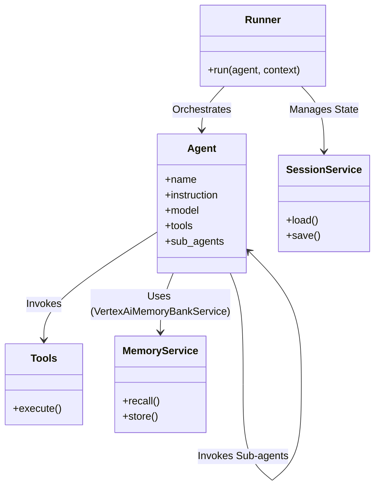
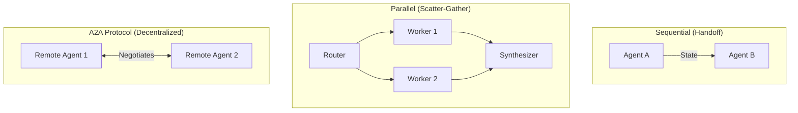
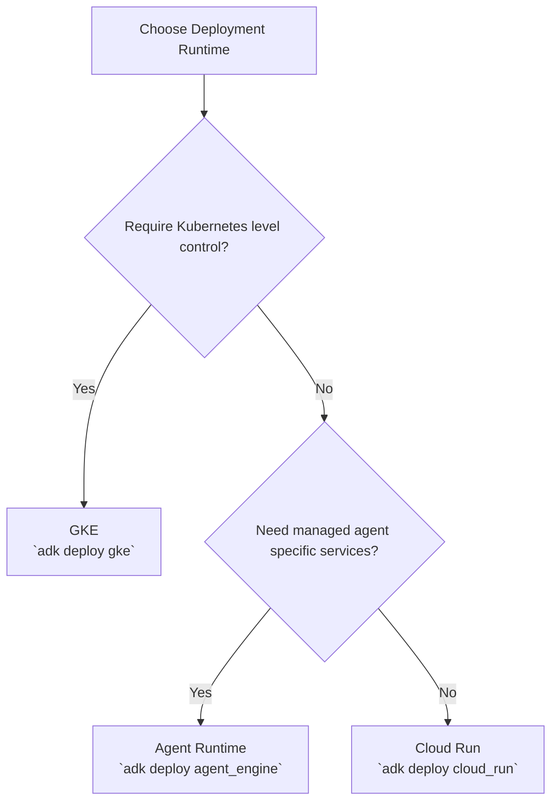
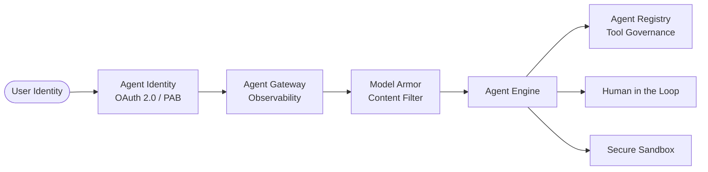

# Google Cloud Certified Professional Agentic Architect — Study Guide

> [!IMPORTANT]
> **Unofficial Certification Guide**: This document is an unofficial companion study guide. Refer to the official exam guide for authoritative objectives.

This guide provides an in-depth architectural breakdown for the exam. It is ordered by the weight of each domain on the exam. Use it for final review before taking the exam.

## Glossary of Renamed Products
- **Agent Runtime**: Formerly *Agent Engine*. Managed runtime for deploying agents.
- **Agent Search**: Formerly *Vertex AI Search*.
- **Agent Registry**: Central metadata, discovery, and governance catalog for agents, skills, and tools.
- **Agent Gateway**: Reverse proxy for observing, securing, and routing traffic to agentic workflows.

---

## 1. Domain 3: Developing Custom Agents (~33%)

This is the largest and most critical domain. It requires a deep understanding of the **Agent Development Kit (ADK)** (version 2.9.0), the Google GenAI SDK, model selection, memory, and orchestration.

### The ADK Object Model
To build agents in code, you must understand the ADK architecture:

### Model Selection Matrix
Selecting the right model is a core exam skill. Do not rely on floating aliases (like `gemini-flash-latest`), memorize the pinned models and their specific use cases:

| Model ID | Primary Best Use Case | Capabilities & Limits |
| :--- | :--- | :--- |
| `gemini-3.7-flash` / `gemini-3.8-flash` | **Default Enterprise Agent Workhorse**: Complex reasoning, coding, tool orchestration, multi-step planning | 1M in / 65K out |
| `gemini-2.5-pro` | Deep analytical synthesis, complex multi-document auditing, extreme mathematical proofs | 1M in / 65K out |
| `gemini-3.5-flash-lite` | High-throughput classification, routing, basic sentiment extraction | 1M in / 65K out |
| `gemma-4-26b-a4b-it` / `gemma-4-31b-it` | **Self-hosted / SLM**: Edge computing, air-gapped environments, strict data residency requirements | 262K in / 32K out |
| `gemini-embedding-2` | **RAG / Vector Search**: Converting text to semantic embeddings | 8,192 input tokens limit |
| `gemini-3.5-live-translate-preview` | **Live API**: Real-time bidirectional streaming | Native audio |

### Multi-Agent Orchestration Topologies
Agents can be orchestrated using the ADK's `google.adk.workflow` graph engine or agentic protocols.

- **Graph Workflow**: Deterministic edge-routing using `Workflow`, `FunctionNode`, and `JoinNode`.
- **Agent2Agent (A2A)**: Stateful, decentralized negotiation over protocols using `google.adk.a2a`. Requires `a2a-sdk` (installed via `google-adk[a2a]`).
- **Model Context Protocol (MCP)**: Agent-to-tool connection. `MCPToolset` standardizes tool access. 

*Covered in: [Track 3 / Lab 07-12](tracks/03_custom_agents)*

---

## 2. Domain 4: Evaluating and Deploying Agentic Workflows (~22%)

### Deployment Runtime Decision Tree
Understanding where to deploy your agent based on cost, latency, and control is frequently tested. 

- **Agent Runtime**: Managed agent-hosting, native ADK support, automatic session management.
- **Cloud Run**: Standard serverless containerized HTTP/gRPC agents. Fast cold starts, scale-to-zero.
- **GKE**: Complex multi-agent clusters, strict VPC isolation, and gVisor sandboxing via `GkeCodeExecutor` (requires `google-adk[extensions]`).

### Evaluation
Agent evaluation goes beyond static prompt scoring. Use `AgentEvaluator` (via `adk eval`) for:
- **Tool Selection Quality**: Did the agent pick the right tool?
- **Trajectory Evaluation**: `trajectory_evaluator` checks the path taken to reach the final state.
- **Final Response Quality**: `final_response_match_v2` checks the ultimate answer against golden datasets.

*Covered in: [Track 4 / Lab 13-15](tracks/04_evaluate_and_deploy)*

---

## 3. Domain 2: Using Coding Agents for Application Development (~17%)

### Code Executors and Sandboxing
When agents write and execute code, they must be strictly isolated.
- **GkeCodeExecutor**: Executes Python in a dedicated GKE Pod. Supports `job` and `sandbox` isolation modes. `sandbox` provides stricter security (e.g., gVisor).
- **CloudRunSandboxCodeExecutor**: Runs inside a Cloud Run container via the `sandbox` CLI. 
- **UnsafeLocalCodeExecutor**: Runs code directly on the host machine. **Highly unsafe**, likely an exam distractor for what *not* to use in production.

### Customizing Coding Agents
- **Antigravity SDK**: Build custom coding agents.
- **MCP Servers**: Connect coding agents to tools and IDEs securely.

*Covered in: [Track 2 / Lab 04-06](tracks/02_coding_agents)*

---

## 4. Domain 5: Securing and Governing Agentic Workflows (~15%)

Security spans multiple distinct layers of enforcement.

- **Agent Identity**: Dedicated workload principal (`GcpAuthProvider`). A **Principal Access Boundary (PAB)** restricts the *maximum* resources this identity can access, acting as a blast-radius cap.
- **Agent Gateway**: Reverse proxy for rate limiting, tracking, and traffic monitoring.
- **Model Armor**: Inspects prompts and responses. Tested frequently: `block_on_screening_failure` (Fail-closed vs. Fail-open).
- **Agent Registry**: Central governance plane (`AgentRegistry`). Provides discovered endpoints for remote A2A agents and `MCPToolset`.
- **Human-in-the-Loop (HITL)**: Required for consequential actions. ADK implements this via `request_input` or `get_user_choice`.

*Covered in: [Track 5 / Lab 16-18](tracks/05_secure_and_govern)*

---

## 5. Domain 1: Building Agents Using Low-Code Tools (~13%)

### Low-Code Workflows
- **Gemini Enterprise Agent Designer / CX Agent Studio**: Use for deterministic, state-based workflows.
- **Pages**: Nodes representing conversation stages.
- **Transition Routes**: Branching logic based on parameters or intent matching.
- **Event Handlers**: Built-in fallback routes.
- **Multimodal**: Native ingestion of images, video, and audio directly into the context window, avoiding separate OCR/transcription pipelines.

*Covered in: [Track 1 / Lab 01-03](tracks/01_low_code_agents)*

---

## Decision Tree: What service should I use?

| Scenario / Requirement | Recommended Architecture | Exam Rationale |
| :--- | :--- | :--- |
| Need cross-conversation, long-term semantic memory | **Agent Platform Memory Bank** | `VertexAiMemoryBankService` provides durable, associative recall beyond single sessions. |
| Need strict blast-radius limitation for an agent | **Agent Identity with Principal Access Boundary (PAB)** | PAB is a hard cap on resources a principal can access, unlike IAM which grants access. |
| Agent needs to query proprietary databases without custom code | **Google Cloud MCP Servers** | MCP provides standardized client-server tool access out of the box. |
| Decentralized collaboration between distinct agent teams | **A2A Protocol** | Agent-to-Agent allows stateful negotiation rather than a rigid top-down supervisor. |
| Securely executing generated code in production | **GkeCodeExecutor (Sandbox Mode)** | gVisor provides syscall-level isolation for untrusted code execution. |
| Guarding against prompt injection and PII leakage | **Model Armor** | `ModelArmorPlugin` filters malicious inputs/outputs directly in the ADK pipeline. |

## Most Likely To Be Tested Distinctions

| The Distinction | Why it matters |
| :--- | :--- |
| **MCP vs. A2A** | MCP connects agents to **tools/resources**. A2A connects agents to **other agents**. |
| **Fail-closed vs. Fail-open Guardrails** | Configured via Model Armor's `block_on_screening_failure`. Crucial for high-security environments. |
| **PAB vs. IAM Allow Policies** | IAM grants access; PAB limits the *maximum* possible access (a ceiling, not a grant). |
| **Agent Runtime vs. Cloud Run vs. GKE** | Agent Runtime has managed ADK-specific integrations (e.g., Memory Bank); Cloud Run is portable serverless container choice; GKE offers Kubernetes-level sandbox control (gVisor). |
| **Session State vs. Memory** | Sessions (`VertexAiSessionService`) hold turn-by-turn state for the current interaction. Memory (`VertexAiMemoryBankService`) persists long-term facts. |
| **Tool-Trajectory vs. Final-Response Scoring** | `trajectory_evaluator` validates *how* the agent reached the answer (e.g., correct tools). `final_response_match_v2` validates *what* the answer is. |
