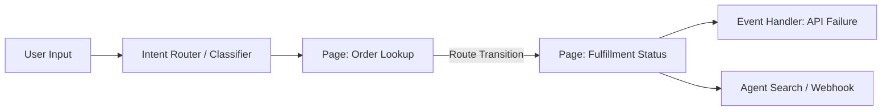
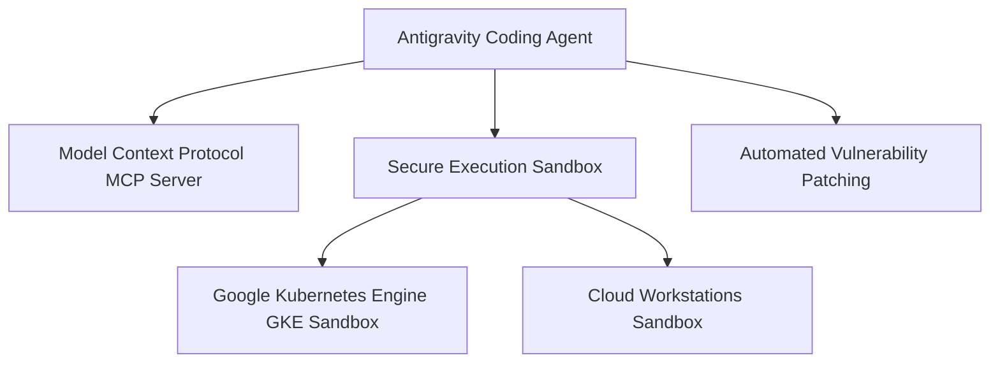
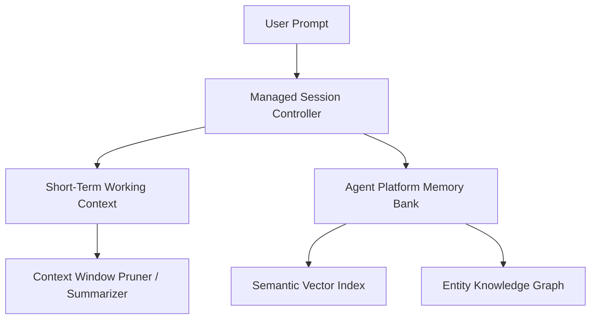

# Google Cloud Certified Professional Agentic Architect — Comprehensive Study Guide

This study guide provides an in-depth architectural and theoretical breakdown for every section of the Google Cloud Certified Professional Agentic Architect exam. Use this guide alongside the 13 hands-on modules and practice exams.

---

## Table of Contents
1. [Domain 1: Building Agents Using Low-Code Tools (~13%)](#domain-1-building-agents-using-low-code-tools-13)
2. [Domain 2: Using Coding Agents for Application Development (~17%)](#domain-2-using-coding-agents-for-application-development-17)
3. [Domain 3: Developing Custom Agents (~33%)](#domain-3-developing-custom-agents-33)
4. [Domain 4: Evaluating and Deploying Agentic Workflows (~22%)](#domain-4-evaluating-and-deploying-agentic-workflows-22)
5. [Domain 5: Securing and Governing Agentic Workflows (~15%)](#domain-5-securing-and-governing-agentic-workflows-15)
6. [Architectural Decision Cheatsheet](#architectural-decision-cheatsheet)

---

## Domain 1: Building Agents Using Low-Code Tools (~13%)

### 1.1 Low-Code Platforms Overview
Google Cloud provides low-code agent creation through **Gemini Enterprise Agent Designer** and **Customer Experience Agent Studio (CX Agent Studio)** (formerly Dialogflow CX).



#### Key Architecture Concepts:
- **Pages**: Fundamental state nodes representing distinct conversation stages. Each page maintains its own state, entry fulfillment, and active parameters.
- **Transition Routes**: Conditional branches triggered by user intents, parameter matching, or agentic condition evaluation (e.g., `if $session.params.order_id != null`).
- **Event Handlers**: Built-in fallback routes triggered by system events (e.g., `sys.no-match-default`, `sys.no-input-default`, webhook timeout).
- **Prompt Templates**: In-console few-shot and Chain-of-Thought (CoT) system instructions formatted to steer low-code agents without writing Python code.

### 1.2 Enterprise Data Grounding & Multimodal Ingestion
- **Agent Search (Vertex AI Search)**: Indexes unstructured documents (PDFs, HTML, Confluence, Google Drive) and provides semantic retrieval with automatic snippet citations.
- **Multimodal Ingestion**: Gemini Enterprise natively processes multimodal payloads (video frame sequences, audio recordings, scanned receipts). Video timestamps and audio transcriptions are processed directly in the Gemini context window up to 2 million tokens.

---

## Domain 2: Using Coding Agents for Application Development (~17%)

### 2.1 Coding Agents & Developer Tooling
Coding agents (e.g., **Google Antigravity**, **Claude Code on Google Cloud**) act as autonomous pair programmers that inspect codebases, execute shell commands, manage tests, and refactor applications.



#### Sandboxing Strategies:
- **Antigravity Sandboxing**: Enforces path isolation, read/write workspace restrictions, and network access boundaries (Standard vs Bypass Sandbox Mode).
- **Cloud Workstations**: Fully managed developer environments running inside private VPCs, enforcing zero-trust corporate security policies.
- **GKE Sandboxes**: Using gVisor (`runsc`) container runtime to run untrusted agent-generated code with syscall filtering.

### 2.2 Customizing Antigravity with Skills, Plugins & Rules
- **Skills (`skills/<name>/SKILL.md`)**: Progressive disclosure capabilities. The model only reads the full instructions when activated by relevance or explicit call.
- **Rules (`GEMINI.md`, `AGENTS.md`)**: Contextual instructions walking up from the current directory to repository root.
- **Plugins (`plugin.json`)**: Bundles packaging skills, rules, and MCP configurations for enterprise reuse.
- **Lifecycle Hooks (`hooks.json`)**: Pre-tool execution, post-tool validation, and error recovery interceptors.
- **Agents CLI (`agy`)**: Command-line tool to initialize, validate, benchmark, and deploy agent skills.

---

## Domain 3: Developing Custom Agents (~33%)

This is the largest domain in the exam. It requires master-level understanding of the **Agent Development Kit (ADK)**, the **Google GenAI SDK**, **Gemini 3.7 Flash**, and multi-agent coordination.

### 3.1 Model Selection & Thinking Budget Matrix

| Model | Primary Best Use Case | Context Window | Thinking Support | Latency / Cost Tier |
| :--- | :--- | :---: | :---: | :---: |
| **Gemini 3.7 Flash** | **Default Enterprise Agent Workhorse**: Complex reasoning, coding, tool orchestration, multi-step planning | 1M - 2M tokens | ✅ Dynamic Thinking Budget (128 - 64K tokens) | Ultra-Low Latency / Cost-Effective |
| **Gemini 2.5 Pro** | Deep analytical synthesis, complex multi-document auditing, extreme mathematical proofs | 2M tokens | ✅ Built-in reasoning | Moderate Latency / Higher Cost |
| **Gemini 2.5 Flash-Lite** | High-throughput classification, routing, basic sentiment extraction | 1M tokens | ❌ Fast deterministic | Lowest Latency / Lowest Cost |
| **Gemma 2 (2B / 9B / 27B)** | On-device, edge computing, zero-network air-gapped environments via LiteRT | 8K tokens | ❌ Fine-tunable SLM | Self-hosted compute cost only |

### 3.2 Agent Memory, State & Sessions



- **Short-Term Working Context**: Active conversation messages in the context window. Uses FIFO pruning or sliding-window summarization when approaching token limits.
- **Managed Sessions**: Ephemeral or persistent session IDs storing conversation state, variables, and tool invocation history across turns.
- **Agent Platform Memory Bank**: Long-term associative memory that extracts key user preferences, facts, and past decisions into a persistent semantic memory store.
- **Redis / Firestore Backends**: Low-latency distributed session cache (Memorystore for Redis) for high-scale multi-instance agent deployments.

### 3.3 Enterprise RAG & Vector Search 1.0
- **Embeddings**: `text-embedding-005` (768-dim / 1536-dim) with Matryoshka dimensionality reduction for optimized vector storage.
- **Vector Search 1.0 (Vertex AI Vector Search)**: Scalable, low-latency approximate nearest neighbor (ANN) search using ScaNN (Score-aware Scalable Nearest Neighbors).
- **Agent Retrieval**: Native tool connector allowing agents to query vector indexes with dynamic filters, similarity thresholds, and reranking.

### 3.4 Model Context Protocol (MCP) & MCP Toolbox for Databases
- **MCP Protocol**: Standardized client-server protocol over `stdio` or `Server-Sent Events (SSE)` exposing resources, prompts, and tools.
- **Google Cloud MCP Toolbox**: Pre-built MCP servers for BigQuery, Cloud SQL, Spanner, AlloyDB, and Google Cloud Storage.

### 3.5 Multi-Agent Orchestration Patterns & Agent2Agent (A2A)

```mermaid
graph TD
    subgraph Hierarchical ["Hierarchical Supervisor Pattern"]
        Supervisor[Supervisor Agent (Gemini 3.7 Flash)] -->|Delegate| ResearchAgent[Research Agent]
        Supervisor -->|Delegate| CodeAgent[Coding Agent]
        Supervisor -->|Delegate| ReviewAgent[Review Agent]
    end

    subgraph Sequential ["Sequential Pipeline Pattern"]
        Step1[Agent 1: Ingestion] --> Step2[Agent 2: Enrichment] --> Step3[Agent 3: Synthesis]
    end

    subgraph A2A ["Agent2Agent (A2A) Protocol"]
        AgentA[Customer Service Agent] <-->|A2A Handoff| AgentB[Billing Dispute Agent]
    end
```

- **Sequential Agents**: Output of Agent A becomes input to Agent B (linear data processing).
- **Parallel Agents**: Multiple specialist agents analyze the same task concurrently; results are synthesized by a reduction agent.
- **Hierarchical Supervisor**: Central router decides which subagent to invoke dynamically, passing state and receiving output.
- **Agent2Agent (A2A)**: Direct negotiation and stateful handoff protocol between decentralized autonomous agents.

---

## Domain 4: Evaluating and Deploying Agentic Workflows (~22%)

### 4.1 Agent Evaluation Frameworks
Agent evaluation differs fundamentally from traditional static ML evaluation because agents interact iteratively with environments and tools.

```mermaid
graph LR
    GoldenDataset[Golden Dataset: Prompts + Expected Actions] --> AgentRuntime[Agent Under Test]
    AgentRuntime --> ExecutionTraces[Traces & Tool Calls]
    ExecutionTraces --> Evalset[ADK Evalset Tooling]
    ExecutionTraces --> LLMJudge[Agent Platform Autorater (Gemini 3.7 Flash)]
    Evalset --> Scorecard[Quality Scorecard: Faithfulness, Tool Precision, Latency]
```

#### Core Metrics:
1. **Tool Selection Accuracy**: Did the agent pick the correct tool from the available schema?
2. **Argument Precision**: Were the extracted function arguments valid, type-safe, and complete?
3. **Retrieval Faithfulness**: Are the agent's assertions grounded strictly in retrieved context (zero hallucination)?
4. **Answer Relevance**: Did the final response directly address user intent without extraneous commentary?
5. **Task Completion Rate**: Percentage of multi-turn goals resolved without human intervention or failure.

### 4.2 Production Deployment Runtimes Comparison

| Runtime | Best For | Cold Start | Scaling | State Management |
| :--- | :--- | :---: | :---: | :---: |
| **Agent Runtime** (formerly Agent Engine) | **Managed Agent Hosting**: Native ADK support, automatic session management, built-in Memory Bank | Low | Automatic Serverless | Built-in Managed Sessions & Memory Bank |
| **Cloud Run** | **Standard Custom Microservices**: Containerized FastAPI / Express agents, HTTP/gRPC triggers | Fast (<1s) | 0 to 1000+ instances | External (Redis / Firestore) |
| **Google Kubernetes Engine (GKE)** | **Complex Multi-Agent Clusters**: High GPU/TPU requirements, gVisor sandboxing, strict VPC isolation | Slower (Pod pull) | Horizontal Pod Autoscaling (HPA) | Distributed State Store (StatefulSets/Redis) |

### 4.3 Troubleshooting Production Agent Failures
- **Semantic Drift**: Agent loses original user goal across long multi-turn tool loops. *Mitigation: Re-inject root goal in system prompt scratchpad.*
- **Infinite Reasoning Loops**: Agent calls the same failing tool repeatedly. *Mitigation: Hard turn budgets (`max_turns=5`), cycle detection hooks, and explicit fallback triggers.*
- **Latency Bottlenecks**: High TTFT (Time to First Token) due to large tool definitions or excessive context. *Mitigation: Progressive tool disclosure, parallel tool calling, and prompt caching.*

---

## Domain 5: Securing and Governing Agentic Workflows (~15%)

### 5.1 Security Architecture & Access Boundaries

```mermaid
graph TD
    User[User / Client] --> AgentGateway[Agent Gateway (OAuth 2.0 Auth Manager)]
    AgentGateway --> ModelArmor[Model Armor: Prompt Injection / Jailbreak Filter]
    ModelArmor --> AgentIdentity[Agent Identity & Principal Access Boundary PAB]
    AgentIdentity --> Tools[Protected Enterprise Tools & Databases]
    Tools --> HITL{High-Risk Action?}
    HITL -->|Yes| HumanApproval[Human-In-The-Loop Approval Gate]
    HITL -->|No| Execute[Execute API Call]
```

#### Key Governance Components:
- **Agent Identity**: Dedicated IAM principal representing the autonomous agent, independent of the invoking end-user.
- **Principal Access Boundary (PAB)**: IAM boundary ensuring the agent cannot elevate permissions or access resources outside its designated VPC / project boundary.
- **Agent Gateway**: Reverse proxy enforcing authentication, rate-limiting, audit logging, and payload validation.
- **Model Armor**: Real-time security filter guarding against prompt injections, system prompt exfiltration, malicious tool hijacking, and PII leakage (integrated with Sensitive Data Protection / Cloud DLP).
- **Human-in-the-Loop (HITL)**: Deterministic policy requiring interactive human approval before executing irreversible actions (e.g., executing database mutations, sending financial wires).

---

## Architectural Decision Cheatsheet

| Scenario / Requirement | Recommended Architecture | Exam Rationale |
| :--- | :--- | :--- |
| Business user needs quick visual customer service bot with structured form filling | **CX Agent Studio / Agent Designer** | Low-code, state-machine pages and routes minimize coding overhead. |
| Autonomous coding agent needing safe execution of untrusted scripts | **Antigravity with GKE Sandbox (gVisor)** | Ensures kernel-level isolation and network restriction for code execution. |
| Complex enterprise reasoning with strict sub-second tool execution | **Gemini 3.7 Flash with Dynamic Thinking** | Best balance of high reasoning capability, low latency, and tool proficiency. |
| Long-term memory across sessions spanning months | **Agent Platform Memory Bank** | Automatically indexes and semantically recalls user preferences and facts. |
| Agent needs to query existing BigQuery and Cloud SQL without custom API code | **Google Cloud MCP Toolbox for Databases** | Standardized MCP servers provide instant, secure SQL tool interfaces. |
| Autonomous workflow involving 3 specialized teams (Sales, Inventory, Billing) | **Agent2Agent (A2A) with Hierarchical Supervisor** | Supervisor routes tasks to specialist agents using A2A handoff protocols. |
| Evaluation of multi-turn tool calling before production promotion | **ADK Evalset with Golden Datasets & Gemini 3.7 Flash Autorater** | Quantitative validation of tool selection, argument accuracy, and faithfulness. |
| Restricting autonomous agents from accessing payroll database | **Agent Identity with Principal Access Boundary (PAB)** | Strictly scopes the agent's IAM token to authorized data stores. |
| Protecting public-facing agents against jailbreaks and prompt injections | **Model Armor + Agent Gateway** | Inline content inspection filters malicious payloads before LLM inference. |
