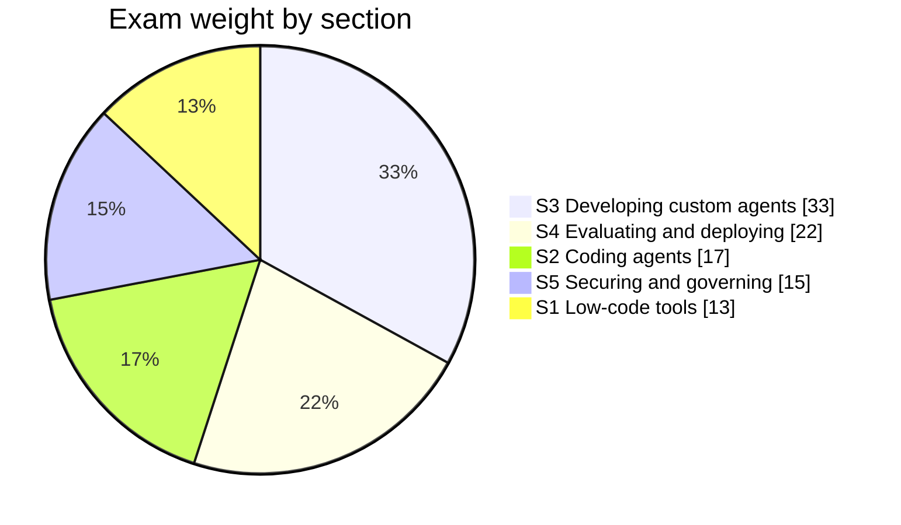

# Exam guide — objectives, weights, and where each is covered

> [!IMPORTANT]
> **Personal, unofficial repository.** This is a personal study project. It is **not
> affiliated with, endorsed by, or maintained by Google or Google Cloud**. The objectives
> below are quoted from the official [Professional Agentic Architect exam guide][guide].
> Always confirm the current guide, logistics, and registration details at
> **[cloud.google.com/learn/certification/agentic-architect](https://cloud.google.com/learn/certification/agentic-architect)**.
> Where anything here disagrees with the official source, **the official source is correct**.
> See [`DISCLAIMER.md`](../DISCLAIMER.md) for the full disclaimer.

[guide]: https://services.google.com/fh/files/misc/professional_agentic_architect_exam_guide_english.pdf

The raw text extracted from the official PDF is preserved verbatim in
[`exam_guide_extracted.txt`](exam_guide_extracted.txt) so you can diff this
mapping against the source yourself.

---

## Who the exam is for

> *"A Google Cloud Certified Professional Agentic Architect is a technical
> practitioner who designs and manages autonomous, AI-driven agentic workflows in
> Google Cloud. This individual is an experienced developer or architect who
> builds agentic solutions while considering reliability, performance, cost,
> security, and scalability. This individual has deep experience utilizing large
> language models (LLMs), applying agent design patterns, writing code, and
> integrating data sources in Google Cloud."*

Read that carefully. Three phrases set the difficulty:

- **"designs and manages"** — you are tested on judgement, not just syntax.
- **"reliability, performance, cost, security, and scalability"** — every scenario
  question hides a trade-off along one of these five axes.
- **"writing code"** — this is not a whiteboard-only architect exam. One third of
  it is building agents in code.

---

## Weighting — and what it should do to your study plan

| Section | Title | Weight | Track |
| :---: | :--- | :---: | :--- |
| 1 | Building agents using low-code tools | ~13% | [Track 1](../tracks/01_low_code_agents) |
| 2 | Using coding agents for application development | ~17% | [Track 2](../tracks/02_coding_agents) |
| 3 | **Developing custom agents** | **~33%** | [Track 3](../tracks/03_custom_agents) |
| 4 | Evaluating and deploying agentic workflows | ~22% | [Track 4](../tracks/04_evaluate_and_deploy) |
| 5 | Securing and governing agentic workflows | ~15% | [Track 5](../tracks/05_secure_and_govern) |

> [!TIP]
> **Sections 3 and 4 are 55% of the exam between them.** If your time is limited,
> master ADK (Track 3) and evaluation/deployment (Track 4) before anything else.
> Section 1 is the lightest at 13% — do not over-invest in console click-paths.

---

## Section 1 — Building agents using low-code tools (~13%)

### 1.1 Configuring agentic workflows and behavior using low-code tools

> - Configuring state-based workflows (pages, transition routes, and event
>   handlers) using Gemini Enterprise tools (e.g., Gemini Enterprise Agent
>   Designer and Customer Experience Agent Studio [CX Agent Studio])
> - Creating system instructions and in-console prompt templates (e.g., few-shot
>   and chain-of-thought) to guide agent behavior (e.g., Agent Designer and CX
>   Agent Studio)

Covered by [Lab 01](../tracks/01_low_code_agents/lab_01_agent_designer_workflows)
and [Lab 02](../tracks/01_low_code_agents/lab_02_cx_agent_studio_state).

### 1.2 Connecting enterprise data to Gemini Enterprise

> - Configuring agents to securely connect and query enterprise proprietary data
>   sources (e.g., Gemini Enterprise and Agent Search)
> - Ingesting and processing unstructured multimodal data (e.g., videos, audio,
>   and images) into the agentic workflow

Covered by [Lab 03](../tracks/01_low_code_agents/lab_03_enterprise_data_and_multimodal).

---

## Section 2 — Using coding agents for application development (~17%)

### 2.1 Using coding agents effectively

> - Configuring coding agents with Model Context Protocol (MCP) servers, custom
>   skills, and access to tools (e.g., Antigravity and Claude Code on Google Cloud)
> - Using coding agents in secure sandboxes (e.g., Google Kubernetes Engine [GKE],
>   Cloud Workstations, and Antigravity)
> - Using coding agents to refactor source code, optimize execution runtimes, and
>   patch application-layer vulnerabilities

Covered by [Lab 04](../tracks/02_coding_agents/lab_04_mcp_and_tooling)
and [Lab 05](../tracks/02_coding_agents/lab_05_secure_sandboxes).

### 2.2 Customizing coding agents for enterprise workflows

> - Creating skills, plugins, extensions hooks, rules, and subagents using Antigravity
> - Augmenting Antigravity with Agents CLI to build, scale, govern, and optimize
>   deployed agents

Covered by [Lab 06](../tracks/02_coding_agents/lab_06_antigravity_customization).

---

## Section 3 — Developing custom agents (~33%)

> The largest section. Six labs.

### 3.1 Designing and building agentic workflows in code

> - Selecting and configuring the appropriate language model (e.g., large language
>   model [LLM] vs. small language model [SLM], self-hosted vs. software as a
>   service [SaaS], and open-source software [OSS] vs. proprietary LLM) considering
>   cost, security, and agent architecture
> - Building custom agents using open-source libraries (e.g., Agent Development
>   Kit [ADK])
> - Configuring sessions and memory (e.g., Agent Platform Memory Bank and managed
>   sessions)
> - Configuring skills using Agents CLI (e.g., plugins and agent vs. human mode)

Covered by [Lab 07](../tracks/03_custom_agents/lab_07_model_selection),
[Lab 08](../tracks/03_custom_agents/lab_08_adk_fundamentals),
[Lab 09](../tracks/03_custom_agents/lab_09_sessions_and_memory),
[Lab 10](../tracks/03_custom_agents/lab_10_tools_and_skills).

### 3.2 Integrating enterprise domain knowledge

> - Designing, configuring, and managing retrieval-augmented generation (RAG)
>   pipelines and vector retrieval systems (e.g., embedding models, similarity
>   scoring, and reranking) using appropriate services such as vector databases
>   (e.g., Vector Search and Agent Retrieval)
> - Configuring agent permissions (e.g., Agent Identity)
> - Using Google Cloud tools (e.g., Agent Registry, Google Cloud MCP Servers) to
>   configure prebuilt and custom capabilities (e.g., custom integration layers for
>   managed databases, API integrations, and MCP server that connects agents to
>   third-party SaaS tools and remote servers)

Covered by [Lab 10](../tracks/03_custom_agents/lab_10_tools_and_skills)
and [Lab 11](../tracks/03_custom_agents/lab_11_rag_and_retrieval).

### 3.3 Orchestrating and coordinating agentic workflows

> - Orchestrating agents using agentic protocols (e.g., MCP and Agent2Agent [A2A])
> - Selecting and coordinating multiagent handoffs and workflows (e.g., parallel
>   agents, sequential agents, and graph workflow) using Google Cloud tools (e.g.,
>   Agent Identity, Agent Registry, Agent Runtime, and agent policies)

Covered by [Lab 12](../tracks/03_custom_agents/lab_12_multi_agent_and_a2a).

---

## Section 4 — Evaluating and deploying agentic workflows (~22%)

### 4.1 Evaluating agents in development and in production

> - Creating test sets for agent evaluation (e.g., golden data, prompts, and edge cases)
> - Creating continuous evaluation pipelines to assess an agent's tool execution
>   based on established success criteria
> - Determining the appropriate evaluation framework and tooling (e.g., ADK
>   evaluation tooling (evalset), Agent Platform Gen AI evaluation service, and
>   custom autoraters)
> - Evaluating an agentic system against a golden dataset to assess agent response
>   and retrieval quality (e.g., using ADK)

Covered by [Lab 13](../tracks/04_evaluate_and_deploy/lab_13_agent_evaluation).

### 4.2 Deploying and scaling production workloads

> - Selecting optimal deployment runtime based on the use case, requirements, and
>   cost (e.g., Agent Runtime, Cloud Run, and GKE)
> - Troubleshooting agent issues (e.g., drift, tool invocation latency, agent
>   reasoning loops, and system failures)
> - Monitoring and optimizing agents for performance, reliability, and cost (e.g.,
>   identify logic errors, latency bottlenecks, and hallucinations)

Covered by [Lab 14](../tracks/04_evaluate_and_deploy/lab_14_deployment_runtimes)
and [Lab 15](../tracks/04_evaluate_and_deploy/lab_15_observability_and_troubleshooting).

---

## Section 5 — Securing and governing agentic workflows (~15%)

### 5.1 Configuring agent security and governance

> - Implementing authentication and secure tool execution (e.g., agent-to-tool API
>   calls using OAuth 2.0)
> - Configuring principal access boundary (PAB) policies using Agent Identity
> - Configuring Agent Gateway to monitor traffic and track agents
> - Designing and configuring agentic governance and policy enforcement (e.g.,
>   Agent Registry and Model Armor)

Covered by [Lab 16](../tracks/05_secure_and_govern/lab_16_agent_identity_and_auth)
and [Lab 18](../tracks/05_secure_and_govern/lab_18_governance_gateway_registry).

### 5.2 Implementing secure agent behavior and execution

> - Designing appropriate safety frameworks and guardrails (e.g., Agent Gateway,
>   Model Armor, and human-in-the-loop [HITL])
> - Configuring secure access to data and identity propagation (e.g., Agent Gateway
>   and Agent Registry)

Covered by [Lab 17](../tracks/05_secure_and_govern/lab_17_model_armor_and_hitl)
and [Lab 18](../tracks/05_secure_and_govern/lab_18_governance_gateway_registry).

---

## Tools in scope — and the code behind each name

The guide lists 26 tools. Product names changed in this rebrand, so the left
column is exam vocabulary and the right column is what you actually import or run.
Verification status for every row is in [`VERIFIED_FACTS.md`](VERIFIED_FACTS.md).

| Exam name | What it actually is |
| :--- | :--- |
| Agent Development Kit (ADK) | `pip install google-adk` (2.9.0) |
| Agent evaluation | `google.adk.evaluation.AgentEvaluator`, `adk eval` |
| **Agent Gateway** | ⚠️ not publicly verifiable yet — see Lab 18 |
| Agent Identity | `google.adk.integrations.agent_identity` |
| Agent Registry | `google.adk.integrations.agent_registry.AgentRegistry` |
| Agent Retrieval and Vector Search 1.0 | Vector Search + `VertexAiRagMemoryService` |
| Agent Runtime *(formerly Agent Engine)* | `adk deploy agent_engine` |
| Agent Search *(formerly Vertex AI Search)* | `google.adk.tools.VertexAiSearchTool` |
| Agentic protocols (A2A, MCP) | `google.adk.a2a`, `google.adk.tools.MCPToolset` |
| Agents CLI in Agent Platform | ⚠️ see Lab 06 — `adk` CLI is the verified stand-in |
| Antigravity (CLI, SDK, App) | coding-agent platform — Track 2 |
| Auth Manager (OAuth 2.0) | `google.adk.auth` (`OAuth2Auth`, exchanger, refresher) |
| BigQuery | `google.adk.tools.bigquery.BigQueryToolset` |
| Cloud Run | `adk deploy cloud_run`, `CloudRunSandboxCodeExecutor` |
| Cloud SQL | `DatabaseSessionService` backend |
| Cloud Storage | `GcsArtifactService`, `integrations.gcs.GCSToolset` |
| Firestore | `google.adk.integrations.firestore` |
| Gemini Enterprise | console product — Track 1 |
| Gemini LLMs | see the verified model catalog in `common/models.py` |
| Google Cloud Observability | `google.adk.telemetry`, `adk telemetry` |
| GKE | `adk deploy gke`, `GkeCodeExecutor` |
| Memorystore for Redis | `google.adk.integrations.redis.RedisSessionService` |
| Model Armor | `google.adk.integrations.model_armor.ModelArmorPlugin` |
| MCP servers | `MCPToolset`, `RemoteMcpServer`, `mcp` 2.2.0 |
| Model Garden | `google.adk.models.Gemma`, `LiteLlm`, `Gemma3Ollama` |
| RAG Engine | `VertexAiRagMemoryService` — Lab 11 |
| Sensitive Data Protection | `google-cloud-dlp` — Lab 17 |
| Skill Registry | `google.adk.skills.SkillRegistry`, `GCPSkillRegistry` |

---

## High-yield distinctions

The exam is scenario-based. These are the pairs it most reliably forces you to
separate. Each links to the lab that drills it.

| Distinction | Why it is tested | Lab |
| :--- | :--- | :--- |
| Low-code state machine vs. code-first agent | Deterministic, auditable business process vs. open-ended reasoning | [02](../tracks/01_low_code_agents/lab_02_cx_agent_studio_state) |
| MCP vs. A2A | Agent-to-**tool** vs. agent-to-**agent** | [12](../tracks/03_custom_agents/lab_12_multi_agent_and_a2a) |
| Session state vs. memory | Within one conversation vs. across conversations | [09](../tracks/03_custom_agents/lab_09_sessions_and_memory) |
| Workflow agents vs. LLM transfer | Deterministic order vs. model-decided routing | [12](../tracks/03_custom_agents/lab_12_multi_agent_and_a2a) |
| Agent Runtime vs. Cloud Run vs. GKE | Managed convenience vs. container control vs. cluster control | [14](../tracks/04_evaluate_and_deploy/lab_14_deployment_runtimes) |
| Tool-trajectory vs. final-response scoring | Did it work *correctly* vs. did it *answer* | [13](../tracks/04_evaluate_and_deploy/lab_13_agent_evaluation) |
| PAB vs. IAM roles | Hard blast-radius cap vs. granted permissions | [16](../tracks/05_secure_and_govern/lab_16_agent_identity_and_auth) |
| LLM vs. SLM, SaaS vs. self-hosted | Capability vs. cost vs. data residency | [07](../tracks/03_custom_agents/lab_07_model_selection) |
| Native multimodal vs. preprocessing pipeline | Cross-modal reasoning vs. deterministic extraction | [03](../tracks/01_low_code_agents/lab_03_enterprise_data_and_multimodal) |
| Fail-closed vs. fail-open guardrails | `block_on_screening_failure` | [17](../tracks/05_secure_and_govern/lab_17_model_armor_and_hitl) |
