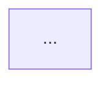

# Lab authoring contract

Every lab in `tracks/` **must** follow this contract. It exists so that eighteen
labs written by different people still feel like one coherent course, and so that
the whole suite stays runnable, free, and CI-safe.

---

## 1. Files every lab must contain

```
lab_NN_short_name/
├── README.md          # the teaching material (see section 3)
├── lab.py             # the runnable demonstration
├── run_lab.sh         # standard entrypoint: demo + tests
├── cleanup.sh         # idempotent teardown
└── tests/
    └── test_lab_NN.py # pytest assertions
```

---

## 2. The offline/live contract

> [!IMPORTANT]
> **Offline by default. Always.** CI runs every lab with no credentials and no
> network. A lab that fails without a Google Cloud project is a broken lab.

```python
from common import load_config, require_live

config = load_config()
if require_live(config):
    run_live(config)     # real API calls, costs money
else:
    run_offline()        # deterministic, free, no network
```

- `python lab.py` → offline, free, deterministic, no network.
- `python lab.py --live` → real Google Cloud calls, only if env vars are present.
- If `--live` is passed but config is incomplete, `require_live()` prints what is
  missing and returns `False`. The lab then **falls back to offline**, never crashes.

**The offline path must still teach the real API.** Build the real ADK objects,
inspect the real agent graph, assert on real class names. Only the *model call*
is stubbed. A lab that teaches a fake API is worse than no lab.

---

## 3. README structure — all eleven parts, in this order

Use this exact skeleton. It is what makes the labs independent: a learner can
open any lab cold and not need the previous one.

````markdown
# Lab NN — <Title>

**Exam section:** <N. Title> (~X% of the exam)
**Objectives covered:** <verbatim objective IDs, e.g. 3.1, 3.3>
**Time:** ~XX minutes · **Cost:** Free offline / ~$X.XX live

---

## 1. Exam objectives covered

> Quoted verbatim from the official exam guide:
> - "..."

## 2. Explain it simply

Plain English first. Use an analogy. No jargon until after the idea has landed.
Two or three short paragraphs maximum.

## 3. How it works



Then the mechanics, in prose, referencing the diagram.

## 4. The decision that matters

A table. This is the highest-value section for the exam, because the exam tests
*judgement*, not recall.

| If you need... | Use | Why not the alternative |
| :--- | :--- | :--- |

## 5. Hands-on A — offline (free)

```bash
./tracks/<track>/<lab>/run_lab.sh
```

Show expected output. Explain what each part of the output proves.

## 6. Hands-on B — live on Google Cloud (opt-in)

Prerequisites, `gcloud` enablement commands, then the run. State the cost.

> [!WARNING]
> Cost note: <specific, honest estimate>

## 7. Verify it worked

Concrete assertions the learner can check themselves.

## 8. Troubleshooting

| Symptom | Cause | Fix |
| :--- | :--- | :--- |

Real failure modes only — things that actually happen.

## 9. Clean up

```bash
./tracks/<track>/<lab>/cleanup.sh
```

Plus the exact `gcloud ... delete` commands for anything the live path created.

## 10. Exam traps

The distinctions examiners exploit. Format as a short list of
"X is not Y" clarifications.

## 11. Check yourself

Three to five questions with answers in a collapsed `<details>` block.
````

---

## 4. Accuracy rules — non-negotiable

1. **Never invent** a model ID, class name, import path, CLI flag, or `gcloud`
   command. If it is not in `docs/VERIFIED_FACTS.md`, verify it or mark it.
2. Import model IDs from `common.models`. **No hard-coded model strings in labs.**
3. When the exam guide names a product that is not publicly verifiable, use this
   callout and name the closest GA equivalent:

   ```markdown
   > [!WARNING]
   > **Pre-GA / naming note.** The exam guide refers to *<Name>*. As of the date
   > in `docs/VERIFIED_FACTS.md` this is not fully public. Learn the concept and
   > the exam vocabulary; practise with <closest GA equivalent>.
   ```
4. Prefer teaching the **decision** over adding more code.
5. Every `gcloud` command that creates a resource must have a matching delete
   command in section 9.

---

## 4a. Diagram rules

Every lab README needs at least one `mermaid` diagram in section 3. A diagram
that fails to parse is worse than no diagram: GitHub replaces it with a red
*"Unable to render rich display"* box, so the reader loses the explanation and
trusts the page less.

> [!IMPORTANT]
> **Quote any label containing a bracket.** Mermaid reads an unquoted `(` as the
> start of a node shape, not as a literal character. This is by far the most
> common way a diagram breaks.

```markdown
<!-- Parse error: the "(" is read as a node shape -->
User[End User] -->|1. Request (User Token)| Gateway[Agent Gateway]

<!-- Correct -->
User["End User"] -->|"1. Request (User Token)"| Gateway["Agent Gateway"]
```

The same applies to `[`, `]`, `{` and `}`. Quoting a label is always safe, so
when in doubt, quote it.

Other rules:
- Use `<br/>` for line breaks inside labels. Avoid other HTML.
- Do not point a node at itself (`Gateway --> Gateway`); it renders as an
  unreadable loop. Add a distinct node for the step instead.
- Declare a known diagram type on the first line (`graph`, `flowchart`,
  `sequenceDiagram`, `classDiagram`, `pie`, ...). A typo silently produces an
  unrenderable block.

**Check before you commit:**

```bash
# Fast, no dependencies - catches the common mistakes.
python -m pytest tests/test_diagrams.py -q

# Authoritative - runs the same parser GitHub uses.
npm install --no-save mermaid jsdom
node scripts/validate_mermaid.mjs
```

---

## 5. Standard `run_lab.sh`

```bash
#!/usr/bin/env bash
set -euo pipefail

LAB_DIR="$(cd "$(dirname "${BASH_SOURCE[0]}")" && pwd)"
REPO_ROOT="$(cd "$LAB_DIR/../../.." && pwd)"
PYTHON_BIN="${PYTHON_BIN:-$REPO_ROOT/.venv/bin/python}"
[[ -x "$PYTHON_BIN" ]] || PYTHON_BIN="${PYTHON_FALLBACK:-python3}"

cd "$REPO_ROOT"
export PYTHONPATH="$REPO_ROOT:${PYTHONPATH:-}"

echo "Running lab: $(basename "$LAB_DIR")"
"$PYTHON_BIN" "$LAB_DIR/lab.py" "$@"

echo
echo "Running lab tests"
"$PYTHON_BIN" -m pytest "$LAB_DIR/tests" -q

echo
echo "Done. Run $LAB_DIR/cleanup.sh when finished."
```

## 6. Standard `cleanup.sh`

```bash
#!/usr/bin/env bash
set -euo pipefail

LAB_DIR="$(cd "$(dirname "${BASH_SOURCE[0]}")" && pwd)"

find "$LAB_DIR" -type d -name __pycache__ -prune -exec rm -rf -- {} +
rm -rf -- "$LAB_DIR/.pytest_cache"
find "$LAB_DIR" -maxdepth 2 -type f \
  \( -name '*.log' -o -name '*.tmp' -o -name '*.session.json' \) -delete

echo "Local cleanup complete for $(basename "$LAB_DIR")."
echo "The offline lab provisions no cloud resources."
echo "If you ran --live, see section 9 of this lab's README for teardown."
```

---

## 7. Tests

- Must pass with **no credentials and no network**.
- Assert on **real** ADK class names and structure, so the test fails if the
  library's API changes underneath the lab.
- Include a guard that the lab's model IDs exist in `common.models.MODEL_CATALOG`.

```python
def test_uses_only_verified_models():
    from common.models import MODEL_CATALOG
    assert lab.MODEL in MODEL_CATALOG
```

---

## 8. Tone

- Short sentences. Active voice.
- Explain **why**, not just **what**.
- No filler ("it's important to note that...", "in today's fast-paced world...").
- No emoji in headings.
- Assume the reader is a competent engineer who is new to *this specific* stack.
