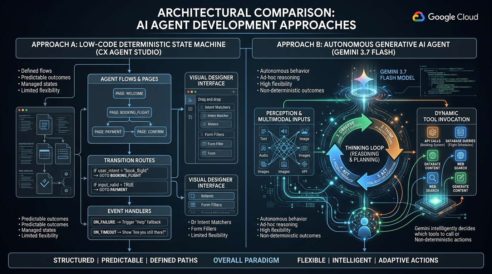

# Module 01: Understand Google Cloud Agents & Architecture

## Overview
This module establishes the foundational architectural principles of Google Cloud AI agents, covering the spectrum from low-code state machines to autonomous generative agents.

---

## 🎯 Exam Objectives Covered
- **1.1 Configuring agentic workflows and behavior using low-code tools**
  - Distinguishing deterministic state-based workflows (pages, transition routes, event handlers) from autonomous agentic loops.
  - Selecting between Gemini Enterprise Agent Designer, Customer Experience Agent Studio (CX Agent Studio), and Custom Code.
- **Scope & Terminology**:
  - **Deterministic Workflow**: Predefined, graph-based execution paths with hardcoded transition conditions.
  - **Autonomous Agent**: Goal-oriented model loops using context, dynamic tool selection, observations, bounded iteration, and concise auditable decisions.
- **1.2 Connecting enterprise data to Gemini Enterprise**
  - Planning secure Agent Search grounding for proprietary text, PDF, image, audio, and video sources.
  - Applying identity-aware connector access, Sensitive Data Protection inspection, access filtering, and citations.

---

## 🏗️ Architecture Comparison



---

## 💡 Key Architectural Trade-Offs

| Dimension | CX Agent Studio / Agent Designer | Custom ADK Agent (Code) |
| :--- | :--- | :--- |
| **Developer Persona** | Business analysts, support engineers, low-code builders | Software engineers, AI architects |
| **Control & Determinism** | 100% deterministic state transitions and guardrails | Dynamic reasoning, non-linear goal execution |
| **Tool Flexibility** | Preconfigured webhooks and Agent Search connectors | Arbitrary Python/gRPC/MCP tools and distributed services |
| **Deployment Model** | Fully managed Google Cloud console platform | Agent Runtime, Cloud Run, or GKE containers |

---

## High-yield exam checkpoint

A low-code page graph is best when transitions and recovery must be deterministic. A custom agent is best when the path cannot be enumerated and the model must choose tools. Enterprise connectors still require least-privilege access, access-filtered retrieval, and citations.

---

## 🚀 Hands-on Lab: Running the Module

The supported entrypoint runs both the demonstration and this module's tests from any current directory:

```bash
./modules/01_understand_agents_and_architecture/run_lab.sh
```

Equivalent manual commands:

### 1. Run the Standalone Demo
```bash
python3 modules/01_understand_agents_and_architecture/agent_architecture_demo.py
```

### 2. Run the Unit Tests
```bash
pytest modules/01_understand_agents_and_architecture/tests/ -v
```

---

## 🧹 Resource Cleanup / Teardown

Always finish with the idempotent module cleanup:

```bash
./modules/01_understand_agents_and_architecture/cleanup.sh
```

This module runs locally in simulation mode and creates no persistent cloud resources.

```bash
# Clean local cache & Python bytecode
rm -rf __pycache__ .pytest_cache
```
