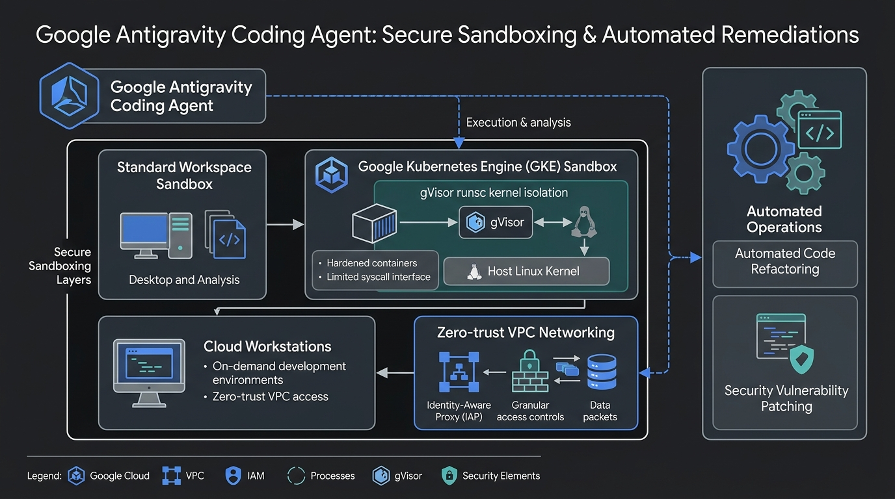

# Module 02: Antigravity SDK & Coding Agents

## Overview
This module explores autonomous coding agents in Google Cloud, focusing on the **Google Antigravity SDK**, **Claude Code on Google Cloud**, secure execution sandboxes (**GKE gVisor**, **Cloud Workstations**, **Antigravity Sandbox**), and automated vulnerability patching.

---

## 🎯 Exam Objectives Covered
- **2.1 Using coding agents effectively**
  - Configuring coding agents with Model Context Protocol (MCP) servers, custom skills, and access to developer tools.
  - Enforcing secure execution sandboxes (GKE with gVisor `runsc`, Cloud Workstations, and Antigravity).
  - Leveraging coding agents for automated refactoring, performance optimization, and patching application-layer vulnerabilities (SQL injection, hardcoded secrets, unsafe deserialization).

---

## 🏗️ Sandboxing Architecture



---

## 🔒 Sandboxing Security Rules for the Exam

| Sandbox Layer | Mechanism | Protection Boundary |
| :--- | :--- | :--- |
| **Antigravity Standard Sandbox** | Path sandboxing & process jailing | Prevents writing outside workspace & blocks unapproved outbound network requests. |
| **GKE Sandbox (gVisor)** | `runsc` OCI runtime | Intercepts Linux syscalls in user-space; isolates untrusted agent-compiled binaries. |
| **Cloud Workstations** | Managed VPC Compute Engine instances | Eliminates sensitive data exfiltration to developer laptops; enforces VPC Service Controls (VPC-SC). |

---

## 🚀 Hands-on Lab: Running the Module

```bash
# Run the coding agent vulnerability remediation demo
python3 modules/02_antigravity_and_coding_agents/coding_agent_sandbox.py

# Run unit tests
pytest modules/02_antigravity_and_coding_agents/tests/ -v
```
