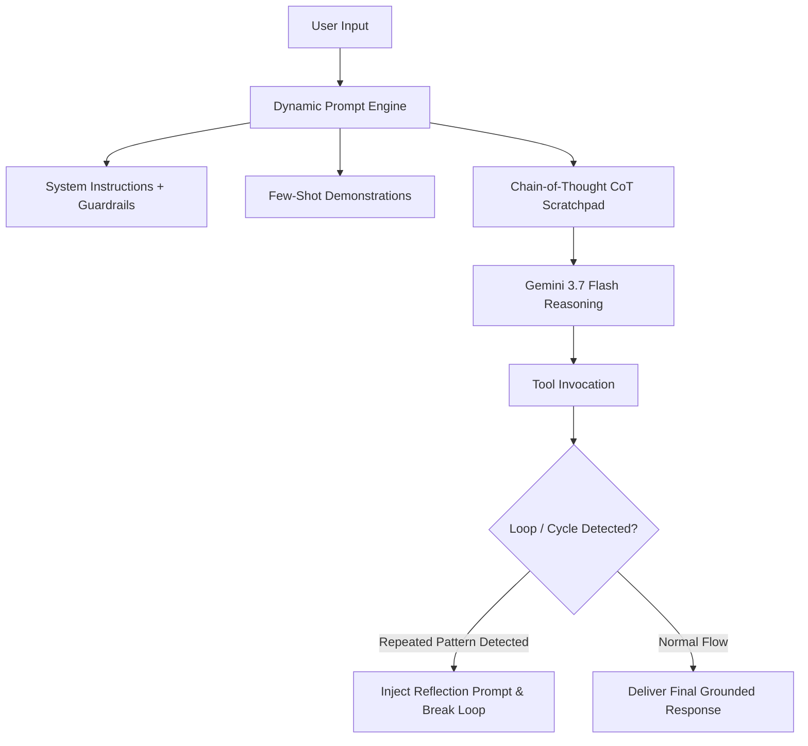

# Module 04: Optimizing Agent Behavior

## Overview
This module explores prompt engineering and behavioral steering techniques essential for enterprise agents on Google Cloud. You will learn to build structured system instructions, Few-Shot demonstration templates, Chain-of-Thought (CoT) scratchpads, and algorithmic cycle/loop detection interceptors.

---

## 🎯 Exam Objectives Covered
- **1.1 Configuring agentic workflows and behavior using low-code & custom tools**
  - Creating system instructions and in-console prompt templates (zero-shot, few-shot, and Chain-of-Thought).
- **4.2 Deploying and scaling production workloads**
  - Troubleshooting agent behavioral pathologies: reasoning loops, semantic drift, repetitive tool calls, and hallucinations.

---

## 🔄 Agent Behavior Steering & Loop Prevention



---

## 🚀 Hands-on Lab: Running the Module

```bash
# Run the prompt optimizer and loop detection lab
python3 modules/04_optimizing_agent_behavior/prompt_optimizer.py

# Run unit tests
pytest modules/04_optimizing_agent_behavior/tests/ -v
```
