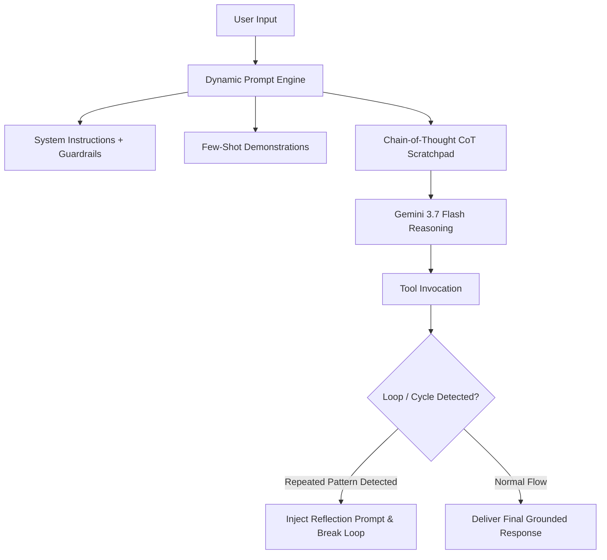

# Module 04: Optimizing Agent Behavior

## Overview
This module explores prompt engineering and behavioral steering techniques essential for enterprise agents on Google Cloud. You will build structured system instructions, few-shot decision examples, concise auditable rationales, and algorithmic cycle/loop detection interceptors while keeping private model scratchpads out of logs and responses.

---

## 🎯 Exam Objectives Covered
- **1.1 Configuring agentic workflows and behavior using low-code & custom tools**
  - Creating system instructions and in-console prompt templates (zero-shot, few-shot, and Chain-of-Thought).
- **4.2 Deploying and scaling production workloads**
  - Troubleshooting agent behavioral pathologies: reasoning loops, semantic drift, repetitive tool calls, and hallucinations.

---

## 🔄 Agent Behavior Steering & Loop Prevention



---

## High-yield exam checkpoint

Use system instructions for role and policy, few-shot examples for behavior, and deterministic code for hard controls. Do not expose private scratchpads; observe concise decisions, tool calls, results, and loop-budget events.

---

## 🚀 Hands-on Lab: Running the Module

The supported entrypoint runs both the demonstration and this module's tests from any current directory:

```bash
./modules/04_optimizing_agent_behavior/run_lab.sh
```

Equivalent manual commands:

```bash
# Run the prompt optimizer and loop detection lab
python3 modules/04_optimizing_agent_behavior/prompt_optimizer.py

# Run unit tests
pytest modules/04_optimizing_agent_behavior/tests/ -v
```

---

## 🧹 Resource Cleanup / Teardown

Always finish with the idempotent module cleanup:

```bash
./modules/04_optimizing_agent_behavior/cleanup.sh
```

This module runs client-side prompt optimization and interceptors.

```bash
# Clean local cache & Python bytecode
rm -rf __pycache__ .pytest_cache
```
