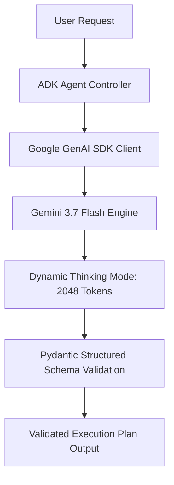

# Module 05: Engineer AI Agents with Agent Development Kit (ADK)

## Overview
This module explores custom code-first agent development using the **Agent Development Kit (ADK)** and the **Google GenAI SDK**. You will implement an autonomous enterprise agent leveraging **Gemini 3.7 Flash** with dynamic thinking tokens and Pydantic-enforced structured outputs (`response_schema`).

---

## 🎯 Exam Objectives Covered
- **3.1 Designing and building agentic workflows in code**
  - Building custom agents using open-source libraries (Agent Development Kit [ADK] & Google GenAI SDK).
  - Leveraging **Gemini 3.7 Flash** (`gemini-3.7-flash`) with thinking budgets.
  - Guaranteeing deterministic integration via type-safe structured schemas (`response_schema` / Pydantic).

---

## 🏗️ Custom ADK Agent Architecture



---

## 🚀 Hands-on Lab: Running the Module

```bash
# Run the custom ADK agent lab (runs live with GEMINI_API_KEY or via built-in mock fallback)
python3 modules/05_agent_development_kit_adk/custom_adk_agent.py

# Run unit tests
pytest modules/05_agent_development_kit_adk/tests/ -v
```

---

## 🧹 Resource Cleanup / Teardown

If you tested live Gemini API calls, no persistent cloud infrastructure is provisioned (stateless API billing per token).

```bash
# Clean local cache & Python bytecode
rm -rf __pycache__ .pytest_cache
```

