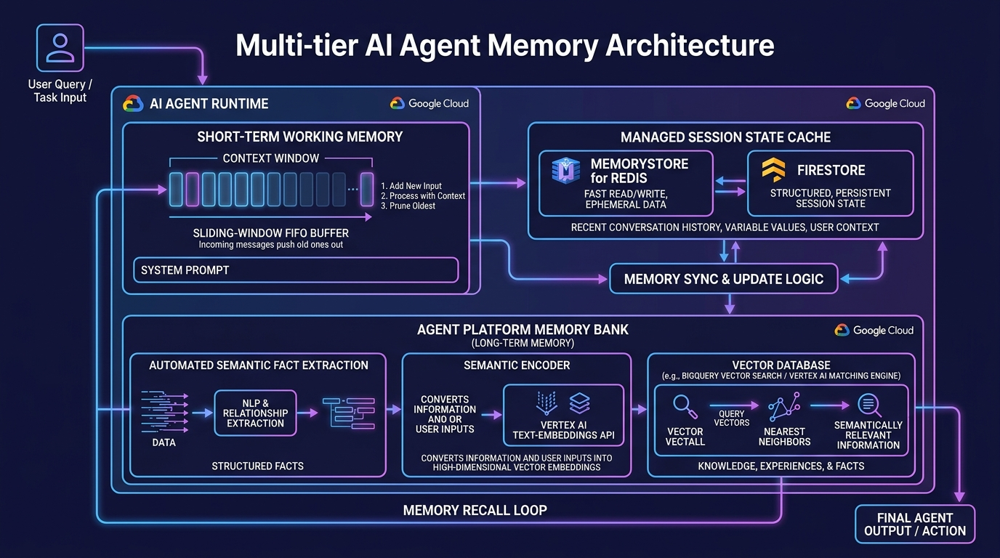

# Module 06: Manage Agent Memory, State & Sessions

## Overview
This module explores enterprise state management for autonomous AI agents on Google Cloud. You will learn the architectural difference between **Managed Sessions** (short-term conversational context) and the **Agent Platform Memory Bank** (long-term associative fact retrieval across sessions).

---

## 🎯 Exam Objectives Covered
- **3.1 Designing and building agentic workflows in code**
  - Configuring sessions and memory (Agent Platform Memory Bank and managed sessions).
  - Managing sliding-window context pruning and token budgets.
  - Integrating distributed cache backends (Memorystore for Redis / Cloud Firestore).

---

## 🧠 Multi-Tier Memory Hierarchy



---

## 💡 Key Concepts & Exam Distinctions

| Memory Tier | Mechanism | Lifetime | Storage Location |
| :--- | :--- | :--- | :--- |
| **Short-Term Context** | Raw message history buffer | Active session only | In-memory / Memorystore for Redis |
| **Managed Sessions** | Stateful multi-turn thread with variables | Minutes to Days | Cloud Firestore / Managed Session Service |
| **Agent Platform Memory Bank** | Asynchronous semantic fact extraction & vector indexing | Months to Permanent | Agent Platform Managed Vector DB |

---

## 🚀 Hands-on Lab: Running the Module

```bash
# Run the Memory Bank and Session State lab
python3 modules/06_agent_memory_and_state/memory_bank_manager.py

# Run unit tests
pytest modules/06_agent_memory_and_state/tests/ -v
```

---

## 🧹 Resource Cleanup / Teardown

If you provisioned a **Memorystore for Redis** instance or **Cloud Firestore** collection for persistent state testing:

```bash
# 1. Delete Memorystore for Redis Instance
gcloud redis instances delete $REDIS_INSTANCE_NAME --region=$REGION --project=$PROJECT_ID --quiet

# 2. Delete Firestore Session Collections
gcloud firestore operations cancel $OPERATION_ID --project=$PROJECT_ID 2>/dev/null || true

# 3. Clean local cache & Python bytecode
rm -rf __pycache__ .pytest_cache agent_memory_cache.json
```

