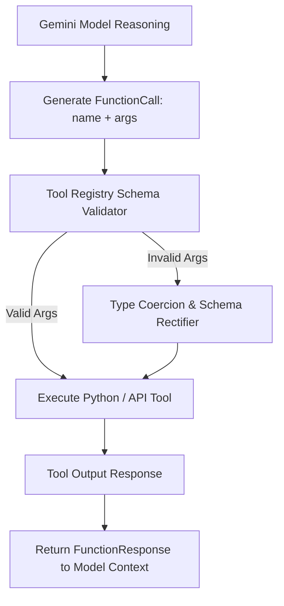

# Module 07: Add Agent Capabilities With Tools

## Overview
This module explores tool integration and dynamic function calling on Google Cloud. You will learn to equip autonomous agents with custom Python tools, generate OpenAPI-compliant JSON schemas for **Gemini 3.7 Flash**, and implement runtime parameter validation and error recovery pipelines.

---

## 🎯 Exam Objectives Covered
- **3.1 Designing and building agentic workflows in code**
  - Equipping agents with custom capabilities and tools.
  - Generating and validating function declaration schemas for Gemini models.
  - Implementing error handling, parameter coercion, and backoff retries for failed tool calls.

---

## ⚙️ Tool Execution Pipeline



---

## High-yield exam checkpoint

A valid function schema improves argument generation but does not authorize execution. Validate types and business constraints, bind the caller identity, make retries idempotent, and require approval for consequential tools.

---

## 🚀 Hands-on Lab: Running the Module

The supported entrypoint runs both the demonstration and this module's tests from any current directory:

```bash
./modules/07_agent_tools_and_capabilities/run_lab.sh
```

Equivalent manual commands:

```bash
# Run the tool orchestration and schema generation lab
python3 modules/07_agent_tools_and_capabilities/tool_orchestrator.py

# Run unit tests
pytest modules/07_agent_tools_and_capabilities/tests/ -v
```

---

## 🧹 Resource Cleanup / Teardown

Always finish with the idempotent module cleanup:

```bash
./modules/07_agent_tools_and_capabilities/cleanup.sh
```

This module tests tool execution and schema generation locally.

```bash
# Clean local cache & Python bytecode
rm -rf __pycache__ .pytest_cache
```
