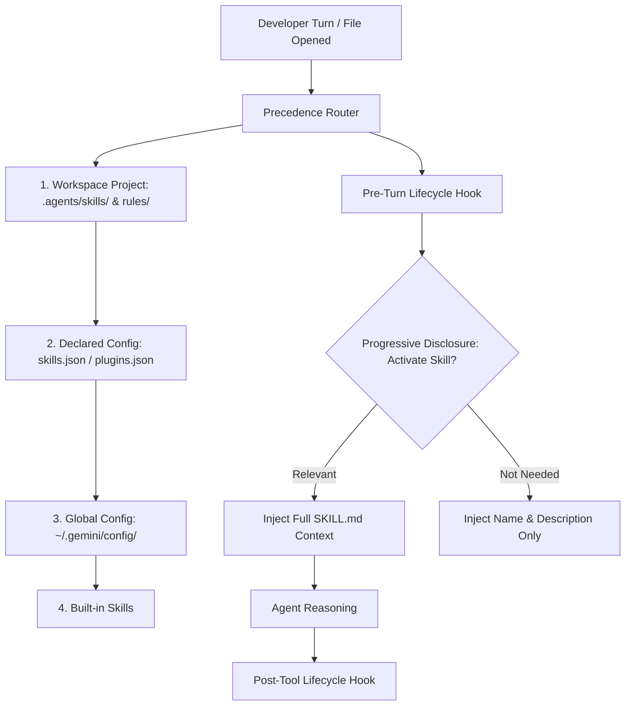

# Module 08: Build Custom Agent Skills, Plugins & Hooks

## Overview
This module explores enterprise extensibility in Google Antigravity and Agents CLI. You will learn to construct modular agent skills (`SKILL.md`), manage progressive disclosure, package plugins, configure contextual rules (`GEMINI.md`), and execute lifecycle interceptor hooks.

---

## 🎯 Exam Objectives Covered
- **2.2 Customizing coding agents for enterprise workflows**
  - Creating custom skills, plugins, extension hooks, rules, and subagents using Antigravity.
  - Understanding skill discovery precedence: Workspace Project (`.agents/`) > Declared (`skills.json`) > Global (`~/.gemini/config/`) > Built-in.
  - Implementing lifecycle hooks for pre-tool validation and post-execution telemetry.
  - Versioning approved skills in Skill Registry and separating Agents CLI agent-mode permissions from human-mode permissions.

---

## 🧩 Antigravity Customization Hierarchy



---

## High-yield exam checkpoint

Skills package reusable instructions; plugins bundle broader capabilities; hooks intercept lifecycle events; rules set persistent constraints; subagents delegate bounded work. Govern versions in Skill Registry and separate autonomous agent mode from interactive human mode.

---

## 🚀 Hands-on Lab: Running the Module

The supported entrypoint runs both the demonstration and this module's tests from any current directory:

```bash
./modules/08_custom_skills_plugins_and_hooks/run_lab.sh
```

Equivalent manual commands:

```bash
# Run the skills and hooks manager lab
python3 modules/08_custom_skills_plugins_and_hooks/skills_and_hooks_manager.py

# Run unit tests
pytest modules/08_custom_skills_plugins_and_hooks/tests/ -v
```

---

## 🧹 Resource Cleanup / Teardown

Always finish with the idempotent module cleanup:

```bash
./modules/08_custom_skills_plugins_and_hooks/cleanup.sh
```

This module manages custom skill definitions and lifecycle hooks in the workspace.

```bash
# Clean local cache & Python bytecode
rm -rf __pycache__ .pytest_cache
```
