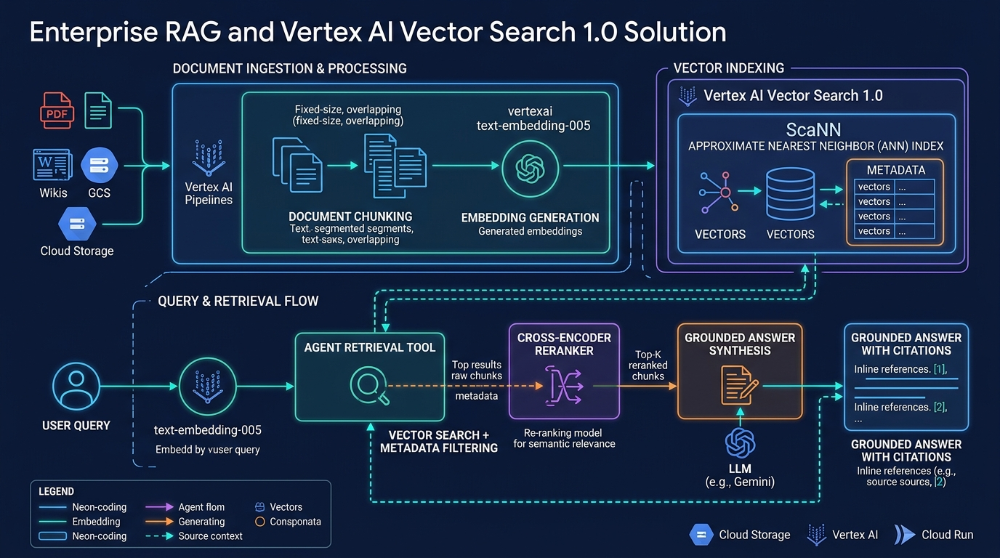

# Module 09: Enterprise RAG & Vector Search 1.0

## Overview
This module explores enterprise domain knowledge grounding using **Vertex AI Vector Search 1.0**, **Agent Retrieval**, and **RAG Engine**. You will build an end-to-end retrieval-augmented generation pipeline featuring `text-embedding-005`, Cosine similarity ranking, and reciprocal rank fusion (RRF) reranking.

---

## 🎯 Exam Objectives Covered
- **3.2 Integrating enterprise domain knowledge**
  - Designing, configuring, and managing retrieval-augmented generation (RAG) pipelines and vector retrieval systems.
  - Selecting embedding models (`text-embedding-005`), similarity distance metrics (Cosine, Dot Product, Euclidean), and rerankers.
  - Leveraging **Vector Search 1.0** (ScaNN index) and **Agent Retrieval** for agent grounding with citations.

---

## 🔍 Enterprise RAG Pipeline Architecture



---

## High-yield exam checkpoint

Evaluate retrieval separately from generation. Embedding and similarity choices affect candidate recall; reranking improves ordering; grounded generation still needs citations, identity-aware filtering, freshness, and response evaluation.

---

## 🚀 Hands-on Lab: Running the Module

The supported entrypoint runs both the demonstration and this module's tests from any current directory:

```bash
./modules/09_enterprise_rag_and_vector_search/run_lab.sh
```

Equivalent manual commands:

```bash
# Run the Vector Search and RAG pipeline lab
python3 modules/09_enterprise_rag_and_vector_search/vector_search_rag.py

# Run unit tests
pytest modules/09_enterprise_rag_and_vector_search/tests/ -v
```

---

## 🧹 Resource Cleanup / Teardown

Always finish with the idempotent module cleanup:

```bash
./modules/09_enterprise_rag_and_vector_search/cleanup.sh
```

If you created live **Vertex AI Vector Search 1.0** index endpoints or **Cloud Storage** staging buckets:

```bash
# 1. Undeploy Index from Index Endpoint
gcloud ai index-endpoints undeploy-index $INDEX_ENDPOINT_ID \
    --deployed-index-id=$DEPLOYED_INDEX_ID \
    --region=$REGION \
    --project=$PROJECT_ID

# 2. Delete Vector Search Index Endpoint
gcloud ai index-endpoints delete $INDEX_ENDPOINT_ID \
    --region=$REGION \
    --project=$PROJECT_ID --quiet

# 3. Delete Vector Search Index
gcloud ai indexes delete $INDEX_ID \
    --region=$REGION \
    --project=$PROJECT_ID --quiet

# 4. Clean local cache & Python bytecode
rm -rf __pycache__ .pytest_cache vector_index_cache.bin
```
