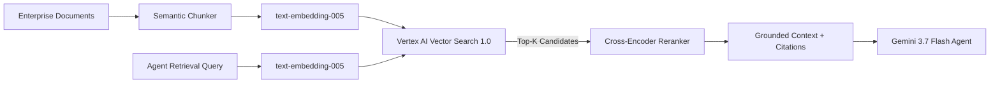

# Module 09: Enterprise RAG & Vector Search 1.0

## Overview
This module explores enterprise domain knowledge grounding using **Vertex AI Vector Search 1.0**, **Agent Retrieval**, and **RAG Engine**. You will build an end-to-end retrieval-augmented generation pipeline featuring `text-embedding-005`, Cosine similarity ranking, and reciprocal rank fusion (RRF) reranking.

---

## 🎯 Exam Objectives Covered
- **3.2 Integrating enterprise domain knowledge**
  - Designing, configuring, and managing retrieval-augmented generation (RAG) pipelines and vector retrieval systems.
  - Selecting embedding models (`text-embedding-005`), similarity distance metrics (Cosine, Dot Product, Euclidean), and rerankers.
  - Leveraging **Vector Search 1.0** (ScaNN index) and **Agent Retrieval** for agent grounding with citations.

---

## 🔍 Enterprise RAG Pipeline Architecture



---

## 🚀 Hands-on Lab: Running the Module

```bash
# Run the Vector Search and RAG pipeline lab
python3 modules/09_enterprise_rag_and_vector_search/vector_search_rag.py

# Run unit tests
pytest modules/09_enterprise_rag_and_vector_search/tests/ -v
```
