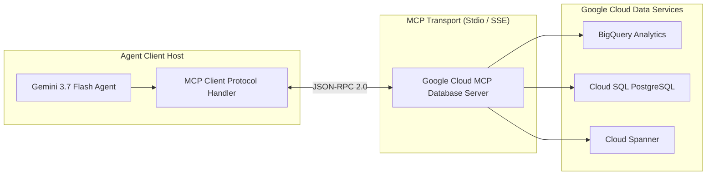

# Module 10: Build AI Agents with Enterprise Databases & MCP

## Overview
This module explores enterprise database integration using the **Model Context Protocol (MCP)** and the **Google Cloud MCP Toolbox for Databases**. You will implement an MCP Server that exposes BigQuery and Cloud SQL database capabilities, and an MCP Agent Client that interacts via standard protocol messages.

---

## 🎯 Exam Objectives Covered
- **3.2 Integrating enterprise domain knowledge**
  - Using Google Cloud tools (Agent Registry, Google Cloud MCP Servers) to configure prebuilt and custom capabilities.
  - Exposing managed databases (BigQuery, Cloud SQL, Spanner) via Model Context Protocol (MCP).
  - Enforcing parameterized, read-only vs write permissions on database tools.

---

## 🔌 Model Context Protocol (MCP) Architecture



---

## 🚀 Hands-on Lab: Running the Module

```bash
# Run the MCP database server and client demo
python3 modules/10_enterprise_databases_and_mcp/mcp_database_server.py

# Run unit tests
pytest modules/10_enterprise_databases_and_mcp/tests/ -v
```
