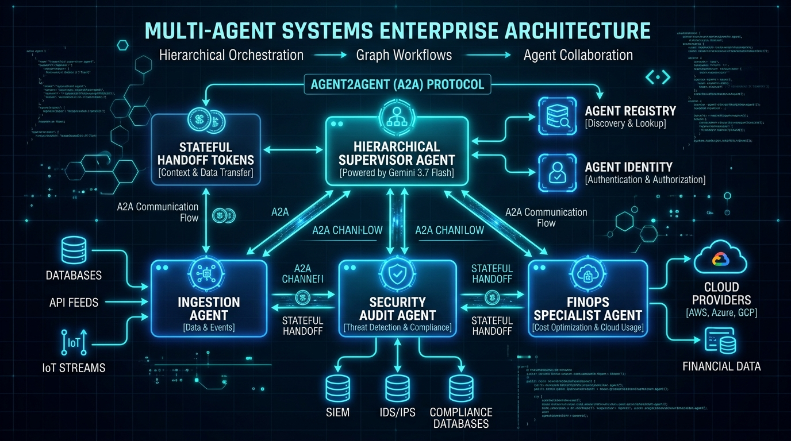

# Module 11: Multi-Agent Systems & Agent2Agent (A2A)

## Overview
This module covers multi-agent design patterns and inter-agent communication protocols on Google Cloud. You will implement a **Hierarchical Supervisor Multi-Agent System** communicating via the **Agent2Agent (A2A)** protocol, supporting stateful handoffs between specialized worker agents.

---

## 🎯 Exam Objectives Covered
- **3.3 Orchestrating and coordinating agentic workflows**
  - Orchestrating agents using agentic protocols (Model Context Protocol [MCP] and Agent2Agent [A2A]).
  - Coordinating multi-agent handoffs and workflows (parallel agents, sequential agents, hierarchical supervisor, and graph workflows).
  - Enforcing agent boundaries and policies using **Agent Identity** and **Agent Registry**.

---

## 🤝 Multi-Agent Topologies & A2A Protocol



---

## 🚀 Hands-on Lab: Running the Module

```bash
# Run the multi-agent orchestration and A2A handoff lab
python3 modules/11_multi_agent_orchestration_a2a/multi_agent_system.py

# Run unit tests
pytest modules/11_multi_agent_orchestration_a2a/tests/ -v
```

---

## 🧹 Resource Cleanup / Teardown

This module orchestrates simulated multi-agent handoffs in memory.

```bash
# Clean local cache & Python bytecode
rm -rf __pycache__ .pytest_cache
```

