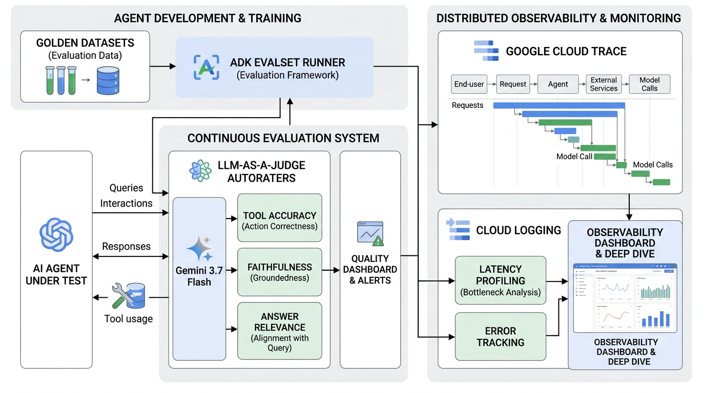

# Module 12: AgentOps: Evaluation & Observability

## Overview
This module explores enterprise AgentOps on Google Cloud. You will learn to build automated evaluation pipelines using **ADK evalset**, create golden datasets, deploy **LLM-as-a-Judge Autoraters (Gemini 3.7 Flash)**, and instrument distributed tracing with **Google Cloud Trace** and **Cloud Logging**.

---

## 🎯 Exam Objectives Covered
- **4.1 Evaluating agents in development and in production**
  - Creating golden evaluation test sets (prompts, edge cases, expected tools).
  - Continuous evaluation pipelines using ADK `evalset` and custom autoraters.
  - Computing quantitative evaluation metrics: Tool Precision, Retrieval Faithfulness, Answer Relevance.
  - Converting success criteria into a continuous release gate that blocks tool, grounding, completion, or latency regressions.
- **4.2 Deploying and scaling production workloads**
  - Distributed tracing and latency bottleneck profiling using Cloud Trace and Cloud Logging.

---

## 📊 Evaluation & Tracing Architecture



---

## High-yield exam checkpoint

A production evaluation gate needs representative golden, edge, adversarial, and failure cases. Measure tool selection and arguments, retrieval and response quality, task completion, safety, latency, reliability, and cost; block regressions continuously.

---

## 🚀 Hands-on Lab: Running the Module

The supported entrypoint runs both the demonstration and this module's tests from any current directory:

```bash
./modules/12_agentops_evaluation_and_monitoring/run_lab.sh
```

Equivalent manual commands:

```bash
# Run the agent evaluation and tracing lab
python3 modules/12_agentops_evaluation_and_monitoring/agent_evaluator.py

# Run unit tests
pytest modules/12_agentops_evaluation_and_monitoring/tests/ -v
```

---

## 🧹 Resource Cleanup / Teardown

Always finish with the idempotent module cleanup:

```bash
./modules/12_agentops_evaluation_and_monitoring/cleanup.sh
```

If you configured live **Google Cloud Logging** sinks or **Cloud Trace** log exports:

```bash
# 1. Delete custom log sinks
gcloud logging sinks delete agentops-eval-sink --project=$PROJECT_ID --quiet 2>/dev/null || true

# 2. Clean local cache & Python bytecode
rm -rf __pycache__ .pytest_cache *.log
```
