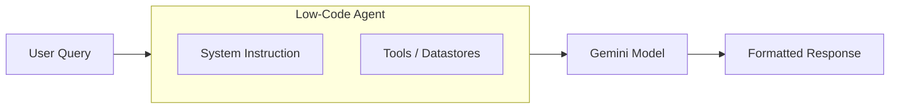

# Lab 01 — Agent Designer Workflows

**Exam section:** 1. Building agents using low-code tools (~13% of the exam)
**Objectives covered:** 1.1
**Time:** ~15 minutes · **Cost:** Free offline / ~$0.01 live

---

## 1. Exam objectives covered

> Quoted verbatim from the official exam guide:
> - "Creating system instructions and in-console prompt templates (e.g., few-shot and chain-of-thought) to guide agent behavior"

## 2. Explain it simply

An agent's **system instruction** is its job description. It tells the LLM who it is, what its goal is, and how it should format its answers. 

When you use a low-code tool like Gemini Enterprise Agent Designer, you don't write Python code to orchestrate the LLM. Instead, you write text **prompt templates**. A prompt template guides the model's behaviour. For example, a "zero-shot" template just asks for an answer, a "few-shot" template gives examples to force a specific format, and a "chain-of-thought" (CoT) template forces the model to explain its reasoning step-by-step before giving the final answer.

## 3. How it works



In a low-code console, you define:
1. **Persona**: "You are a helpful customer service agent."
2. **Task**: "Extract the sentiment of the following review."
3. **Format/Constraints**: "Reply ONLY with POSITIVE or NEGATIVE."

When a user sends a query, the console securely injects the system instruction alongside the user's text and sends it to the Gemini API.

## 4. The decision that matters

The exam frequently tests whether you should build a low-code agent in the console or a code-first agent using the Agent Development Kit (ADK).

| If you need... | Use | Why not the alternative |
| :--- | :--- | :--- |
| **Rapid prototyping and business user access** | Low-code (Agent Designer) | Code-first requires engineering resources and CI/CD pipelines to iterate on prompts. |
| **Complex custom graphs or multi-agent handoffs** | Code-first (ADK / LangChain) | Low-code tools are optimized for single-agent or simple multi-agent playbooks; they cannot easily model complex parallel loops. |
| **Integration with internal enterprise CI/CD** | Code-first (ADK) | Console agents are harder to version-control in standard Git repositories without API sync tools. |

## 5. Hands-on A — offline (free)

This simulates how prompt templates shape an agent's configuration using ADK classes.

```bash
./tracks/01_low_code_agents/lab_01_agent_designer_workflows/run_lab.sh
```

**Expected Output:**
You will see three agents created: `ZeroShotAgent`, `FewShotAgent`, and `ChainOfThoughtAgent`. The output will show that the `instruction` field is successfully populated. The offline lab verifies the state deterministically without calling the model.

## 6. Hands-on B — live on Google Cloud (opt-in)

To see how the models actually respond differently to the templates:

```bash
./tracks/01_low_code_agents/lab_01_agent_designer_workflows/run_lab.sh --live
```

> [!WARNING]
> Cost note: This will make three API calls to `gemini-3.7-flash` and cost a fraction of a cent.

## 7. Verify it worked

Check that the tests pass. The tests assert that the `Agent` objects were constructed with the correct `instruction` parameters and that the prompt templates contain the required structural keywords (like `Examples:` for few-shot).

## 8. Troubleshooting

| Symptom | Cause | Fix |
| :--- | :--- | :--- |
| `ImportError: cannot import name 'Agent' from 'google.adk'` | Stale virtualenv or wrong ADK version. | Ensure `google-adk==2.9.0` is installed. |
| `--live` fails with quota errors | Project doesn't have Vertex AI API enabled. | Run `gcloud services enable aiplatform.googleapis.com` |

## 9. Clean up

```bash
./tracks/01_low_code_agents/lab_01_agent_designer_workflows/cleanup.sh
```

There are no cloud resources created by this lab to delete.

## 10. Exam traps

- **Zero-shot vs Few-shot:** If the prompt explicitly includes "Examples:" or "Q: ... A: ...", it is few-shot. Zero-shot relies purely on the instruction.
- **Chain of thought (CoT):** CoT is for improving reasoning on complex tasks by forcing intermediate steps. It is *not* for reducing latency (it actually increases latency because more tokens are generated).
- **Agent Designer vs ADK:** The exam distinguishes between "low-code business user workflows" (Designer/CX) and "developer-led integration" (ADK).

## 11. Check yourself

<details>
<summary>1. You need an agent to classify customer tickets into 15 specific custom categories. Zero-shot prompting is failing to correctly categorize edge cases. Which technique should you use?</summary>

**Few-shot prompting**. By providing examples of edge cases mapped to the correct custom categories in the system instruction, the LLM learns the pattern and constraints.
</details>

<details>
<summary>2. An agent is hallucinating math calculations when summarizing usage reports. How can you alter the prompt template to fix this?</summary>

**Chain-of-thought prompting**. Add an instruction like "Think step-by-step and show your calculations before providing the final answer." This forces the model to generate the intermediate arithmetic, drastically reducing hallucination.
</details>

<details>
<summary>3. Your marketing team wants to build and iterate on an internal FAQ bot without waiting for the engineering team's two-week sprint cycle. Which approach should you choose?</summary>

**Low-code tools (e.g., Gemini Enterprise Agent Designer or CX Agent Studio)**. This allows non-developers to iterate on prompt templates and grounding data visually, without code changes or CI/CD deployments.
</details>

> [!WARNING]
> **Pre-GA / naming note.** The exam guide refers to *Gemini Enterprise Agent Designer*. This is a console-centric configuration interface. The lab simulates its behaviour using Python to give you a concrete, testable understanding of how prompt templates and instructions work.
