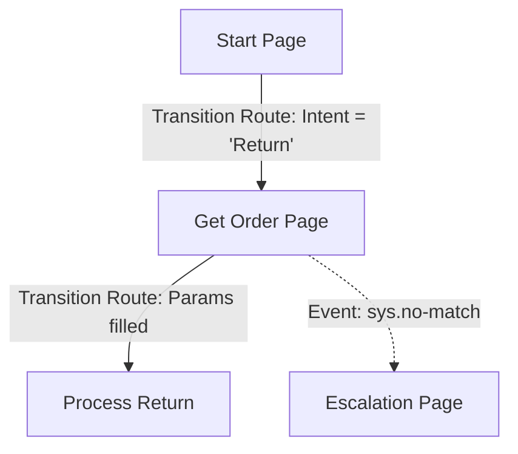

# Lab 02 — CX Agent Studio State

**Exam section:** 1. Building agents using low-code tools (~13% of the exam)
**Objectives covered:** 1.1
**Time:** ~15 minutes · **Cost:** Free offline (simulator only)

---

> **Personal study repo — not affiliated with Google Cloud.** Official guidance: [cloud.google.com/learn/certification/agentic-architect](https://cloud.google.com/learn/certification/agentic-architect) · [Disclaimer](../../../DISCLAIMER.md)

## 1. Exam objectives covered

> Quoted verbatim from the official exam guide:
> - "Configuring state-based workflows (pages, transition routes, and event handlers) using Gemini Enterprise tools (e.g., Gemini Enterprise Agent Designer and Customer Experience Agent Studio [CX Agent Studio])"

## 2. Explain it simply

LLMs are generative; they naturally want to invent conversations. But enterprise workflows—like refunding a credit card or processing an insurance claim—cannot be left to an LLM's imagination. You need rigid, auditable control.

**CX Agent Studio** (built on Dialogflow CX primitives) solves this using a **State Machine**. 
Instead of letting the LLM talk freely, the conversation is modeled as a series of **Pages** (states). To move from one page to another, the user's input must trigger a **Transition Route**. If the user says something unexpected, an **Event Handler** catches it and safely escalates.

## 3. How it works



1. **Pages**: A node in the graph representing a specific state (e.g., "Collecting Order Number").
2. **Transition Routes**: Edges connecting pages. They fire when an Intent is matched or a specific Parameter is collected.
3. **Event Handlers**: Fallbacks. If the user input matches no routes, an event like `sys.no-match-default` fires. You can configure this to retry, or immediately route to a human agent.
4. **Playbooks**: A newer feature that blends state machines with generative agents. A Playbook gives the agent a goal and a set of tools, allowing the agent to dynamically navigate the state machine rather than relying purely on hardcoded routes.

## 4. The decision that matters

The exam frequently tests your judgement on when to use strict state machines versus generative playbooks or custom code.

| If you need... | Use | Why not the alternative |
| :--- | :--- | :--- |
| **Strict regulatory compliance (e.g., KYC, banking)** | Deterministic State Machine (Pages/Routes) | Generative agents can hallucinate or skip legally required disclosures. |
| **Flexible conversational goal-seeking** | Generative Playbooks (CX) | Pure state machines break if the user changes topics abruptly (non-linear conversation). |
| **Complex integrations with custom code logic** | ADK (Code-first) | Console tools struggle with deeply nested logic loops or CI/CD integration. |

## 5. Hands-on A — offline (free)

This lab runs a pure Python simulator of the CX state machine. Because CX Agent Studio is a console-only product with no Python SDK, we simulate its semantics so you can see exactly how the exam concepts operate under the hood.

```bash
./tracks/01_low_code_agents/lab_02_cx_agent_studio_state/run_lab.sh
```

**Expected Output:**
You will see two conversations. 
1. The **Happy Path** shows the user matching the intent and filling the parameters, successfully traversing the Transition Routes to the final page.
2. The **Unhappy Path** shows the user providing invalid input, failing the parameter check, triggering the Event Handler (`sys.no-match-default`), and successfully escalating.

## 6. Hands-on B — live on Google Cloud (opt-in)

There is no live `--live` API equivalent for this lab because CX Agent Studio configuration is done entirely via the Google Cloud Console UI. 

To practice this live, open [Dialogflow CX](https://dialogflow.cloud.google.com/cx/projects) in the Google Cloud Console, create a new Agent, and manually create the Pages, Transition Routes, and Event Handlers described in the simulator.

## 7. Verify it worked

Check that the simulator asserts the correct page transitions. The tests assert that the simulator correctly moves to `ProcessReturn` when input is valid, and `Escalation` when input triggers the Event Handler.

## 8. Troubleshooting

| Symptom | Cause | Fix |
| :--- | :--- | :--- |
| `ImportError: cannot import name 'LabReport'` | PYTHONPATH is unset. | Use `run_lab.sh` which sets it automatically. |

## 9. Clean up

```bash
./tracks/01_low_code_agents/lab_02_cx_agent_studio_state/cleanup.sh
```

## 10. Exam traps

- **"Generative Fallback"**: The exam might ask how to handle a user going off-script in a strict state machine. You use an Event Handler with Generative Fallback to let the LLM handle the out-of-domain chat, before pulling them back to the rigid Page.
- **Intents vs Playbooks**: Playbooks reduce the need for hundreds of hardcoded training phrases (Intents) by using the LLM to understand user goals dynamically. If the exam scenario mentions "too many intents to maintain," the answer is Playbooks/Generative Agents.

## 11. Check yourself

<details>
<summary>1. A financial institution requires users to explicitly type "I agree" to terms before a refund is processed. An LLM agent keeps skipping this step if the user is angry. How do you fix this?</summary>

Use a **deterministic state machine (Pages and Transition Routes)**. Force the conversation into a Page that cannot be exited until the specific "I agree" parameter is collected, removing the LLM's discretion.
</details>

<details>
<summary>2. A user is on the "Collect Order Number" page and says "Actually, how much is shipping?". The bot responds "I did not understand your order number." How do you improve this?</summary>

Enable **Generative Fallback** on the no-match Event Handler. This allows the LLM to answer the shipping question using a Datastore, and then seamlessly guide the user back to asking for the order number.
</details>

> [!WARNING]
> **Pre-GA / naming note.** The exam guide refers to *CX Agent Studio*. This is a console-centric UI built on Dialogflow CX. The concepts (pages, routes, handlers) are identical.
