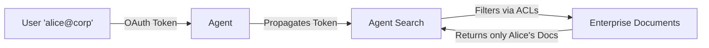

# Lab 03 — Enterprise Data & Multimodal

**Exam section:** 1. Building agents using low-code tools (~13% of the exam)
**Objectives covered:** 1.2
**Time:** ~15 minutes · **Cost:** Free offline

---

> **Personal study repo — not affiliated with Google Cloud.** Official guidance: [cloud.google.com/learn/certification/agentic-architect](https://cloud.google.com/learn/certification/agentic-architect) · [Disclaimer](../../../DISCLAIMER.md)

## 1. Exam objectives covered

> Quoted verbatim from the official exam guide:
> - "Configuring agents to securely connect and query enterprise proprietary data sources (e.g., Gemini Enterprise and Agent Search)"
> - "Ingesting and processing unstructured multimodal data (e.g., videos, audio, and images) into the agentic workflow"

## 2. Explain it simply

An agent is only as good as the data it can see. But in an enterprise, not everyone can see everything. **Identity Propagation** ensures that when an agent searches a datastore on behalf of a user, it only retrieves documents that the user is permitted to view.

Furthermore, enterprise data is rarely just text. It includes PDFs, audio recordings, and videos. To process this, you must choose how to ingest **multimodal data**: do you pass the raw video directly to a multimodal LLM, or do you run it through a preprocessing pipeline (like Speech-to-Text) first?

## 3. How it works

**Identity Propagation:**

When you attach `DiscoveryEngineSearchTool` or configure Agent Search in the console, you enable Identity Propagation. The user's OAuth token is passed down, and the search engine filters the vector results against the document Access Control Lists (ACLs) *before* returning them to the LLM.

**Multimodal Ingestion:**
A native multimodal model (like `gemini-3.7-flash`) can accept a GCS URI of a video and reason about both the audio and visual frames simultaneously.

## 4. The decision that matters

### Native Multimodal vs Pre-processing Pipeline

| If you need... | Use | Why not the alternative |
| :--- | :--- | :--- |
| **Cross-modal reasoning (e.g., "why is the person in the video laughing?")** | Native Multimodal Prompting (`gemini-3.7-flash` / `gemini-omni`) | A Speech-to-Text pipeline loses the visual context of the laugh. |
| **Deterministic structured extraction at massive scale** | Pre-processing Pipeline (Speech-to-Text, Document AI) | Native multimodal models are more expensive and slower for bulk transcription than dedicated API services. |
| **To index video content for future text-based search** | Pre-processing Pipeline | Vector databases typically index text embeddings; you need to extract the transcript first. |

## 5. Hands-on A — offline (free)

This lab runs an ACL simulator to demonstrate Identity Propagation and instantiates the real ADK tools for Agent Search.

```bash
./tracks/01_low_code_agents/lab_03_enterprise_data_and_multimodal/run_lab.sh
```

**Expected Output:**
You will see three different users search for the same term ("policy"). The simulator will enforce the ACLs and return different results for each user. You will also see the instantiation of the `DiscoveryEngineSearchTool` and confirmation of the native multimodal capabilities of the Gemini Flash model.

## 6. Hands-on B — live on Google Cloud (opt-in)

Because Vertex AI Agent Search datastores can take several hours to index, this lab does not run live queries. To practice this live:
1. Go to the [Agent Builder Console](https://console.cloud.google.com/gen-app-builder/engines).
2. Create a Search Data Store backed by Google Drive or Cloud Storage.
3. Explicitly enable **Identity Propagation** in the datastore settings.

## 7. Verify it worked

Check that the simulator asserts the correct document counts for each user based on their ACLs, proving that identity was propagated and enforced at the retrieval layer.

## 8. Troubleshooting

| Symptom | Cause | Fix |
| :--- | :--- | :--- |
| `ImportError: cannot import name 'DiscoveryEngineSearchTool'` | Stale virtualenv or wrong ADK version. | Ensure `google-adk==2.9.0` is installed. |

## 9. Clean up

```bash
./tracks/01_low_code_agents/lab_03_enterprise_data_and_multimodal/cleanup.sh
```

## 10. Exam traps

- **Agent Search vs Vector Search:** *Agent Search* (formerly Vertex AI Search) is the turnkey solution with built-in connectors, OCR, and chunking. *Vector Search* is the underlying vector database. If the question asks for a fully managed enterprise search with Google Drive integration, the answer is Agent Search.
- **Identity Propagation:** The LLM does *not* do the filtering. The retrieval engine (Agent Search) does the filtering *before* the chunks are passed to the LLM. If the LLM does the filtering, you risk leaking sensitive data in the prompt context.

## 11. Check yourself

<details>
<summary>1. You are building an internal HR agent. The agent must summarize an employee's performance review, but employees must not be able to query reviews belonging to others. How do you design this?</summary>

Configure **Agent Search with Identity Propagation**. When the user authenticates, their identity is passed to the datastore, which enforces the document ACLs before returning any context to the LLM.
</details>

<details>
<summary>2. You have 10,000 hours of call center audio. You need to extract the customer's account number and the reason for the call, and save it to BigQuery. Should you use native multimodal prompting or a Speech-to-Text pipeline?</summary>

A **Speech-to-Text pipeline**. For bulk, deterministic extraction at massive scale, dedicated APIs are cheaper, faster, and easier to pipe into structured databases than passing 10,000 hours of raw audio to a multimodal LLM.
</details>

> [!WARNING]
> **Pre-GA / naming note.** The exam guide refers to *Agent Search*. This is the newer name for *Vertex AI Search*. The ADK tools still use the underlying API names (`VertexAiSearchTool` and `DiscoveryEngineSearchTool`).
