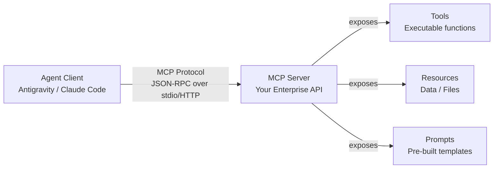

# Lab 04 — MCP and Tooling

**Exam section:** 2. Using coding agents for application development (~17% of the exam)
**Objectives covered:** 2.1
**Time:** ~20 minutes · **Cost:** Free offline / ~$0.50 live

---

## 1. Exam objectives covered

> Quoted verbatim from the official exam guide:
> - "Configuring coding agents with Model Context Protocol (MCP) servers, custom skills, and access to tools (e.g., Antigravity and Claude Code on Google Cloud)"

## 2. Explain it simply

Before MCP, integrating tools with LLM agents was an $N \times M$ problem. If you had 5 types of agents (like Antigravity, Claude Code, LangChain) and 10 enterprise APIs (like Jira, GitHub, Cloud Run), you had to write 50 different integration plugins.

The **Model Context Protocol (MCP)** collapses this to an $N + M$ problem. It acts like a USB-C cable for AI agents. You write exactly one MCP server for your enterprise API. Any MCP-compatible agent can then discover the server's tools, read its resources, and execute functions, without needing custom plugin code. 

## 3. How it works



The protocol uses a client-server architecture:
1. **The Server**: Exposes capabilities (tools, resources, prompts). Built using the `mcp` SDK.
2. **The Client**: An agentic framework (like Google ADK's `McpToolset` or Claude Code) connects to the server and negotiates capabilities.
3. **The Transport**: The communication channel. Can be `stdio` (local subprocesses) or HTTP/SSE (remote streaming).

## 4. The decision that matters

When to use which transport protocol for an MCP server:

| If you need... | Use | Why not the alternative |
| :--- | :--- | :--- |
| **A local coding assistant** to read local files or run local git commands | `stdio` | HTTP requires opening ports and managing local network firewall rules. `stdio` just pipes through the process boundary. |
| **A centralized enterprise tool** (like an internal Jira connector) shared across many developers | HTTP / SSE | `stdio` requires the server code to be distributed to every developer's laptop. HTTP allows central deployment on Cloud Run. |
| **Strict identity & access management** per user | HTTP / SSE | You can use Cloud Run + Identity-Aware Proxy (IAP) to enforce IAM on the HTTP endpoints. |

## 5. Hands-on A — offline (free)

In the offline lab, we use the `mcp` SDK to run a local `stdio` server, and the ADK's `McpToolset` to dynamically discover and call its tools. This models how Claude Code or Antigravity discovers your enterprise tools locally.

```bash
./tracks/02_coding_agents/lab_04_mcp_and_tooling/run_lab.sh
```

**Expected output:**
You will see the agent discover the `calculate_checksum` tool from the MCP server, and use it seamlessly as if it was a native Python function.

## 6. Hands-on B — live on Google Cloud (opt-in)

The live path runs a real language model to reason about the MCP-provided tools and formulate the arguments dynamically. 

```bash
export GEMINI_API_KEY="your-key"
./tracks/02_coding_agents/lab_04_mcp_and_tooling/run_lab.sh --live
```

> [!WARNING]
> Cost note: ~$0.50. This executes live API calls against Gemini models.

## 7. Verify it worked

1. Check that the server successfully exposed the tools: you should see `calculate_checksum` listed in the tool discovery payload.
2. Check that the client properly connected via `StdioServerParameters`.

## 8. Troubleshooting

| Symptom | Cause | Fix |
| :--- | :--- | :--- |
| `pydantic_core._pydantic_core.ValidationError` | The MCP SDK (`mcp`) version mismatch. | The exam tests `mcp` 2.x. Run `pip install mcp==2.2.0`. |
| Process hangs indefinitely | `stdio` server isn't reading input properly, or printing extra logs to stdout. | An MCP `stdio` server **must** print logs to `stderr`, not `stdout`. `stdout` is strictly for JSON-RPC messages. |

## 9. Clean up

```bash
./tracks/02_coding_agents/lab_04_mcp_and_tooling/cleanup.sh
```

## 10. Exam traps

- **MCP is a protocol, not a model runtime**. It does not execute inference. It connects agents to data and tools.
- **`stdout` pollution**. If you print debugging information to `stdout` in a `stdio` MCP server, you will break the JSON-RPC channel. Always log to `stderr`.
- **Google Cloud MCP servers** exist natively (like the `cloudrun` or `firebase-mcp-server`), meaning you don't always have to write your own.

## 11. Check yourself

<details>
<summary>1. A developer wants to build a central HR database MCP server for 50 remote Antigravity clients. Which transport is optimal?</summary>
HTTP/SSE. A central service accessed by distributed clients should use remote transports like SSE, usually hosted on Cloud Run, rather than distributing the database connector binary to everyone's laptop for stdio.
</details>

<details>
<summary>2. You are writing a local MCP server that wraps a local CLI tool using `stdio`. You add `print("Connecting...")` to debug the initialization. What happens?</summary>
The client will fail to connect with a JSON parsing error. In `stdio` transport, `stdout` is exclusively reserved for JSON-RPC messages. All logs must go to `stderr`.
</details>
