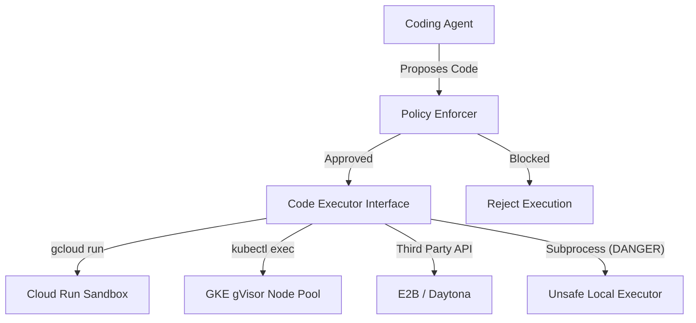

# Lab 05 — Secure Sandboxes

**Exam section:** 2. Using coding agents for application development (~17% of the exam)
**Objectives covered:** 2.1
**Time:** ~20 minutes · **Cost:** Free offline / ~$2.00 live (GKE cluster provisioning)

---

## 1. Exam objectives covered

> Quoted verbatim from the official exam guide:
> - "Using coding agents in secure sandboxes (e.g., GKE, Cloud Workstations, and Antigravity)"
> - "Using coding agents to refactor source code, optimize execution runtimes, and patch application-layer vulnerabilities"

## 2. Explain it simply

Agents write code to solve problems. To verify if the code works, they need to execute it. But executing AI-generated code directly on the host machine or inside the agent's memory space is extremely dangerous—it exposes credentials, files, and the local network to malicious or hallucinated code.

A **secure sandbox** solves this by providing a disposable, strictly isolated environment where the agent can run code, see the output, and retry if it fails, without risking the host. Think of it like a bomb disposal unit testing a suspicious device in a reinforced steel box.

## 3. How it works



The Google Agent Development Kit (ADK) standardizes code execution through the `BaseCodeExecutor` interface (and `BaseEnvironment` for third parties). By injecting different executors into your agent, you change where and how securely the code runs.

## 4. The decision that matters

When to use which ADK Code Executor:

| If you need... | Use | Why not the alternative |
| :--- | :--- | :--- |
| **High isolation, strict egress control**, custom namespaces | `GkeCodeExecutor` (sandbox mode) | `job` mode lacks the strict gVisor isolation of `sandbox` mode. GKE gives you network-level egress control, unlike basic containers. |
| **Fast serverless sandboxing** from within a Cloud Run container | `CloudRunSandboxCodeExecutor` | This runs the `sandbox` CLI *from inside* a Cloud Run service where sandboxes are enabled. It **cannot** be used remotely from outside. |
| **Agent runtime integration** | `AgentEngineSandboxCodeExecutor` | Ideal when already deploying to the Agent Runtime environment. |
| **Managed remote cloud sandboxes** | `E2BEnvironment` or `DaytonaEnvironment` | These are third-party services. They lack native Google Cloud VPC integration but offer out-of-the-box infrastructure management. |
| **Local dev/testing ONLY** | `UnsafeLocalCodeExecutor` | **NEVER use this in production.** It executes code directly as a subprocess on the host system, granting full access to the environment. |

## 5. Hands-on A — offline (free)

In the offline lab, we simulate a policy-gated code-execution decision. Given a proposed code action, our policy enforces which executor tier is required and blocks unsafe combinations (like using `UnsafeLocalCodeExecutor` in a production profile).

```bash
./tracks/02_coding_agents/lab_05_secure_sandboxes/run_lab.sh
```

**Expected output:**
You will see the policy engine instantiate `GkeCodeExecutor` with strict settings (gVisor `sandbox` mode, resource requests/limits) for production, load the third-party integrations, and actively flag `UnsafeLocalCodeExecutor`.

## 6. Hands-on B — live on Google Cloud (opt-in)

The live path executes the logic offline as provisioning a GKE sandbox takes time, but it serves as an educational framework for production sandboxing.

```bash
# Enable required APIs
gcloud services enable run.googleapis.com
./tracks/02_coding_agents/lab_05_secure_sandboxes/run_lab.sh --live
```

> [!WARNING]
> Cost note: ~$2.00 if you test the GKE executor, or ~$0.10 for Cloud Run invocations.

## 7. Verify it worked

Check the `GkeCodeExecutor` configuration offline. Ensure `executor_type='sandbox'` is explicitly set.

## 8. Troubleshooting

| Symptom | Cause | Fix |
| :--- | :--- | :--- |
| `ImportError: cannot import name 'GkeCodeExecutor'` | Missing ADK extras | Run `pip install "google-adk[extensions]"` to unlock GKE execution capabilities. |
| Code executes but fails to download packages | `allow_egress=False` | The executor has explicitly blocked network egress. If your code needs `pip install`, you must either pre-bake the image or selectively allow egress. |

## 9. Clean up

```bash
./tracks/02_coding_agents/lab_05_secure_sandboxes/cleanup.sh
```

## 10. Exam traps

- **`CloudRunSandboxCodeExecutor` location restriction:** It explicitly runs from *inside* a Cloud Run container using the `sandbox` CLI. You cannot initialize it from your laptop to execute code in Cloud Run remotely.
- **GKE `job` vs `sandbox`:** The `GkeCodeExecutor` docstring warns these modes **do not provide the same isolation**. `sandbox` maps to gVisor (GKE Sandbox) which virtualizes the Linux kernel syscalls; `job` is just a standard pod.
- **`UnsafeLocalCodeExecutor`:** This is the trap answer for any question asking about "testing agent code." It provides zero isolation.

## 11. Check yourself

<details>
<summary>1. An agent is deployed on a VM and needs to execute generated Python scripts. The team wants serverless isolation and decides to use `CloudRunSandboxCodeExecutor`. Why will this fail?</summary>
Because `CloudRunSandboxCodeExecutor` must be executed *from inside* a Cloud Run container where the sandbox feature is enabled. It is not a remote API caller for VM clients.
</details>

<details>
<summary>2. You configure `GkeCodeExecutor(executor_type='job')`. A penetration test reveals that agent code can exploit kernel vulnerabilities to escape the container. How do you fix this?</summary>
Change the executor to `executor_type='sandbox'` and ensure the GKE node pool has GKE Sandbox (gVisor) enabled, which intercepts and isolates kernel syscalls.
</details>
