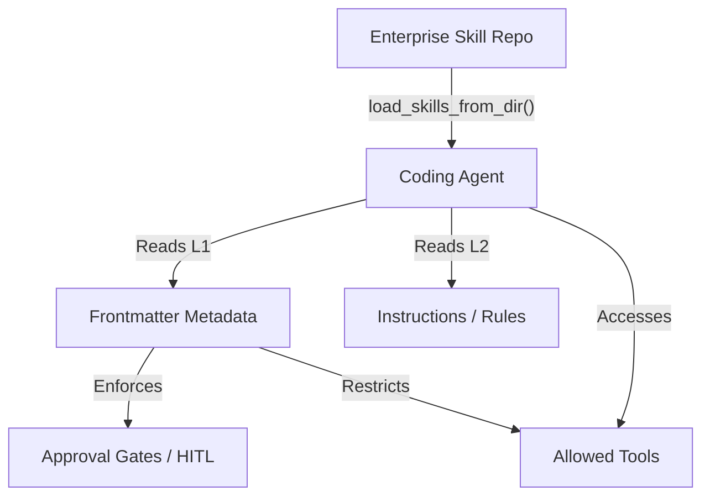

# Lab 06 — Customizing Coding Agents for Enterprise

**Exam section:** 2. Using coding agents for application development (~17% of the exam)
**Objectives covered:** 2.2
**Time:** ~20 minutes · **Cost:** Free offline / Free live

---

## 1. Exam objectives covered

> Quoted verbatim from the official exam guide:
> - "Creating skills, plugins, extensions hooks, rules, and subagents using Antigravity"
> - "Augmenting Antigravity with Agents CLI to build, scale, govern, and optimize deployed agents"

> [!WARNING]
> **Pre-GA / naming note.** The exam guide refers to *Antigravity*, *Gemini CLI*, *Gemini Code Assist*, and *Agents CLI in Agent Platform*. As of the date in `docs/VERIFIED_FACTS.md`, the CLI surface (Agents CLI) is not fully publicly verified and Antigravity is preview-only (via `antigravity-preview-05-2026`). The verifiable, portable core for creating skills, rules, and subagents across all of these products is the `google.adk.skills` module and the Skill Registry, which this lab teaches.

## 2. Explain it simply

An out-of-the-box coding agent is like a talented new hire who doesn't know your company's rules. If you just tell it to "write an API," it will guess at the framework, guess at the database, and ignore your security policies. 

To fix this, you don't rewrite the agent—you provide it with an employee handbook. In Google Cloud, this handbook takes the form of **Skills** and **Rules**. A Skill bundles instructions, allowed tools, and specific file resources into a single, portable package that an agent can load at runtime to gain specialized, governed capabilities.

## 3. How it works



When an enterprise wants to standardize how agents write code (e.g., enforcing zero-trust security), they author a **Skill** using a standard `SKILL.md` file. The ADK's `load_skills_from_dir` reads this file in layers:
1. **L1 Frontmatter**: Metadata like `allowed_tools` and `metadata.approval_gate`. This is the governance layer.
2. **L2 Instructions**: The natural language rules (e.g., "Always use GKE code executors").
3. **L3 Resources**: Bundled scripts, test plans, or mock data.

## 4. The decision that matters

When customizing a coding agent, choose the right primitive:

| If you need... | Use | Why not the alternative |
| :--- | :--- | :--- |
| **Broad, reusable capabilities** (e.g., a "Database Specialist" profile) | **Skills** | Rules are too simple and don't bundle external resources or tool allowances. |
| **Strict runtime governance** (e.g., restricting which APIs an agent can call) | **Frontmatter `allowed_tools`** | System instructions can be ignored or hallucinated by the model; frontmatter is enforced by the execution engine. |
| **Intercepting execution** (e.g., blocking prompt injection before the model sees it) | **Plugins / Hooks** | Skills guide behavior, but Hooks actively intercept and modify the execution graph (e.g., `before_model_callback`). |
| **Delegating complex workflows** | **Subagents** | A single agent with too many skills gets confused. Subagents act as dedicated specialists. |

## 5. Hands-on A — offline (free)

In this offline lab, we programmatically author a custom enterprise Skill containing strict governance metadata, then use the ADK to parse and load it.

```bash
./tracks/02_coding_agents/lab_06_antigravity_customization/run_lab.sh
```

**Expected output:**
You will see the ADK parse the newly created `SKILL.md` file. It will output the `Frontmatter`, showing the `allowed_tools` list being restricted and an `approval_gate: required` metadata flag being detected for Human-In-The-Loop (HITL) enforcement.

## 6. Hands-on B — live on Google Cloud (opt-in)

The core customization engine runs locally using the ADK. When deploying to a managed service like Agent Registry or Skill Registry, these same `SKILL.md` files are zipped and uploaded. This lab remains offline as it teaches the portable syntax.

```bash
./tracks/02_coding_agents/lab_06_antigravity_customization/run_lab.sh --live
```

## 7. Verify it worked

Check the `SKILL.md` parsing. The ADK's `Frontmatter` class enforces specific fields: `name`, `description`, `license`, `compatibility`, `allowed_tools`, and `metadata`. If any are misspelled in your YAML frontmatter, the ADK will not parse them correctly.

## 8. Troubleshooting

| Symptom | Cause | Fix |
| :--- | :--- | :--- |
| `Frontmatter` missing fields during load | Invalid YAML syntax | Ensure the `---` delimiters are correct and keys match the ADK `Frontmatter` spec exactly. |
| Agent ignores custom rules | Instructions placed in L1 | Ensure instructions are placed *below* the second `---` delimiter in `SKILL.md`. |

## 9. Clean up

```bash
./tracks/02_coding_agents/lab_06_antigravity_customization/cleanup.sh
```

## 10. Exam traps

- **Frontmatter vs. Instructions:** The exam will test if you know how to govern an agent. Putting "Do not use the delete tool" in the instructions (L2) is a soft prompt. Putting `allowed_tools: [read, list]` in the Frontmatter (L1) is a hard, engine-level constraint.
- **Agents CLI vs. ADK:** The ADK is the programmatic SDK. The Agents CLI is the command-line interface for deploying and evaluating these configurations at scale. Both use the same underlying `SKILL.md` format.

## 11. Check yourself

<details>
<summary>1. You are tasked with creating a custom behavior for Antigravity that prevents the agent from deploying code without human review. Where should this constraint be configured?</summary>
In the Skill's Frontmatter metadata. By setting an `approval_gate` or restricting `allowed_tools`, the execution engine can enforce Human-In-The-Loop (HITL) independent of the LLM's behavior.
</details>

<details>
<summary>2. An enterprise wants their coding agent to natively understand their proprietary internal framework. Should they use a Rule, a Plugin, or a Skill?</summary>
A Skill. Skills bundle instructions with specific resources (like code snippets of the framework) and can be centrally managed and distributed via the Skill Registry.
</details>
