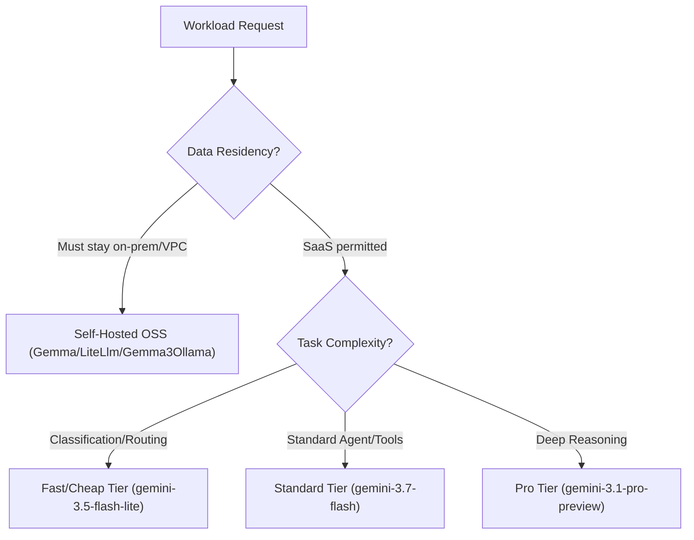

# Lab 07 — Model Selection

**Exam section:** 3. Developing custom agents (~33% of the exam)
**Objectives covered:** 3.1
**Time:** ~15 minutes · **Cost:** Free offline / ~$0.01 live

---

## 1. Exam objectives covered

> Quoted verbatim from the official exam guide:
> - "Selecting and configuring the appropriate language model (LLM vs. SLM, self-hosted vs. SaaS, OSS vs. proprietary) considering cost, security, and agent architecture"

## 2. Explain it simply

Before writing your first agent, you have to choose its "brain" (the model). In the Agent Development Kit (ADK), this means picking a model class (`Gemini`, `Gemma`, `Claude`, `LiteLlm`, `Gemma3Ollama`, or `FallbackModel`) and a specific model ID (like `gemini-3.7-flash` or `gemma-4-31b-it`).

Every choice is a trade-off between **capability** (can it reason well?), **cost** (how much per token?), **latency** (how fast?), and **security/residency** (where do the weights live and who sees the data?). You never default to the smartest model for every task — you match the model to the job. The exam tests your judgment on exactly this matching process.

## 3. How it works



In the ADK, model integration happens through the `google.adk.models` package. All models inherit from `BaseLlm`.

- **`Gemini`**: The managed Google API models (SaaS).
- **`Gemma`**: Google's open-weights models (often self-hosted).
- **`LiteLlm`**: A proxy to third-party/OSS models.
- **`Gemma3Ollama`**: Local self-hosted execution for Gemma models.
- **`Claude`**: Anthropic models via Vertex AI.
- **`FallbackModel`**: A pattern for high availability (try Model A, if fail, try Model B).

## 4. The decision that matters

| If you need... | Use | Why not the alternative |
| :--- | :--- | :--- |
| Strict air-gap or data residency | `gemma-4-31b-it` (Self-hosted) | SaaS models (`gemini-*`) send data to Google infrastructure. |
| High-volume simple classification | `gemini-3.5-flash-lite` | The Pro tier is too slow and too expensive for simple tasks. |
| Deep architectural reasoning | `gemini-3.1-pro-preview` | Flash tier may struggle with complex, multi-step logic. |
| GA-only, strict SLAs | `gemini-2.5-pro` | Preview models (e.g., `gemini-3.1-pro-preview`) often lack strict SLAs. |
| General agent with tool calling | `gemini-3.7-flash` | The best balance of cost, speed, and capability. |

## 5. Hands-on A — offline (free)

```bash
./tracks/03_custom_agents/lab_07_model_selection/run_lab.sh
```

You will see output demonstrating model instantiation using the ADK classes and a walkthrough of constraint-based model selection. This proves you can configure `google.adk.models.Gemini` and `Gemma` and use `FallbackModel` without making live network calls.

## 6. Hands-on B — live on Google Cloud (opt-in)

```bash
./tracks/03_custom_agents/lab_07_model_selection/run_lab.sh --live
```

> [!WARNING]
> Cost note: This will make a few basic API calls to the Gemini models, costing less than $0.01.

## 7. Verify it worked

Check the output of the script. You should see the ADK model classes correctly instantiated and the exact model IDs matched to the scenarios.

## 8. Troubleshooting

| Symptom | Cause | Fix |
| :--- | :--- | :--- |
| `ImportError: cannot import name 'FallbackModel' from 'google.adk.models'` | You are not using `google-adk==2.9.0`. | Verify `google-adk` installation in your environment. |
| Live mode fails with authentication error | Missing API Key or Google Cloud credentials. | Set `GOOGLE_API_KEY` or configure ADC (`gcloud auth application-default login`). |

## 9. Clean up

```bash
./tracks/03_custom_agents/lab_07_model_selection/cleanup.sh
```

There are no cloud resources created in this lab.

## 10. Exam traps

- **Self-hosted vs SaaS**: `Gemma` is self-hosted (OSS), `Gemini` is SaaS (Proprietary).
- **Pro vs Flash vs Lite**: Always pick the *smallest, cheapest* model that reliably completes the task. Don't use Pro for a routing task.
- **Model IDs**: `text-embedding-005` is stale; use `gemini-embedding-2`.

## 11. Check yourself

<details>
<summary>1. A customer requires that no data leaves their VPC. Which model hosting strategy is appropriate?</summary>
Self-hosted open-weights models (like Gemma) deployed on GKE or Vertex AI Model Garden. SaaS models like Gemini are not permitted.
</details>

<details>
<summary>2. You need an agent to classify 10,000 incoming support tickets per minute. Which tier should you choose?</summary>
The Lite tier (e.g., `gemini-3.5-flash-lite`), as it is a high-volume, low-complexity task where cost and latency dominate.
</details>

<details>
<summary>3. In the ADK, which class handles routing traffic to a secondary model if the primary model fails?</summary>
<code>google.adk.models.FallbackModel</code>
</details>
