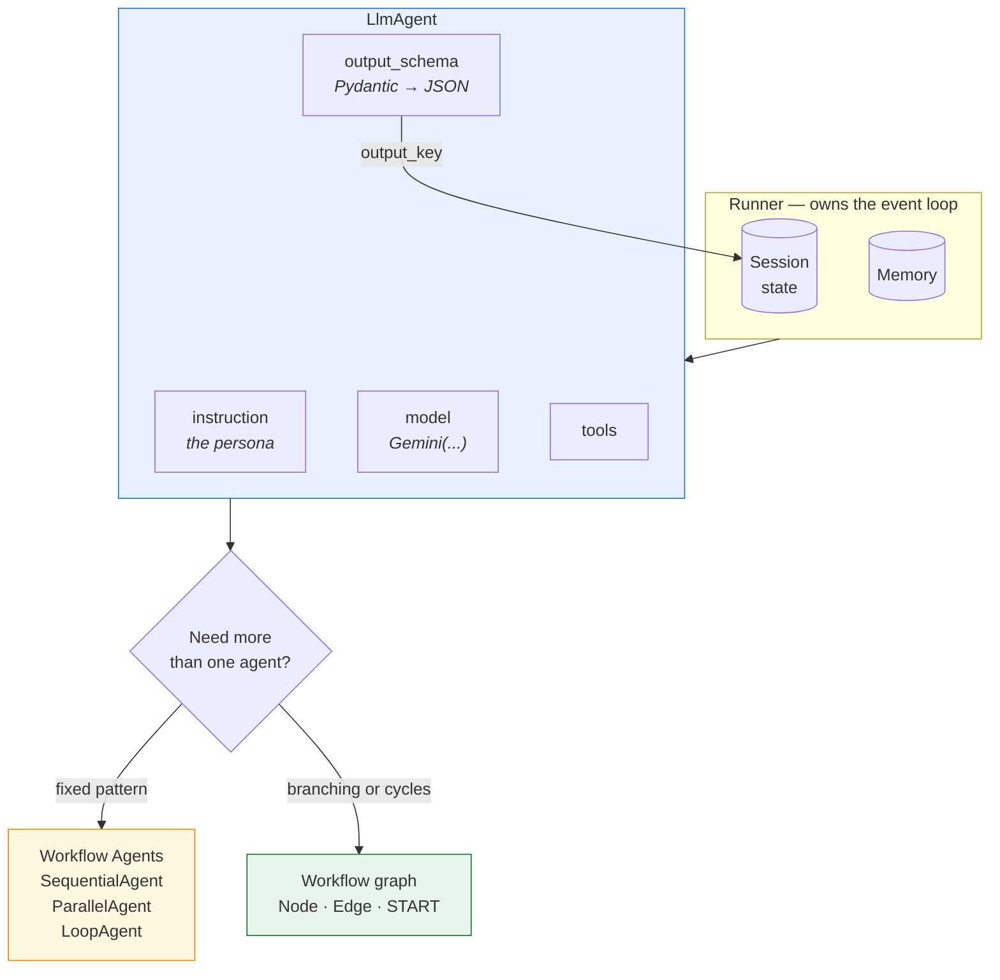

# Lab 08 — ADK Fundamentals

**Exam section:** 3. Developing custom agents (~33% of the exam)
**Objectives covered:** 3.1
**Time:** ~20 minutes · **Cost:** Free offline / ~$0.05 live

---

## 1. Exam objectives covered

> Quoted verbatim from the official exam guide:
> - "Building custom agents using open-source libraries (e.g., ADK)"
> - "Orchestrating agents using agentic protocols ... selecting and coordinating multiagent handoffs and workflows (parallel, sequential, graph workflow)"

## 2. Explain it simply

The ADK lets you write agents in Python instead of configuring them in a UI. At its core, an `LlmAgent` pairs a language model with system instructions, tools, and a structured output schema.

When you need multiple agents to work together, you have two choices:
1. **Workflow Agents** (`SequentialAgent`, `ParallelAgent`, `LoopAgent`): A fast, declarative way to run a list of agents in a fixed pattern.
2. **Graph Workflow** (`google.adk.workflow.Workflow`): A highly customizable execution graph using nodes and edges (like LangGraph) for complex conditional logic and cycles.

## 3. How it works



### The core agent (`LlmAgent`)

Every agent is defined by its properties:
- `model`: The underlying LLM (e.g. a `Gemini` instance).
- `instruction`: The prompt that tells the agent what to do (the persona).
- `global_instruction` vs `static_instruction`: Specialised instructions that apply globally or statically.
- `output_schema`: Forces the LLM to return structured JSON matching a Pydantic model.
- `output_key`: When an agent returns structured data, where it lands in the session state.
- `include_contents`: Controls whether the agent sees the full message history or just the latest input.

### Execution

To run an agent you need a `Runner` (such as `InMemoryRunner`), which provides the event loop and
owns the session and memory services. Execution also triggers lifecycle hooks
(`before_agent_callback`, `before_model_callback`, `before_tool_callback`) — these are where you
attach logging, guardrails and caching.

### The `adk` CLI
You can scaffold, serve and test your apps from the command line:
- `adk create`: Scaffolds a new project.
- `adk run`: Runs an agent interactively in the terminal.
- `adk web` / `adk api_server`: Serves the agent over HTTP.

## 4. The decision that matters

| If you need... | Use | Why not the alternative |
| :--- | :--- | :--- |
| A simple pipeline (Agent A -> Agent B -> Agent C) | `SequentialAgent` | A full `Workflow` graph is verbose and over-engineered for a straight line. |
| Fan-out tasks (Run A, B, and C simultaneously) | `ParallelAgent` | `SequentialAgent` would run them one by one, wasting time. |
| Complex, conditional, multi-step routing with cycles | `Workflow` + `Node` + `Edge` | Workflow Agents are too rigid for conditional branching. |

## 5. Hands-on A — offline (free)

```bash
./tracks/03_custom_agents/lab_08_adk_fundamentals/run_lab.sh
```

You will see:
1. An `LlmAgent` instantiated with structured schemas and keys.
2. A declarative `SequentialAgent` linking two agents.
3. A `Workflow` graph built using `Node`, `Edge`, and `FunctionNode`.

## 6. Hands-on B — live on Google Cloud (opt-in)

```bash
./tracks/03_custom_agents/lab_08_adk_fundamentals/run_lab.sh --live
```

> [!WARNING]
> Cost note: This will make calls to Gemini and process the responses via the `InMemoryRunner`. Costs are minimal, around ~$0.05.

## 7. Verify it worked

Check the Python output. You should see both the `SequentialAgent` and `Workflow` representations.

## 8. Troubleshooting

| Symptom | Cause | Fix |
| :--- | :--- | :--- |
| `pydantic.ValidationError` on Agent creation | The output schema doesn't match the required types | Ensure you pass a valid Pydantic BaseModel class to `output_schema`. |
| Graph Workflow fails to route | Missing `Edge` from a node | Ensure every active node has a defined edge or routes to an exit condition. |

## 9. Clean up

```bash
./tracks/03_custom_agents/lab_08_adk_fundamentals/cleanup.sh
```

No cloud resources are provisioned.

## 10. Exam traps

- **Workflow vs Workflow Agents:** `SequentialAgent`, `ParallelAgent` and `LoopAgent` are **deprecated in favour of `Workflow`** — constructing one emits a `DeprecationWarning`. But they are **not removed, and not yet replaceable**: the warning itself says *"Workflow cannot yet be used as an LlmAgent sub-agent."* So if you need a composite step nested inside an `LlmAgent`, you still reach for a workflow agent today. The wrong answers here are both "they're gone" and "nothing has changed".
- **Loop termination:** A `LoopAgent` uses `max_iterations` to prevent infinite loops, and can use the `exit_loop` tool to break out early.
- **State Schemas:** An `output_key` binds the agent's `output_schema` to the session's overall `state_schema`.

## 11. Check yourself

<details>
<summary>1. You need an agent to repeatedly execute a task until a condition is met or a max count is reached. What is the simplest ADK primitive for this?</summary>
<code>LoopAgent</code> (configured with <code>max_iterations</code>).
</details>

<details>
<summary>2. You want to serve your custom agent with a Web UI for stakeholders to test. Which CLI command do you use?</summary>
<code>adk web</code>
</details>

<details>
<summary>3. What is the difference between <code>SequentialAgent</code> and <code>Workflow</code>?</summary>
<code>SequentialAgent</code> is a declarative helper for straight-line execution. <code>Workflow</code> is a full graph engine allowing conditional edges (branching) and cycles.
</details>
