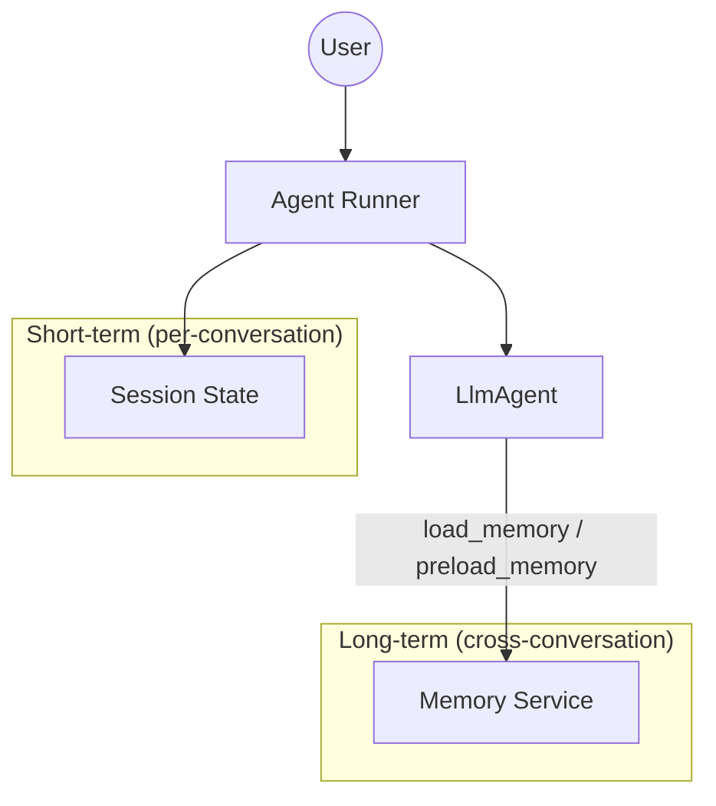

# Lab 09 — Sessions and Memory

**Exam section:** 3. Developing custom agents (~33% of the exam)
**Objectives covered:** 3.1
**Time:** ~15 minutes · **Cost:** Free offline

---

## 1. Exam objectives covered

> Quoted verbatim from the official exam guide:
> - "Configuring sessions and memory (e.g., Agent Platform Memory Bank and managed sessions)"

## 2. Explain it simply

Agents are stateless by default. If you ask an agent your name in turn 1, it won't remember it in turn 2 unless you store it.

The exam heavily tests the architectural distinction between two types of persistence:
1. **Session State (Short-term context):** The exact transcript and structured state for *one ongoing conversation*. It lives while the user is actively chatting, usually bound by a `state_schema`, and is retrieved quickly on every turn.
2. **Memory (Long-term facts):** Extracted knowledge stored across sessions. If you tell an agent you have a dog, it stores that fact in memory so it remembers next month, even in a brand new session.

## 3. How it works



### Session Services (`google.adk.sessions`)
Session services store the conversation history and the typed state.
- `InMemorySessionService`: Local testing only.
- `DatabaseSessionService`: SQL-backed (e.g., Cloud SQL).
- `VertexAiSessionService`: Serverless managed sessions in Agent Platform.
- `RedisSessionService` (from `google.adk.integrations.redis`): High-speed caching in Memorystore for Redis.

You can move sessions between backends using the `adk migrate session` CLI command.
Agents can write structured data directly to the session by binding their `output_schema` to an `output_key` that exists in the workflow's `state_schema`.

### Memory Services (`google.adk.memory`)
Memory services store facts.
- `InMemoryMemoryService`: Local testing.
- `VertexAiMemoryBankService`: Agent Platform Memory Bank (stores entities/facts extracted by the LLM).
- `VertexAiRagMemoryService`: RAG-backed memory using Vector Search for large-scale semantic recall.

### Recall Tools
Agents retrieve long-term memory via built-in tools:
- `load_memory`: On-demand tool call. The LLM decides when to search memory based on the user's prompt.
- `preload_memory`: Automatic context injection. Memory is fetched proactively *before* the model responds.

## 4. The decision that matters

### Choosing a Session Backend
| If you need... | Use | Why not the alternative |
| :--- | :--- | :--- |
| Ultra-low latency for high-traffic chat | `RedisSessionService` | `VertexAiSessionService` introduces API latency; SQL is slower. |
| Fully serverless managed history | `VertexAiSessionService` | Redis/SQL require provisioning and managing infrastructure (ops burden). |
| Durable, multi-region ACID transactions | `DatabaseSessionService` | Redis is typically a cache and can lose data if not heavily configured. |

### Choosing a Memory Service
| If you need... | Use | Why not the alternative |
| :--- | :--- | :--- |
| Remembering a user's explicit preferences | `VertexAiMemoryBankService` | RAG is overkill for structured entity facts and costs more to embed. |
| Recalling massive amounts of unstructured context | `VertexAiRagMemoryService` | Memory Bank isn't designed for large-scale semantic similarity search (vector recall). |

## 5. Hands-on A — offline (free)

```bash
./tracks/03_custom_agents/lab_09_sessions_and_memory/run_lab.sh
```

You will see the instantiation of various session and memory backends, the configuration of Memorystore for Redis, and how an agent binds to a `state_schema` via `output_key`.

## 6. Hands-on B — live on Google Cloud (opt-in)

```bash
./tracks/03_custom_agents/lab_09_sessions_and_memory/run_lab.sh --live
```

> [!WARNING]
> Cost note: This lab is fully local for demonstrations and will not incur cloud charges. Live mode relies on actual Redis/Vertex/SQL endpoints which are beyond the scope of this sandbox.

## 7. Verify it worked

Check the terminal output. You should see ADK objects created successfully, including `RedisSessionServiceConfig` and `DatabaseSessionService`, proving you are using real ADK classes.

## 8. Troubleshooting

| Symptom | Cause | Fix |
| :--- | :--- | :--- |
| Cannot import `RedisSessionService` | Using the wrong import path | It lives in `google.adk.integrations.redis`, not `google.adk.sessions`. |
| State validation error | `output_key` doesn't match `state_schema` | Ensure the key the agent writes to exists in the global schema. |

## 9. Clean up

```bash
./tracks/03_custom_agents/lab_09_sessions_and_memory/cleanup.sh
```

## 10. Exam traps

- **Sessions vs Memory:** If a scenario says "Remember the customer's account ID when they return next week," that is **Memory**. If it says "Keep track of the shopping cart during the chat," that is **Session State**.
- **Redis Import Path:** Memorystore for Redis is in `google.adk.integrations.redis`, not the core sessions package.
- **`adk migrate session`:** This is a real CLI command to move session data between backends.
- **On-demand vs Proactive:** `load_memory` requires an LLM tool call. `preload_memory` injects context automatically before generation.

## 11. Check yourself

<details>
<summary>1. A retail agent needs to remember that a user prefers vegan recipes across all future interactions. Should this be stored in Session State or Memory?</summary>
Memory (e.g., <code>VertexAiMemoryBankService</code>). Session state is for the current conversation only.
</details>

<details>
<summary>2. You want to store session state in Memorystore for Redis. Which config class must you instantiate?</summary>
<code>RedisSessionServiceConfig</code>
</details>

<details>
<summary>3. Which ADK tool allows an agent to automatically fetch relevant user context before responding, saving a tool-call round trip?</summary>
<code>preload_memory</code>
</details>
