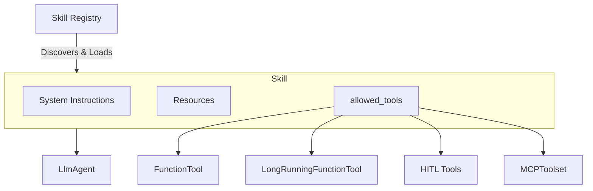

# Lab 10 — Tools and Skills

**Exam section:** 3. Developing custom agents (~33% of the exam)
**Objectives covered:** 3.1, 2.2, 5.1
**Time:** ~20 minutes · **Cost:** Free offline

---

## 1. Exam objectives covered

> Quoted verbatim from the official exam guide:
> - "Configuring skills using Agents CLI (e.g., plugins and agent vs. human mode)"
> - "Using Google Cloud tools (e.g., Agent Registry, Google Cloud MCP Servers) to configure prebuilt and custom capabilities"
> - "Designing appropriate safety frameworks and guardrails (Agent Gateway, Model Armor, HITL)"

## 2. Explain it simply

Agents without tools can only talk. Tools give agents hands. 

The exam tests your understanding of the entire capability taxonomy. At the lowest level, a **tool** is just a function the LLM can call (like Python code or an MCP server). But in an enterprise, you don't just hand raw functions to agents; you package them into a **skill**. A skill is a versioned, governed bundle that contains tools, system instructions, and resources. You store these skills in a **Skill Registry** so agents can dynamically discover and load them.

## 3. How it works



### 1. Tools (The building blocks)
- **Plain Python functions:** ADK automatically wraps them into tools using their docstrings and type hints.
- **`LongRunningFunctionTool`:** For asynchronous tasks.
- **Human-in-the-Loop (HITL):** Built-in tools like `request_input` and `get_user_choice` that pause execution to ask a human.
- **Agent-as-a-tool:** Using `AgentTool` or `transfer_to_agent`, an agent can call another agent like a function.
- **Built-in Tools:** `google_search`, `enterprise_web_search`, `exit_loop`.
- **MCP Toolsets:** Standardized integration using `MCPToolset` and `RemoteMcpServer`.

### 2. Skills (The governance layer)
A `Skill` consists of:
- **`Frontmatter`:** Discovery metadata (`name`, `description`, `allowed_tools`).
- **Instructions:** Persona and behavior guidelines.
- **Resources:** Context files (markdown, data).

Skills are loaded locally (`load_skills_from_dir`), from GCS (`load_skill_from_gcs_dir`), or centrally via the enterprise `GCPSkillRegistry` (which implements the `SkillRegistry` interface).

## 4. The decision that matters

| If you need... | Use | Why not the alternative |
| :--- | :--- | :--- |
| To ask the user for approval before modifying a database | `get_user_choice` (HITL tool) | Standard functions run autonomously and could make dangerous changes without oversight. |
| To share an internal capability across multiple teams safely | `SkillRegistry` / `GCPSkillRegistry` | Hardcoding functions directly in `LlmAgent(tools=[...])` creates drift and prevents central governance. |
| To integrate with 100+ internal microservices uniformly | `MCPToolset` | Writing bespoke Python wrapper tools for every internal REST API is unmaintainable. |

## 5. Hands-on A — offline (free)

```bash
./tracks/03_custom_agents/lab_10_tools_and_skills/run_lab.sh
```

You will see the creation of various tools, the instantiation of a `GCPSkillRegistry`, and an `LlmAgent` resolving its tool manifest. We also demonstrate a `LongRunningFunctionTool` configured for a HITL pause.

## 6. Hands-on B — live on Google Cloud (opt-in)

```bash
./tracks/03_custom_agents/lab_10_tools_and_skills/run_lab.sh --live
```

> [!WARNING]
> Cost note: This lab is fully local for demonstrations and will not incur cloud charges. Live mode relies on actual GCP Skill Registry endpoints which are beyond the scope of this sandbox.

## 7. Verify it worked

Check the terminal output. You should see ADK objects created successfully, including `GCPSkillRegistry` and the resolved `LlmAgent` tools manifest, proving you are using real ADK classes.

## 8. Troubleshooting

| Symptom | Cause | Fix |
| :--- | :--- | :--- |
| Missing discovery metadata when loading a skill | Malformed `Frontmatter` | Ensure the skill directory contains a valid YAML frontmatter header defining `name` and `allowed_tools`. |

## 9. Clean up

```bash
./tracks/03_custom_agents/lab_10_tools_and_skills/cleanup.sh
```

## 10. Exam traps

- **Tool vs. Skill:** A tool is a callable. A skill is a *bundle* of instructions + resources + tools. Do not confuse them.
- **`GCPSkillRegistry`:** This is the GCP-specific implementation of the abstract `SkillRegistry` interface. It takes `project_id`, `location`, and `credentials`.
- **HITL vs LongRunning:** `LongRunningFunctionTool` executes in the background. If it requires user intervention, you explicitly pair it with HITL patterns. `request_input` and `get_user_choice` are dedicated primitives for explicitly stopping for a human.

## 11. Check yourself

<details>
<summary>1. Your enterprise wants to ensure that all customer support agents share the exact same prompt instructions and specific approved tools. How should you distribute this?</summary>
Package it as a <code>Skill</code> and publish it to the <code>GCPSkillRegistry</code>.
</details>

<details>
<summary>2. An agent needs to query a third-party server that takes 45 seconds to respond. Which tool wrapper should you use to avoid blocking the main event loop?</summary>
<code>LongRunningFunctionTool</code>.
</details>

<details>
<summary>3. Which built-in tool should an agent use to explicitly ask a user to select from a list of options (e.g., "Approve", "Deny", "Escalate")?</summary>
<code>get_user_choice</code>
</details>
