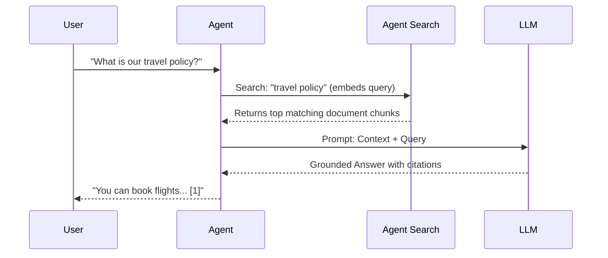

# Lab 11 — RAG and Retrieval

**Exam section:** 3. Developing custom agents (~33% of the exam)
**Objectives covered:** 3.2 Integrating enterprise domain knowledge
**Time:** ~15 minutes · **Cost:** Free offline / ~$0.05 live

---

> **Personal study repo — not affiliated with Google Cloud.** Official guidance: [cloud.google.com/learn/certification/agentic-architect](https://cloud.google.com/learn/certification/agentic-architect) · [Disclaimer](../../../DISCLAIMER.md)

## 1. Exam objectives covered

> Quoted verbatim from the official exam guide:
> - "Designing, configuring, and managing RAG pipelines and vector retrieval systems (embedding models, similarity scoring, reranking) using services such as vector databases (e.g., Vector Search and Agent Retrieval)"

## 2. Explain it simply

Agents can only reason about what they know. When you need an agent to answer questions based on your company's private documents, you use Retrieval-Augmented Generation (RAG). Instead of fine-tuning a model (which is expensive and doesn't easily update), you store your documents in a searchable database.

Think of RAG like an open-book test. When a user asks a question, the agent first searches the textbook (the vector database), pulls out the relevant paragraphs, and then reads those paragraphs to answer the question.

> [!WARNING]
> **Pre-GA / naming note.** The exam guide refers to *Agent Search*. As of the date in `docs/VERIFIED_FACTS.md`, the public documentation often still refers to this as *Vertex AI Search*. Expect to see both terms.

## 3. How it works



A complete RAG pipeline involves:
1. **Chunking**: Breaking long documents into smaller, meaningful pieces.
2. **Embedding**: Converting text into dense vector representations. (e.g., `gemini-embedding-2` with 8192 dimensions).
3. **Retrieval**: Finding the vectors in your database that have the highest cosine similarity to the user's query vector.
4. **Re-ranking & Grounding**: Re-evaluating the top hits for relevance and assembling the context so the model can cite its sources (reducing hallucination).

In ADK, memory and retrieval are handled by the `VertexAiRagMemoryService`.

## 4. The decision that matters

| If you need... | Use | Why not the alternative |
| :--- | :--- | :--- |
| Managed, out-of-the-box RAG | **Agent Search (Vertex AI Search)** | Self-managed is too operationally complex if you just want to search PDFs. |
| Custom chunking & embedding control | **Vertex AI RAG Engine** | Agent Search hides the chunking logic; RAG Engine lets you customize it. |
| Existing SQL/DW integration | **AlloyDB/pgvector or BigQuery Vector Search** | You already have the data in a database, no need to duplicate it to a vector store. |
| Low setup, small documents | **Long-context stuffing** | Vector databases add latency and cost. If the doc fits in 1M tokens, just pass it in. |

## 5. Hands-on A — offline (free)

```bash
./tracks/03_custom_agents/lab_11_rag_and_retrieval/run_lab.sh
```

You will see the script manually execute the steps of RAG (chunking, embedding, cosine similarity ranking, and prompt assembly) without any cloud dependencies. It proves how the mechanics work before you abstract them away with a managed service.

## 6. Hands-on B — live on Google Cloud (opt-in)

Requires a Google Cloud project with the Vertex AI API enabled.

```bash
./tracks/03_custom_agents/lab_11_rag_and_retrieval/run_lab.sh --live
```

> [!WARNING]
> Cost note: The live embedding API calls cost roughly $0.00002 per 1k characters.

## 7. Verify it worked

Check that the offline pipeline correctly ranks the chunks so the most relevant chunk (highest cosine similarity) is placed into the context window.

## 8. Troubleshooting

| Symptom | Cause | Fix |
| :--- | :--- | :--- |
| `ResourceExhausted` during live embed | Embedding batch too large | Batch your requests or request a quota increase. |
| Hallucinated answers | Poor retrieval quality | Add a re-ranker, tweak chunk size, or use Hybrid Search (keyword + semantic). |

## 9. Clean up

```bash
./tracks/03_custom_agents/lab_11_rag_and_retrieval/cleanup.sh
```

There are no resources created in the live path for this lab (only API calls), so local cleanup is sufficient.

## 10. Exam traps

- **Agent Search vs RAG Engine**: Agent Search is the fully managed turnkey solution. RAG Engine is the modular API for building custom retrieval pipelines.
- **Fine-tuning vs RAG**: If the data changes frequently, use RAG. Do not choose fine-tuning for dynamic factual knowledge.
- **Dimensions**: `gemini-embedding-2` produces vectors with 8192 dimensions.

## 11. Check yourself

<details>
<summary>When should you use BigQuery Vector Search over Agent Search?</summary>
When your enterprise data already resides in BigQuery and you want to join vector search results with structured tabular data in a single SQL query.
</details>
<details>
<summary>What is the primary purpose of grounding?</summary>
To anchor the LLM's response in retrieved facts (citations), significantly reducing the risk of hallucination.
</details>
