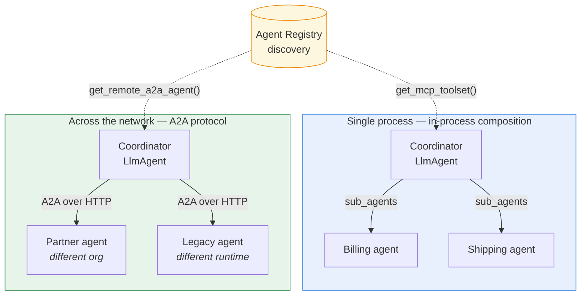
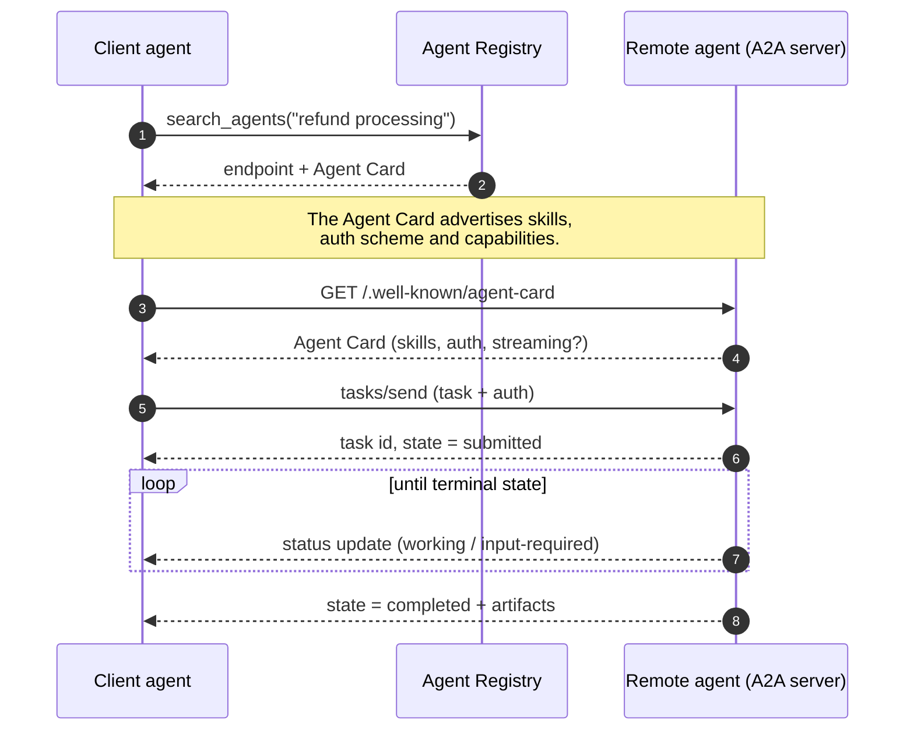

# Lab 12 — Multi-Agent and A2A

**Exam section:** 3. Developing custom agents (~33% of the exam)
**Objectives covered:** 3.3
**Time:** ~25 minutes · **Cost:** Free offline

---

> **Personal study repo — not affiliated with Google Cloud.** Official guidance: [cloud.google.com/learn/certification/agentic-architect](https://cloud.google.com/learn/certification/agentic-architect) · [Disclaimer](../../../DISCLAIMER.md)

## 1. Exam objectives covered

> Quoted verbatim from the official exam guide:
> - "Orchestrating agents using agentic protocols (e.g., MCP and A2A)"
> - "Selecting and coordinating multiagent handoffs and workflows (parallel, sequential, graph workflow) using Google Cloud tools (Agent Identity, Agent Registry, Agent Runtime, agent policies)"

## 2. Explain it simply

Agents can collaborate to solve larger problems. 
- **Agent-to-Tool (Vertical)**: When an agent needs to do something (like read a file or query a database), it uses a tool. **MCP** (Model Context Protocol) is the standard for this.
- **Agent-to-Agent (Horizontal)**: When an agent delegates a sub-task to another intelligent agent, it uses **A2A** (Agent-to-Agent protocol).

To avoid hard-coding URLs when agents need to find other agents or tools, they use the **Agent Registry** (the "discovery plane").

## 3. How it works

Two agents can talk in one of two fundamentally different ways, and the dividing line is the
**process boundary**. Inside one process they are just Python objects calling each other. Across a
network — different team, different runtime, different company — they need a wire protocol, and
that protocol is A2A.



### The A2A task handshake

A2A is task-oriented rather than request/response: the caller opens a task, the remote agent may
work on it for a while, and progress streams back. That is what makes it viable across a network
where a single blocking call would time out.



### Coordination patterns
- **Workflow Agents**: `SequentialAgent` and `ParallelAgent` for fixed pipelines.
- **Graph Workflow**: Complex state machines with loops and conditions.
- **Hierarchical delegation**: A supervisor agent uses `sub_agents` and transfers control dynamically using tools like `transfer_to_agent`.

### A2A (Agent-to-Agent)
A2A (`google.adk.a2a` plus the `a2a-sdk` package) lets agents communicate across boundaries securely.
- **`A2aRemoteAgentConfig`**: Defines how to talk to the remote agent (`request_interceptors`, `card_request_interceptors`, and so on).
- **Agent Cards**: Metadata describing an agent's capabilities — the contract a caller reads before it calls.

### Agent Registry
`AgentRegistry.get_remote_a2a_agent(...)` and `AgentRegistry.get_mcp_toolset(...)` locate agents and
tools dynamically, so you never embed IPs or URLs in your code. This is the link between the three
concepts: the Registry is how an agent *discovers* an A2A peer or an MCP server at runtime.

## 4. The decision that matters

| If you need... | Use | Why not the alternative |
| :--- | :--- | :--- |
| To give an agent access to a secure internal database | **MCP** | A2A is for talking to other *agents*, not databases. |
| To delegate a planning sub-task to an expert agent | **A2A** | MCP is for tools, not full agentic reasoning handoffs. |
| To discover remote resources without hardcoding | **Agent Registry** | Hardcoding URLs breaks when services move. |

## 5. Hands-on A — offline (free)

```bash
./tracks/03_custom_agents/lab_12_multi_agent_and_a2a/run_lab.sh
```

You will see the initialization of an A2A remote agent config, Agent Registry, and MCP toolset.

## 6. Hands-on B — live on Google Cloud (opt-in)

```bash
./tracks/03_custom_agents/lab_12_multi_agent_and_a2a/run_lab.sh --live
```

> [!WARNING]
> Cost note: Offline only. Live usage of Agent Registry / A2A requires deployed endpoints.

## 7. Verify it worked

Check the script output. You will see the successful creation of A2A configurations and MCP Toolsets via the Agent Registry.

## 8. Troubleshooting

| Symptom | Cause | Fix |
| :--- | :--- | :--- |
| `ImportError: cannot import name 'A2aRemoteAgentConfig'` | Missing `[a2a]` extra | Ensure you installed `google-adk[a2a]`. |
| `ImportError: cannot import name 'AgentRegistry'` | Missing `[agent-identity]` extra | Ensure you installed `google-adk[agent-identity]`. |

## 9. Clean up

```bash
./tracks/03_custom_agents/lab_12_multi_agent_and_a2a/cleanup.sh
```

## 10. Exam traps

- **MCP vs A2A:** MCP = Agent to Tool. A2A = Agent to Agent. This is a very common exam question.
- **Agent Registry:** It's the discovery plane. It hands you a ready-made `MCPToolset` or a remote A2A agent instead of you hard-coding endpoints.

## 11. Check yourself

<details>
<summary>1. Your agent needs to query a third-party weather API. Which protocol should you use to connect them?</summary>
MCP (Model Context Protocol), because it's a tool, not another agent.
</details>

<details>
<summary>2. You want your coding agent to delegate code review to a separate security agent running on a different cluster. Which protocol?</summary>
A2A (Agent-to-Agent).
</details>

<details>
<summary>3. Instead of hard-coding the URL for the security agent, which service should you query to find it?</summary>
Agent Registry.
</details>
