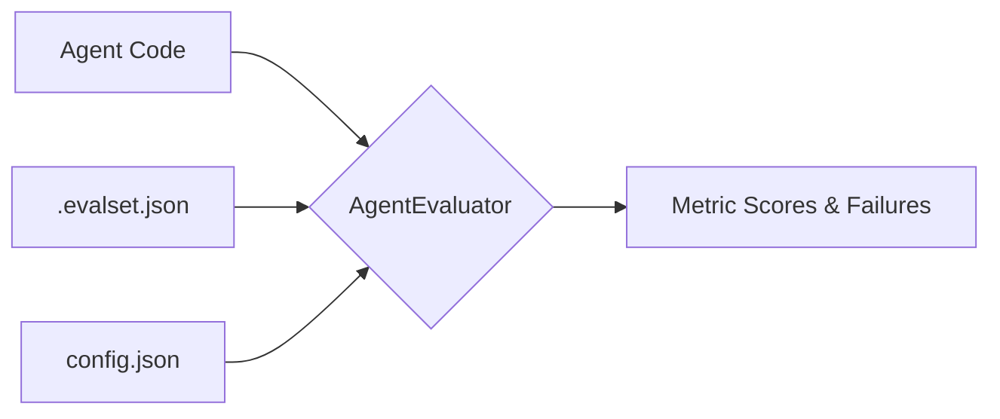

# Lab 13 — Agent Evaluation

**Exam section:** 4.1 Evaluating agents in development and in production (~22% of the exam)
**Objectives covered:** 4.1 (Creating test sets for agent evaluation, continuous evaluation pipelines, appropriate evaluation framework and tooling, evaluating against a golden dataset).
**Time:** ~25 minutes · **Cost:** Free offline / ~$0.05 live

---

## 1. Exam objectives covered

> Quoted verbatim from the official exam guide:
> - "Creating test sets for agent evaluation (golden data, prompts, edge cases)"
> - "Creating continuous evaluation pipelines to assess an agent's tool execution against success criteria"
> - "Determining the appropriate evaluation framework and tooling (ADK evaluation tooling (evalset), Agent Platform Gen AI evaluation service, custom autoraters)"
> - "Evaluating an agentic system against a golden dataset to assess response and retrieval quality"

## 2. Explain it simply

Evaluating agents is fundamentally different from traditional unit testing. Traditional software is deterministic; given the same input, you get the exact same output. Large Language Models are non-deterministic and can achieve the right outcome through varied reasoning paths and phrasing. 

To evaluate an agent, we provide a "Golden Dataset" (`.evalset.json`), which contains test cases with expected behavior. We then use an "Evaluator" (often another LLM acting as a judge) to compare the agent's actual responses and tool usage against rubrics and success criteria.

## 3. How it works



1. **EvalSets:** `adk eval_set` helps manage evaluation sets (groups of `EvalCase` objects). Each case defines an input (conversation or scenario) and expected attributes (like `final_session_state`, `rubrics`, or exact `final_response`).
2. **Metrics:** Configured via JSON, metrics fall into two broad buckets:
   - Programmatic / Deterministic (e.g. `final_response_match_v1`, `trajectory_evaluator`)
   - LLM-as-judge (e.g. `rubric_based_final_response_quality_v1`, `llm_as_judge`, `rubric_based_tool_use_quality_v1`)
3. **Execution:** The `adk eval` command takes your agent, the eval set, and the config, simulates the interactions, computes the metrics, and reports success or failure based on thresholds.

## 4. The decision that matters

| If you need... | Use | Why not the alternative |
| :--- | :--- | :--- |
| Exact string matching for a known fixed answer | `final_response_match_v1` | LLM-as-judge is slower, more expensive, and overkill for exact matches. |
| To check if tool execution was procedurally correct | `trajectory_evaluator` / `rubric_based_tool_use_quality_v1` | Final response metrics only check the answer, not *how* the agent got it (it could have hallucinated the answer without using the tool). |
| Qualitative assessment of tone, helpfulness, or accuracy | `rubric_based_final_response_quality_v1` | Exact string match fails if the agent phrases the right answer slightly differently. |
| Custom programmatic evaluation logic | `custom_metric_evaluator` | Built-in rubrics are LLM-backed; custom metrics allow deterministic Python assertions. |

## 5. Hands-on A — offline (free)

```bash
./tracks/04_evaluate_and_deploy/lab_13_agent_evaluation/run_lab.sh
```

In the offline run, we mock the inference but validate the schema of the `AgentEvaluator` configuration and the `.evalset.json` files. The tests assert that the metric names correspond exactly to the available ADK 2.9.0 evaluators.

## 6. Hands-on B — live on Google Cloud (opt-in)

Ensure you have credentials configured:
```bash
export GOOGLE_CLOUD_PROJECT="your-project-id"
export GOOGLE_CLOUD_LOCATION="us-central1"
```

```bash
./tracks/04_evaluate_and_deploy/lab_13_agent_evaluation/run_lab.sh --live
```

> [!WARNING]
> Cost note: This will execute LLM calls for both the agent generating responses and the judge model evaluating them. For a few eval cases, this will cost less than $0.05.

## 7. Verify it worked

1. Check that `.evalset.json` follows the `EvalSet` Pydantic schema (it must contain `eval_set_id` and `eval_cases`).
2. Check that `config.json` sets thresholds for `rubric_based_final_response_quality_v1`.
3. Check the CLI command `adk eval agent.py .evalset.json --config_file_path config.json` executes without schema errors.

## 8. Troubleshooting

| Symptom | Cause | Fix |
| :--- | :--- | :--- |
| `Not evaluated. No score was produced` | The judge model failed to return a valid structured response, or ran into quota errors. | Check Cloud Logging / traces to see if the judge model failed. Try a different judge model. |
| Test passes despite incorrect tool usage | You are only using a final response metric, and the agent guessed the right answer. | Add `trajectory_evaluator` or `rubric_based_tool_use_quality_v1` to check the tool calls. |
| `KeyError` on metric name | You used an invalid metric name string. | Use exact ADK metric keys (e.g. `final_response_match_v1`, `rubric_based_final_response_quality_v1`). |

## 9. Clean up

```bash
./tracks/04_evaluate_and_deploy/lab_13_agent_evaluation/cleanup.sh
```

## 10. Exam traps

- **Agent vs. Judge Model:** The model doing the evaluating (`DEFAULT_JUDGE_MODEL`) should be at least as capable as the model being tested (`DEFAULT_AGENT_MODEL`). If you judge a Flash agent with that same Flash model, it will share the blind spots it is supposed to be catching — self-evaluation flatters. Judge with a stronger tier, or with a Pro-class reasoning model.
- **Trajectory vs. Final Response:** The exam tests your ability to distinguish between testing the *result* and testing the *process*. Tool use quality and trajectory evaluation check the *process*.

## 11. Check yourself

<details>
<summary>1. You want to ensure an agent correctly calls the `get_inventory` tool and passes the parameter `item_id="123"` before responding. Which evaluator approach is best?</summary>
Use a trajectory evaluator (`trajectory_evaluator` or `rubric_based_tool_use_quality_v1`). A final response evaluator will only check the final text, allowing the agent to pass if it hallucinates the right inventory count without using the tool.
</details>

<details>
<summary>2. How do you define custom success criteria for an LLM judge using ADK?</summary>
Provide rubrics in your `EvalCase` or `config.json` and use a rubric-based metric like `rubric_based_final_response_quality_v1` to assess them.
</details>

<details>
<summary>3. True or False: `adk eval` only supports LLM-as-judge evaluation.</summary>
False. It supports programmatic determinism (like `final_response_match_v1`) as well as `custom_metric_evaluator` for arbitrary Python checks.
</details>
