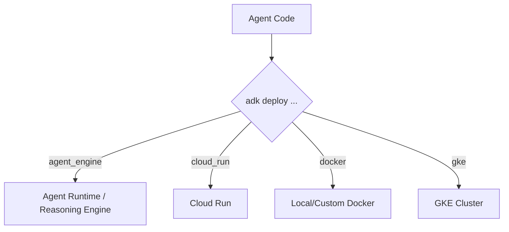

# Lab 14 — Deployment Runtimes

**Exam section:** 4.2 Deploying and scaling production workloads (~22% of the exam)
**Objectives covered:** 4.2 (Selecting optimal deployment runtime based on use case, requirements, and cost - Agent Runtime, Cloud Run, GKE)
**Time:** ~25 minutes · **Cost:** Free offline / ~$1.00 live

---

> **Personal study repo — not affiliated with Google Cloud.** Official guidance: [cloud.google.com/learn/certification/agentic-architect](https://cloud.google.com/learn/certification/agentic-architect) · [Disclaimer](../../../DISCLAIMER.md)

## 1. Exam objectives covered

> Quoted verbatim from the official exam guide:
> - "Selecting optimal deployment runtime based on use case, requirements, and cost (Agent Runtime, Cloud Run, GKE)"

## 2. Explain it simply

Once your agent is built and tested, you need to host it somewhere so users or systems can talk to it. The ADK CLI gives you several deployment targets. Think of them as renting different kinds of cars:
- **Agent Runtime (Agent Engine):** A taxi. You just get in and tell it where to go. Google manages everything else.
- **Cloud Run:** A rental car. You drive, but you don't worry about maintenance, and you only pay when you're driving.
- **GKE (Google Kubernetes Engine):** Buying a fleet of trucks. You have total control, massive scale, and can carry custom hardware (like GPUs), but you are responsible for maintaining the garage.
- **Compute Engine:** Buying individual truck parts and assembling them. Maximum control, but maximum operational burden. Rarely the right choice for just hosting an ADK agent unless you have very specific legacy requirements.

## 3. How it works



Under the hood, `adk deploy` packages your agent into a container (via Cloud Build) and pushes it to the target.

### Serving Locally
Before deploying, you can serve your agent locally using:
- `adk api_server`: Starts a FastAPI server for agents, perfect for headless testing.
- `adk web`: Starts a FastAPI server with a Web UI, perfect for visual testing (`--with_ui` is enabled by default).

Both support `--session_service_uri` and `--memory_service_uri` to test stateful backends locally.

### Exact CLI Flags
When deploying to Google Cloud, the exact flags you pass determine the environment's capabilities:

- **Agent Engine**: `adk deploy agent_engine . --project=MY_PROJECT --region=us-central1 --worker_pool=projects/...`
  - `--worker_pool`: Required for VPC-SC / private-network environments that cannot use the default public Cloud Build pool.
  - `--extra_packages`: Stuffs additional local packages into the container for dependency pinning.
- **Cloud Run**: `adk deploy cloud_run . --project=MY_PROJECT --region=us-central1 --otel_to_cloud --session_service_uri=redis://...`
  - `--otel_to_cloud`: Enables OpenTelemetry export to GCP (Cloud Trace and Cloud Logging).
  - `--with_cloud_run_sandbox`: Enables the Cloud Run sandbox for code execution (requires beta track).
- **GKE**: `adk deploy gke . --project=MY_PROJECT --region=us-central1 --cluster_name=my-cluster --service_type=LoadBalancer`
  - `--service_type`: Determines if it's exposed externally (`LoadBalancer`) or kept internal (`ClusterIP`).
- **Docker**: `adk deploy docker .`
  - Useful for manually taking the generated image and deploying to Compute Engine or on-prem.

### Scaling, Cold Starts, and Sessions
- **Cold Starts**: Cloud Run scales to zero, meaning the first request after a period of inactivity will take longer (cold start). Agent Engine and GKE typically keep instances warm.
- **Session Durability**: Cloud Run and GKE replicas are ephemeral. If you rely on in-memory sessions, subsequent requests might hit a different replica and lose state. You MUST use a remote session service (`--session_service_uri=redis://...` or `agentengine://`) for session durability across replicas.

## 4. The decision that matters

| If you need... | Use | Why not the alternative |
| :--- | :--- | :--- |
| Zero-ops, managed Vertex AI integration, out-of-the-box memory | Agent Runtime | Limited customizability, restricted networking options compared to GKE. |
| Scale-to-zero, low cost, event-driven HTTP (Eventarc) | Cloud Run | Does not easily support custom GPUs or stateful workloads without complex volume setups. |
| Custom GPUs (for self-hosted SLMs), strict VPC controls, high concurrency | GKE | High operational overhead; requires managing node pools, namespaces, and ingress. |
| Legacy OS requirements, extreme kernel tuning | Compute Engine | You have to manage the OS, patching, and scaling yourself. Use GKE instead if possible. |

> [!WARNING]
> **Naming Trap!** The exam guide refers to **"Agent Runtime"**. However, the actual ADK CLI command remains **`adk deploy agent_engine`**. If you see "Agent Runtime" on the exam, know that it corresponds to the `agent_engine` subcommand and the Vertex AI Reasoning Engine API.

## 5. Hands-on A — offline (free)

```bash
./tracks/04_evaluate_and_deploy/lab_14_deployment_runtimes/run_lab.sh
```

In the offline mode, the script mocks the deployment and displays the underlying `adk deploy` commands that *would* be run. The tests verify that the exact CLI flags and targets map correctly to ADK 2.9.0's supported surfaces.

## 6. Hands-on B — live on Google Cloud (opt-in)

Ensure you have credentials and a project set:

```bash
export GOOGLE_CLOUD_PROJECT="your-project-id"
export GOOGLE_CLOUD_LOCATION="us-central1"
```

To deploy to Cloud Run:
```bash
./tracks/04_evaluate_and_deploy/lab_14_deployment_runtimes/run_lab.sh --live cloud_run
```

To deploy to Agent Engine:
```bash
./tracks/04_evaluate_and_deploy/lab_14_deployment_runtimes/run_lab.sh --live agent_engine
```

> [!WARNING]
> Cost note: Deploying to Cloud Run incurs minimal costs (fraction of a cent per request). Deploying to Agent Engine incurs similar managed compute costs. Provisioning a GKE cluster just for this lab will cost several dollars an hour.

## 7. Verify it worked

1. If deploying to Cloud Run, look for a new service in the Google Cloud Console under "Cloud Run".
2. If deploying to Agent Runtime, look for a Reasoning Engine resource in Vertex AI.
3. Both runtimes should expose an API endpoint that you can query with HTTP POST requests.

## 8. Troubleshooting

| Symptom | Cause | Fix |
| :--- | :--- | :--- |
| `adk deploy gke` fails with cluster not found | The cluster doesn't exist or isn't in your active project. | Ensure `gcloud container clusters get-credentials` works and you pass `--cluster_name`. |
| Deploy fails on Cloud Run with `PermissionDenied` | Missing IAM roles for Cloud Build or Artifact Registry. | Grant `roles/cloudbuild.builds.builder` and `roles/run.admin` to your deployment user/service account. |
| `ImportError` on deploy | Missing `requirements.txt` or unsupported packages in your agent folder. | Ensure all dependencies (like `google-adk`) are explicitly listed. |
| Sessions reset on Cloud Run | Relying on default in-memory sessions across ephemeral instances. | Supply `--session_service_uri` pointing to a Redis instance or database. |

## 9. Clean up

```bash
./tracks/04_evaluate_and_deploy/lab_14_deployment_runtimes/cleanup.sh
```

If you deployed live:
```bash
gcloud run services delete your-agent-name --region=$GOOGLE_CLOUD_LOCATION --quiet
# Or for Agent Engine:
# gcloud ai reasoning-engines delete <id>
```

## 10. Exam traps

- **Agent Runtime vs Agent Engine:** They are the same thing. The CLI says `agent_engine`.
- **Docker is a target:** `adk deploy docker` is a valid subcommand. It generates a Docker image locally but does not push to a managed runtime.
- **Stateful Memory:** Cloud Run is stateless. If you use memory on Cloud Run, you MUST back it with a remote service like `--memory_service_uri rag://...` or Redis, otherwise sessions vanish between requests.

## 11. Check yourself

<details>
<summary>1. You are running an OSS model using Gemma3Ollama locally and need to deploy it with your agent. You require direct GPU access. Which deployment target is best?</summary>
GKE. Neither Cloud Run nor Agent Runtime provide native GPU support for custom self-hosted model execution within the same container instance easily.
</details>

<details>
<summary>2. You need your agent to scale to zero to save costs during off-peak hours and respond to Pub/Sub events. Which deployment target is best?</summary>
Cloud Run. It offers scale-to-zero and integrates natively with Eventarc/PubSub for event-driven invocations.
</details>

<details>
<summary>3. What CLI flag would you use to attach a Vertex AI Rag Memory Service to your Cloud Run deployed agent?</summary>
`--memory_service_uri="rag://<corpus_id>"`
</details>
