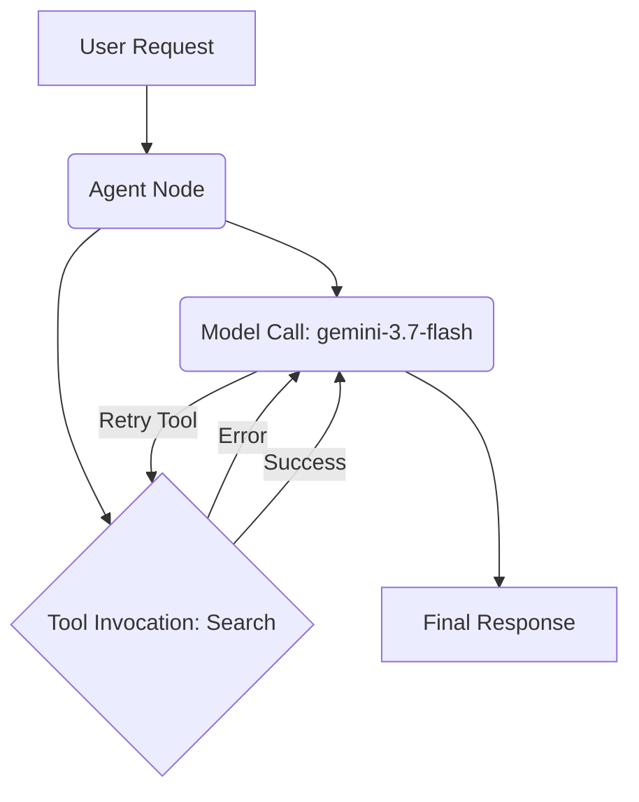

# Lab 15 — Observability and Troubleshooting

**Exam section:** 4.2 Deploying and scaling production workloads (~22% of the exam)
**Objectives covered:** 4.2 (Troubleshooting agent issues, monitoring and optimizing agents)
**Time:** ~30 minutes · **Cost:** Free offline / ~$1.00 live

---

## 1. Exam objectives covered

> Quoted verbatim from the official exam guide:
> - "Troubleshooting agent issues (drift, tool invocation latency, agent reasoning loops, system failures)"
> - "Monitoring and optimizing agents for performance, reliability, and cost"

## 2. Explain it simply

Operating agents in production requires deep observability. Traditional Application Performance Monitoring (APM) tells you that an HTTP endpoint took 5 seconds and returned a 200 OK. But was that 5 seconds spent waiting for a slow API call (tool), or was the model taking a long time to generate a reasoning plan? If the agent loops between calling a tool and getting an error, a standard APM just sees a long response time.

ADK uses OpenTelemetry to trace every step of an agent's turn. It breaks down the single HTTP request into spans for the model call, tool executions, and sub-agent handoffs, and tracks metrics like token usage and cost.

## 3. How it works



When you enable `adk telemetry`, ADK emits structured traces:
1. **Trace Hierarchy:** The entire turn is a root span. Child spans represent individual model calls and tool invocations.
2. **Latency Attribution:** You can clearly separate "time spent waiting for the LLM" from "time spent waiting for a backend API".
3. **Loop Detection:** If an agent gets stuck in a retry loop (e.g., repeatedly generating invalid SQL), the trace will show multiple `trace_tool_call` spans alternating with LLM calls.
4. **Token Accounting:** Spans contain metadata for input and output token counts, allowing cost attribution per turn.

## 4. The decision that matters

| If you need to monitor... | Use | Why not the alternative |
| :--- | :--- | :--- |
| Why a specific request took 15 seconds | Cloud Trace (via OpenTelemetry) | Cloud Logging is unstructured; finding the exact sequence of tool calls is hard. |
| Aggregated token spend across all users | Cloud Monitoring (Metrics) | Trace data is sampled and not meant for precise aggregate financial metrics. |
| Tool error rates causing reasoning loops | Cloud Trace + Log Alerts | A standard HTTP 500 alert won't catch agents that gracefully handle the error but get stuck in a loop. |
| Regression detection after model updates | `adk conformance test` | Traditional unit tests don't capture the multi-step nature of agent interactions. |

## 5. Hands-on A — offline (free)

```bash
./tracks/04_evaluate_and_deploy/lab_15_observability_and_troubleshooting/run_lab.sh
```

In the offline mode, the script simulates a multi-step agent turn (a model call followed by a tool failure and retry) and emits a structured local trace to the console. It computes derived metrics such as per-step latency and tool error rates.

## 6. Hands-on B — live on Google Cloud (opt-in)

Ensure you have credentials and a project set:

```bash
export GOOGLE_CLOUD_PROJECT="your-project-id"
export GOOGLE_CLOUD_LOCATION="us-central1"
```

1. Enable telemetry in ADK:
   ```bash
   adk telemetry enable
   ```

2. Run the lab live:
   ```bash
   ./tracks/04_evaluate_and_deploy/lab_15_observability_and_troubleshooting/run_lab.sh --live
   ```

3. To export telemetry to Google Cloud when deploying, use the `--otel_to_cloud` flag:
   ```bash
   adk deploy cloud_run . --project=$GOOGLE_CLOUD_PROJECT --region=$GOOGLE_CLOUD_LOCATION --otel_to_cloud
   ```

> [!WARNING]
> Cost note: Generating traces and metrics will incur standard Cloud Observability charges, which are generally a few cents for a lab run. The agent inference itself will cost standard Gemini API rates.

## 7. Verify it worked

**Querying Logs for Tool Errors:**
```bash
gcloud logging read 'resource.type="cloud_run_revision" AND textPayload:"Tool execution failed"' --limit=10
```

**Viewing Traces in Cloud Console:**
Navigate to **Cloud Trace > Trace Explorer** and look for spans named `trace_call_llm` and `trace_tool_call`.

## 8. Troubleshooting

| Symptom | Cause | Fix |
| :--- | :--- | :--- |
| No traces appearing in Cloud Trace | Missing IAM permissions | Ensure the runtime service account has `roles/cloudtrace.agent` and `roles/monitoring.metricWriter`. |
| Agent timeouts without obvious errors | Agent reasoning loop | Check Cloud Trace. If you see dozens of sequential `trace_tool_call` spans, the agent is stuck in a retry loop. Increase instruction clarity or limit iterations. |
| `adk telemetry enable` fails | Environment variable conflicts | Ensure you aren't overriding OpenTelemetry endpoints via custom `OTEL_EXPORTER_OTLP_ENDPOINT` variables unless intended. |

## 9. Clean up

```bash
./tracks/04_evaluate_and_deploy/lab_15_observability_and_troubleshooting/cleanup.sh
```

If you deployed any services live, delete them:
```bash
# Disable local telemetry
adk telemetry disable
```

## 10. Exam traps

- **Generic APM is not enough:** The exam often tests whether you understand that standard HTTP monitoring is insufficient for agents. You must use Agent-aware tracing (like ADK's OpenTelemetry integration) to see tool calls and loops.
- **Latency Attribution:** A common scenario describes a slow agent. The correct troubleshooting step is to use Cloud Trace to determine if the latency is in the *LLM generation phase* or the *tool execution phase*.
- **Evaluation in Production:** Replaying recorded traces as regression tests is done using `adk conformance record` and `adk conformance test`.

## 11. Check yourself

<details>
<summary>1. Your agent is taking 30 seconds to respond, but sometimes it takes 2 seconds. The LLM latency is consistently ~2 seconds. What is the most likely cause, and how do you verify it?</summary>
The agent is likely entering a reasoning loop, retrying a failing tool repeatedly. You verify this by inspecting the trace in Cloud Trace and looking for multiple sequential `trace_tool_call` spans.
</details>

<details>
<summary>2. You want to ensure that a new prompt update doesn't break existing successful agent interactions. What ADK feature should you use?</summary>
Use `adk conformance record` to capture golden interactions, and `adk conformance test` to run regression tests against those recordings before deploying.
</details>

<details>
<summary>3. Which ADK deployment flag automatically instruments your agent for Google Cloud Observability?</summary>
`--otel_to_cloud`
</details>
