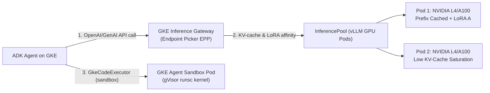

# Lab 19 — GKE Inference Gateway, Open-Weight GPU Serving & Agent Sandbox

**Exam section:** 4.2 Deploying and scaling production workloads (~22% of the exam) & 3.1 Model selection
**Objectives covered:** 3.1 (Selecting and configuring LLM vs. SLM, self-hosted vs. SaaS, OSS vs. proprietary), 4.2 (Selecting optimal deployment runtime based on use case, requirements, and cost — Agent Runtime, Cloud Run, GKE)
**Time:** ~30 minutes · **Cost:** Free offline / ~$1.50 live (GKE GPU node pool)

---

> **Personal study repo — not affiliated with Google Cloud.** Official guidance: [cloud.google.com/learn/certification/agentic-architect](https://cloud.google.com/learn/certification/agentic-architect) · [Disclaimer](../../../DISCLAIMER.md)

## 1. Exam objectives covered

> Quoted verbatim from the official exam guide:
> - "Selecting and configuring the appropriate language model (LLM vs. SLM, self-hosted vs. SaaS, OSS vs. proprietary) considering cost, security, and agent architecture"
> - "Selecting optimal deployment runtime based on use case, requirements, and cost (Agent Runtime, Cloud Run, GKE)"
> - "Using coding agents in secure sandboxes (e.g., Google Kubernetes Engine [GKE], Cloud Workstations, and Antigravity)"

## 2. Explain it simply

**Agent Runtime** (`adk deploy agent_engine`) is the fastest way to host a Python ADK agent that calls managed Gemini APIs. However, enterprise architectures frequently hit three hard boundaries where Agent Runtime cannot be used and you **must choose GKE** (`adk deploy gke`):
1. **Self-Hosting Open-Weight Models on GPUs:** You must run `gemma-4-31b-it` or `gemma-4-26b-a4b-it` inside your own VPC on NVIDIA L4/A100/H100 GPUs (using vLLM or TGI) for air-gapped data residency or custom LoRA adapters.
2. **LLM-Aware Load Balancing (GKE Inference Gateway):** Standard HTTP load balancers route round-robin, ignoring which GPU pod already holds your agent's 50,000-token conversation prefix in its KV-cache or whose GPU VRAM is 99% full. **GKE Inference Gateway** routes based on live GPU KV-cache utilization, prefix-cache affinity, LoRA adapter residency, and request criticality.
3. **Kernel-Isolated Code Sandboxing (Agent Sandbox on GKE):** When your agent executes untrusted Python code via `GkeCodeExecutor`, setting `executor_type="sandbox"` runs the code inside a **GKE Sandbox (gVisor `runsc`)** pod managed by `sandbox_gateway_name` and `sandbox_template` so a kernel exploit cannot escape to the underlying node.

## 3. How it works



### Architectural Components on GKE

1. **GKE Inference Gateway (`inference.networking.x-k8s.io`)**:
   - **`InferencePool`**: Groups your vLLM/JetStream model-serving pods and attaches an **Endpoint Picker (EPP)** extension that scrapes real-time Prometheus metrics (`kv_cache_usage_perc`, `waiting_queue_depth`, active LoRA adapters) from each GPU pod.
   - **`InferenceModel`**: Exposes logical model names (e.g., `gemma-4-risk-analyzer`), maps them to target LoRA adapters on the base `gemma-4-31b-it` weights, and assigns **criticality tiers** (`Critical` for live interactive user turns vs. `Sheddable` for background offline evaluations).
2. **Deploying Open-Weight Models on GKE with GPUs**:
   - Uses GKE GPU node pools (`g2-standard` for NVIDIA L4, `a2-highgpu` for A100, `a3-highgpu` for H100).
   - Model weights (`gemma-4-26b-a4b-it` MoE or `gemma-4-31b-it` dense) are streamed from Cloud Storage via **Cloud Storage FUSE (`gcsfuse`) with parallel downloads / Run:ai model streamer** into GPU memory rather than bloating 60 GB container images.
   - Horizontal Pod Autoscaler (HPA) scales on **custom GPU inference metrics** (`vllm:gpu_cache_usage_perc` and `vllm:num_requests_waiting`), never on CPU utilization.
3. **Agent Sandbox on GKE (`GkeCodeExecutor`)**:
   - Configured in ADK via `GkeCodeExecutor(executor_type="sandbox", sandbox_gateway_name="...", sandbox_template="...")`.
   - Unlike `executor_type="job"` (which runs a normal Kubernetes Job sharing the host Linux kernel), `executor_type="sandbox"` schedules pods with `runtimeClassName: gvisor`, intercepting all guest syscalls in user space via `runsc`.

## 4. The decision that matters

| If you need... | Use | Why not the alternative |
| :--- | :--- | :--- |
| Managed Python ADK hosting calling SaaS Gemini APIs with zero infrastructure ops | **Agent Runtime (`adk deploy agent_engine`)** | Cannot attach custom GPU node pools, cannot run vLLM open-weight serving, and cannot configure GKE Inference Gateway (`InferencePool`). |
| Self-hosted `gemma-4-31b-it` / `gemma-4-26b-a4b-it` on GPUs with KV-cache & LoRA routing | **GKE + GKE Inference Gateway** | Standard L7 load balancers route blindly (`RoundRobin`), causing KV-cache misses, redundant prefill computation, and GPU OOM preemption. |
| Executing untrusted agent-generated code with kernel syscall isolation | **GKE Agent Sandbox (`GkeCodeExecutor` with `executor_type="sandbox"`)** | `GkeCodeExecutor(executor_type="job")` shares the host node's Linux kernel; `UnsafeLocalCodeExecutor` has zero isolation. |
| Protecting interactive agent latency during a spike of batch eval jobs on shared GPUs | **`InferenceModel` Criticality Tiers (`Critical` vs `Sheddable`)** | Without Inference Gateway criticality shedding, batch prompts saturate the vLLM KV-cache and stall live customer conversations. |
| Multi-agent traffic authentication, OAuth token propagation, and MCP/A2A governance | **Agent Gateway** | **GKE Inference Gateway** optimizes *model token serving* (KV-cache/LoRA); **Agent Gateway** governs *agent-to-agent (A2A) and agent-to-tool (MCP)* security and identity. |

## 5. Hands-on A — offline (free)

```bash
./tracks/04_evaluate_and_deploy/lab_19_gke_inference_gateway_and_gpus/run_lab.sh
```

The offline script inspects the real ADK 2.9.0 classes (`GkeCodeExecutor`, `Gemma`, `LiteLlm`, `FallbackModel`, `LlmAgent`), validates the isolation difference between `executor_type="sandbox"` and `executor_type="job"`, and runs a deterministic **GKE Inference Gateway Endpoint Picker (EPP)** routing simulator comparing prefix-cache / KV-cache aware routing against naive round-robin load balancing.

## 6. Hands-on B — live on Google Cloud (opt-in)

To provision a GKE cluster with an L4 GPU node pool, gVisor sandbox node pool, and Inference Gateway CRDs:

```bash
export GOOGLE_CLOUD_PROJECT="your-project-id"
export GOOGLE_CLOUD_LOCATION="us-central1"

gcloud container clusters create agentic-gke-cluster \
  --project="$GOOGLE_CLOUD_PROJECT" \
  --location="$GOOGLE_CLOUD_LOCATION" \
  --machine-type=e2-standard-4 --num-nodes=2

gcloud container node-pools create gvisor-sandbox-pool \
  --cluster=agentic-gke-cluster \
  --location="$GOOGLE_CLOUD_LOCATION" \
  --sandbox="type=gvisor" --num-nodes=1

./tracks/04_evaluate_and_deploy/lab_19_gke_inference_gateway_and_gpus/run_lab.sh --live
```

> [!WARNING]
> Cost note: A GKE cluster with an L4 GPU node pool (`g2-standard-8`) costs ~$0.85–$1.50/hour. Always run cleanup immediately after testing.

## 7. Verify it worked

1. Verify that `GkeCodeExecutor(executor_type="sandbox")` exposes `sandbox_gateway_name` and `sandbox_template` attributes in ADK 2.9.0.
2. Verify that `FallbackModel` chains the self-hosted GKE open-weight model (`gemma-4-26b-a4b-it`) with a managed SaaS fallback (`gemini-3.7-flash`).
3. Verify that the GKE Inference Gateway simulator selects the GPU pod with matching prefix cache and lower KV-cache saturation while shedding `Sheddable` requests above the saturation threshold.

## 8. Troubleshooting

| Symptom | Cause | Fix |
| :--- | :--- | :--- |
| `ImportError` when importing `GkeCodeExecutor` | Missing the `extensions` extra in `google-adk`. | Run `pip install "google-adk[extensions]"`. |
| High Time-To-First-Token (TTFT) on multi-turn GKE vLLM calls | Standard K8s `Service` routes consecutive turns to different GPU pods, recomputing KV-cache prefill. | Deploy **GKE Inference Gateway** (`InferencePool`) with prefix-cache affinity enabled. |
| HPA fails to scale vLLM GPU pods under heavy prompt load | HPA is configured to watch CPU % instead of GPU KV-cache metrics. | Configure HPA on custom Prometheus metrics (`vllm:gpu_cache_usage_perc` or `vllm:num_requests_waiting`). |
| Pod stuck in `Pending` with `runtimeClassName: gvisor` | Default node pool does not have GKE Sandbox enabled. | Create a dedicated node pool with `--sandbox="type=gvisor"` (note: GPU node pools and gVisor node pools must be separate node pools). |

## 9. Clean up

```bash
./tracks/04_evaluate_and_deploy/lab_19_gke_inference_gateway_and_gpus/cleanup.sh
```

If you provisioned a live GKE cluster:
```bash
gcloud container clusters delete agentic-gke-cluster \
  --project="$GOOGLE_CLOUD_PROJECT" \
  --location="$GOOGLE_CLOUD_LOCATION" --quiet
```

## 10. Exam traps

- **Agent Runtime vs. GKE:** If a scenario requires **self-hosting open-weight models (`Gemma 4`) on GPUs**, **GKE Inference Gateway**, or **GKE Agent Sandbox (`gVisor`)**, **Agent Runtime (`adk deploy agent_engine`) is NOT valid** — you must choose **GKE (`adk deploy gke`)**.
- **GKE Inference Gateway vs. Agent Gateway:** **GKE Inference Gateway** sits in front of *model-serving pods (vLLM/TGI on GPUs)* to route based on KV-cache, prefix cache, and LoRA adapters. **Agent Gateway** sits in front of *agents and MCP servers* to enforce OAuth authentication, rate limits, and identity propagation.
- **`executor_type="sandbox"` vs. `executor_type="job"`:** Both run on GKE via `GkeCodeExecutor`, but only `sandbox` provides kernel isolation (gVisor `runsc`) and sub-second warm sandbox claiming via `sandbox_gateway_name` / `sandbox_template`.
- **GPU Node Pools + gVisor Node Pools:** In GKE, a single node pool cannot enable both hardware GPUs and `--sandbox="type=gvisor"` on the same node. You run two node pools in the same GKE cluster: a **GPU node pool** for `InferencePool` (vLLM) and a **gVisor node pool** for `GkeCodeExecutor(executor_type="sandbox")`.

## 11. Check yourself

<details>
<summary>1. Why does GKE Inference Gateway significantly reduce Time-To-First-Token (TTFT) for multi-turn agentic workflows running on self-hosted vLLM pods?</summary>
Multi-turn agents repeatedly resend a large system instruction, tool schemas, and conversation history prefix. GKE Inference Gateway's Endpoint Picker tracks prefix-cache residency across GPU pods and routes follow-up turns to the pod that already holds those prefix tokens in GPU KV-cache, avoiding redundant prefill computation.
</details>

<details>
<summary>2. When should you choose `gemma-4-26b-a4b-it` over `gemma-4-31b-it` for self-hosted GKE GPU serving?</summary>
`gemma-4-26b-a4b-it` is a Mixture-of-Experts (MoE) model with only ~4B active parameters per token (out of 26B total), giving significantly lower token generation latency and higher throughput per GPU than the dense 31B model (`gemma-4-31b-it`).
</details>

<details>
<summary>3. Your GKE cluster runs both self-hosted `Gemma 4` GPU inference and `GkeCodeExecutor(executor_type="sandbox")` for untrusted Python execution. How should you configure the GKE node pools?</summary>
Create two distinct node pools within the cluster: (1) a GPU-accelerated node pool (e.g., `g2-standard` with L4 GPUs) for the `InferencePool` vLLM pods, and (2) a CPU node pool with `--sandbox="type=gvisor"` enabled for the `GkeCodeExecutor` sandbox pods.
</details>
