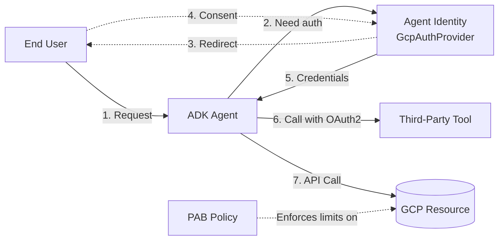

# Lab 16 — Agent Identity and Auth

**Exam section:** 5.1 Configuring agent security and governance (~15% of the exam)
**Objectives covered:** "Implementing authentication and secure tool execution (agent-to-tool API calls using OAuth 2.0)", "Configuring principal access boundary (PAB) policies using Agent Identity"
**Time:** ~25 minutes · **Cost:** Free offline / ~$0.00 live

---

## 1. Exam objectives covered

> Quoted verbatim from the official exam guide:
> - "Implementing authentication and secure tool execution (agent-to-tool API calls using OAuth 2.0)"
> - "Configuring principal access boundary (PAB) policies using Agent Identity"

## 2. Explain it simply

Imagine your agent is a new employee. When they start, they need a badge to get into the building (identity), specific keys for different rooms (tool access), and rules about which floors they can never enter (boundary policies).

**Agent Identity** is how your agent proves who it is to Google Cloud and to third-party tools. **OAuth 2.0** is the standard protocol the agent uses to request permission to use those tools on behalf of a human user. A **Principal Access Boundary (PAB) policy** is an absolute boundary line—a fail-safe that guarantees the agent can only touch specific resources, regardless of what other permissions it might have accidentally been granted.

## 3. How it works



1.  **Auth Schemes:** You configure tools with an `AuthConfig` specifying an `AuthScheme` (like `GcpAuthProviderScheme` or `OAuth2Auth`).
2.  **Agent Identity:** The ADK uses the `GcpAuthProvider` to handle the OAuth flow, exchanging credentials and optionally redirecting the user for consent.
3.  **PAB Policies:** A PAB policy is bound to the agent's service account. It restricts the service account to only access resources within a specific organization, folder, or project. Even if the service account has `roles/editor` globally, the PAB blocks access outside the boundary.

## 4. The decision that matters

| If you need... | Use | Why not the alternative |
| :--- | :--- | :--- |
| To limit an agent's maximum blast radius across GCP | **PAB Policy** | IAM roles (`roles/storage.objectViewer`) dictate *what* an agent can do, but PABs dictate *where*. PABs override IAM. |
| To call a third-party API on behalf of the user | **OAuth 2.0 / OIDC** | Service accounts (`AuthCredentialTypes.SERVICE_ACCOUNT`) act as the agent, not the user. OAuth acts on the user's behalf. |
| To authenticate internal agent-to-tool calls securely | **Workload Identity** | Long-lived API keys leak. Short-lived tokens generated by Workload Identity are secure and rotate automatically. |

## 5. Hands-on A — offline (free)

```bash
./tracks/05_secure_and_govern/lab_16_agent_identity_and_auth/run_lab.sh
```

This offline run demonstrates constructing the real ADK `GcpAuthProviderScheme` and setting up a PAB policy definition in python.

**Output highlights:**
- Shows the real `GcpAuthProviderScheme` attributes.
- Demonstrates how to configure an `AgentTool` with authentication.
- Shows the `gcloud iam principal-access-boundary-policies` command structure.

## 6. Hands-on B — live on Google Cloud (opt-in)

Enable the IAM API:
```bash
gcloud services enable iam.googleapis.com cloudresourcemanager.googleapis.com
```

Create a Principal Access Boundary Policy:
```bash
gcloud iam principal-access-boundary-policies create my-pab-policy \
    --organization=YOUR_ORG_ID \
    --location=global \
    --display-name="Agent Boundary" \
    --details-rules="description=Limit to sandbox,effect=ALLOW,resources=//cloudresourcemanager.googleapis.com/projects/YOUR_PROJECT_ID"
```
*(Note: PAB policies require an Organization ID)*

Run the lab:
```bash
./tracks/05_secure_and_govern/lab_16_agent_identity_and_auth/run_lab.sh --live
```

> [!WARNING]
> Cost note: Free. IAM operations and PAB policies do not incur direct costs.

## 7. Verify it worked

Check the PAB policy:
```bash
gcloud iam principal-access-boundary-policies list --organization=YOUR_ORG_ID --location=global
```

## 8. Troubleshooting

| Symptom | Cause | Fix |
| :--- | :--- | :--- |
| `ImportError: cannot import name 'GcpAuthProvider'` | Missing the Agent Identity extra. | Run `pip install "google-adk[agent-identity]"`. |
| PAB policy creation fails | Missing Organization ID. | PAB policies cannot be created at the project level, they require an Organization. |

## 9. Clean up

```bash
./tracks/05_secure_and_govern/lab_16_agent_identity_and_auth/cleanup.sh
```

Live cleanup:
```bash
gcloud iam principal-access-boundary-policies delete my-pab-policy \
    --organization=YOUR_ORG_ID --location=global
```

## 10. Exam traps

*   **PAB vs IAM:** PABs do **not** grant access. They only restrict it. If a PAB allows a project, the agent still needs an IAM role to do anything in that project.
*   **Service Account vs OAuth:** If the exam asks how an agent should access a user's personal Google Drive, the answer is OAuth 2.0 (user identity), not a Service Account (workload identity).
*   **Agent Identity is an ADK extra:** You must explicitly install `google-adk[agent-identity]` to use `GcpAuthProvider`.

## 11. Check yourself

<details>
<summary>1. What happens if a service account has the Owner role on Project A, but a PAB policy attached to the service account only allows access to Project B?</summary>
The service account will be denied access to Project A. PAB policies cap the blast radius, overriding granted IAM roles.
</details>

<details>
<summary>2. How does the ADK support authenticating tool calls using Agent Identity?</summary>
By configuring the tool's `auth_config` with a `GcpAuthProviderScheme`.
</details>

<details>
<summary>3. Which gcloud command group manages PABs?</summary>
`gcloud iam principal-access-boundary-policies`.
</details>
