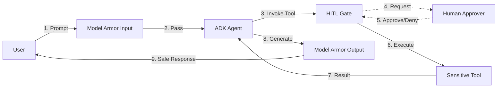

# Lab 17 — Model Armor and HITL Guardrails

**Exam section:** 5.2 Implementing secure agent behavior and execution (~15% of the exam)
**Objectives covered:** "Designing appropriate safety frameworks and guardrails (e.g., Agent Gateway, Model Armor, and human-in-the-loop [HITL])"
**Time:** ~25 minutes · **Cost:** Free offline / ~$0.00 live

---

> **Personal study repo — not affiliated with Google Cloud.** Official guidance: [cloud.google.com/learn/certification/agentic-architect](https://cloud.google.com/learn/certification/agentic-architect) · [Disclaimer](../../../DISCLAIMER.md)

## 1. Exam objectives covered

> Quoted verbatim from the official exam guide:
> - "Designing appropriate safety frameworks and guardrails (e.g., Agent Gateway, Model Armor, and human-in-the-loop [HITL])"

## 2. Explain it simply

Even the smartest agents can be tricked (prompt injection), generate harmful content (jailbreaks), or decide to use a tool destructively (deleting a production database). 

**Model Armor** acts as a firewall for LLMs. It screens the prompt *before* it reaches the model and screens the response *before* it reaches the user.
**Human-in-the-loop (HITL)** acts as a manual override. When an agent attempts a sensitive action (like running a Terraform apply or sending an email), execution pauses, and a human must explicitly approve the tool call.

## 3. How it works



1.  **Input Screening:** `ModelArmorPlugin` uses a prompt template to scan the user's input for PII, malicious URLs, or prompt injections.
2.  **Tool Guardrails (HITL):** Before executing a tool, the ADK pauses. Using `request_input` or `get_user_choice`, the agent waits for human confirmation.
3.  **Output Screening:** The agent's generated response is scanned against a response template to ensure it does not leak sensitive information or violate safety policies.

## 4. The decision that matters

| Threat | Appropriate Guardrail | Why not the alternative |
| :--- | :--- | :--- |
| Prompt Injection & Jailbreaks | **Model Armor (Input)** | A system prompt instructing the model to "ignore injections" is ineffective; LLMs can easily be bypassed by clever phrasing. |
| Malicious tool execution (e.g., `drop table`) | **HITL (Human-in-the-loop)** | Model Armor only screens text. It cannot judge the contextual business risk of executing a valid SQL statement. |
| Accidental Data Leakage in Output | **Model Armor (Output)** / **Sensitive Data Protection** | Relying on the LLM's own safety filters is insufficient for strict enterprise compliance (e.g., hiding credit card numbers). |

## 5. Hands-on A — offline (free)

```bash
./tracks/05_secure_and_govern/lab_17_model_armor_and_hitl/run_lab.sh
```

This offline lab configures the real `ModelArmorPlugin` from the ADK and demonstrates how to handle screening failures using `block_on_screening_failure`. It also simulates a HITL intercept on a tool call using a `before_tool_callback`.

**Output highlights:**
- Shows the real `ModelArmorConfig` and `ModelArmorPlugin` initialization.
- Demonstrates how to block on screening failure (fail-closed behavior).
- Demonstrates how to intercept a tool call using a callback and `get_user_choice`.

## 6. Hands-on B — live on Google Cloud (opt-in)

Enable the required APIs:
```bash
gcloud services enable modelarmor.googleapis.com
```

Create a Model Armor template:
```bash
# This is a representative command. Model Armor configuration is often done via 
# the Cloud Console or Terraform due to complex filter criteria.
# See: https://cloud.google.com/security-command-center/docs/model-armor-overview
```

Run the lab:
```bash
./tracks/05_secure_and_govern/lab_17_model_armor_and_hitl/run_lab.sh --live
```

> [!WARNING]
> Cost note: Model Armor charges based on characters screened. Small lab runs will cost pennies.

## 7. Verify it worked

Check the `ModelArmorConfig` attributes in the offline run output. They should exactly match the required fields: `prompt_template_name`, `response_template_name`, `input_blocked_message`, `output_blocked_message`, and `block_on_screening_failure`.

## 8. Troubleshooting

| Symptom | Cause | Fix |
| :--- | :--- | :--- |
| `ImportError: cannot import name 'ModelArmorPlugin'` | Missing the GCP extra. | Run `pip install "google-adk[gcp]"`. |
| Model Armor plugin fails to block | `block_on_screening_failure` is set to `False`. | Change the config to `block_on_screening_failure=True` to fail-closed. |

## 9. Clean up

```bash
./tracks/05_secure_and_govern/lab_17_model_armor_and_hitl/cleanup.sh
```

## 10. Exam traps

*   **Fail-Open vs Fail-Closed:** The exam will test your understanding of what happens if the screening service is down. `block_on_screening_failure=True` is fail-closed (secure but reduces availability). `False` is fail-open (maintains availability but risks security).
*   **Model Armor vs Sensitive Data Protection (DLP):** Model Armor is specifically designed for LLM prompts/responses and handles prompt injections. Sensitive Data Protection (Cloud DLP) is for general de-identification of data pipelines. They can be used together.

## 11. Check yourself

<details>
<summary>1. Which ADK class is used to configure input and output screening?</summary>
`ModelArmorConfig` passed into `ModelArmorPlugin`.
</details>

<details>
<summary>2. How can an agent pause and wait for a human to approve an action?</summary>
By using the built-in `request_input` or `get_user_choice` tools, or by implementing a `before_tool_callback` that requires human interaction.
</details>

<details>
<summary>3. What is the effect of setting block_on_screening_failure=True?</summary>
If the Model Armor API call fails (e.g., network error), the agent will block the response and return the configured blocked message. This is a fail-closed security posture.
</details>
