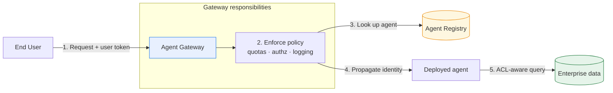

# Lab 18 — Agent Governance, Gateways, and Registries

**Exam section:** 5.1 Configuring agent security and governance (~15% of the exam)
**Objectives covered:** "Configuring Agent Gateway to monitor traffic and track agents", "Designing and configuring agentic governance and policy enforcement", "Configuring secure access to data and identity propagation"
**Time:** ~30 minutes · **Cost:** Free offline / ~$0.00 live

---

> **Personal study repo — not affiliated with Google Cloud.** Official guidance: [cloud.google.com/learn/certification/agentic-architect](https://cloud.google.com/learn/certification/agentic-architect) · [Disclaimer](../../../DISCLAIMER.md)

## 1. Exam objectives covered

> Quoted verbatim from the official exam guide:
> - "Configuring Agent Gateway to monitor traffic and track agents"
> - "Designing and configuring agentic governance and policy enforcement (e.g., Agent Registry and Model Armor)"
> - "Configuring secure access to data and identity propagation (e.g., Agent Gateway and Agent Registry)"

## 2. Explain it simply

When an enterprise scales to hundreds of agents, you cannot manage them individually. You need a central catalogue of who built what, and a single chokepoint to enforce security rules.

The **Agent Registry** is the catalogue. It discovers and manages agents, MCP servers, and tools across the organization.
The **Agent Gateway** is the chokepoint. It sits in front of your agents, intercepting every request to enforce quotas, monitor traffic, and ensure that the identity of the user is securely passed down to the agent (identity propagation).

## 3. How it works



1.  **Agent Registry:** Developers publish their agents and MCP servers to the Registry.
2.  **Agent Gateway:** Instead of calling agents directly, clients call the Gateway. The Gateway enforces global policies (like rate limiting) and logs traffic.
3.  **Identity Propagation:** The Gateway takes the end-user's identity (e.g., an OAuth token) and passes it through to the agent.
4.  **ACL-Aware Retrieval:** When the agent searches enterprise data (like Vertex AI Search), it uses the propagated identity. The search engine only returns documents the *end-user* is allowed to see, preventing data leakage.

## 4. The decision that matters

| If you need... | Use | Why not the alternative |
| :--- | :--- | :--- |
| To discover remote A2A agents or MCP servers | **Agent Registry** | Hardcoding agent URLs breaks when versions change. The Registry provides a dynamic catalog and ready-made `MCPToolset` objects. |
| To enforce global rate limits and audit all agent traffic | **Agent Gateway** | Modifying every individual agent's code to add logging is unscalable and prone to bypass. |
| To ensure an agent only reads documents the user can see | **Identity Propagation (ACL-Aware)** | If the agent uses its own Service Account, it might read a confidential CEO document and summarize it for a junior employee. |

## 5. Hands-on A — offline (free)

```bash
./tracks/05_secure_and_govern/lab_18_governance_gateway_registry/run_lab.sh
```

This offline lab instantiates the real `AgentRegistry` and explores its methods (`list_agents`, `get_mcp_toolset`, etc.). It also simulates the architectural pattern of an Agent Gateway intercepting a request and propagating identity.

**Output highlights:**
- Shows the real `AgentRegistry` methods for agent and MCP server discovery.
- Demonstrates a mock Gateway enforcing policy.
- Shows how user identity must be passed to tools for ACL-aware retrieval.

## 6. Hands-on B — live on Google Cloud (opt-in)

> [!WARNING]
> **Pre-GA / naming note.** The exam guide refers to *Agent Gateway*. As of the date in `docs/VERIFIED_FACTS.md`, this specific product name is not fully public in the ADK. Learn the architectural concept (a policy-enforcement chokepoint for agents). For practice, you can build this pattern using **Apigee API Management** or a **Cloud Run** reverse proxy.

We will not deploy a full Apigee gateway in this lab due to complexity, but the offline simulation accurately reflects the architectural pattern you must know for the exam.

## 7. Verify it worked

Check the offline script output. It will assert the presence of specific methods on the `AgentRegistry` class (e.g., `list_agents`, `get_remote_a2a_agent`).

## 8. Troubleshooting

| Symptom | Cause | Fix |
| :--- | :--- | :--- |
| `ImportError: cannot import name 'AgentRegistry'` | Missing the Agent Identity extra. | Run `pip install "google-adk[agent-identity]" mcp`. |

## 9. Clean up

```bash
./tracks/05_secure_and_govern/lab_18_governance_gateway_registry/cleanup.sh
```

## 10. Exam traps

*   **Registry vs Gateway:** The Registry is for *discovery and lifecycle* (finding an agent). The Gateway is for *runtime traffic management* (routing and throttling calls to the agent).
*   **Agent Identity vs User Identity:** If a question asks how to prevent an agent from surfacing restricted HR documents in a RAG response, the answer relies on **propagating the user's identity** to the search tool (ACL-aware search), NOT relying solely on the agent's service account.

## 11. Check yourself

<details>
<summary>1. Which ADK class is used to discover remote A2A agents and MCP servers?</summary>
`AgentRegistry` (from `google.adk.integrations.agent_registry`).
</details>

<details>
<summary>2. Why is identity propagation critical for agentic RAG workflows?</summary>
So the underlying search engine (e.g., Vertex AI Search) can enforce Document-Level ACLs based on the end-user's permissions, preventing the agent from leaking restricted data.
</details>

<details>
<summary>3. What architectural component should you use to monitor all traffic to agents and enforce rate limits?</summary>
An Agent Gateway.
</details>
